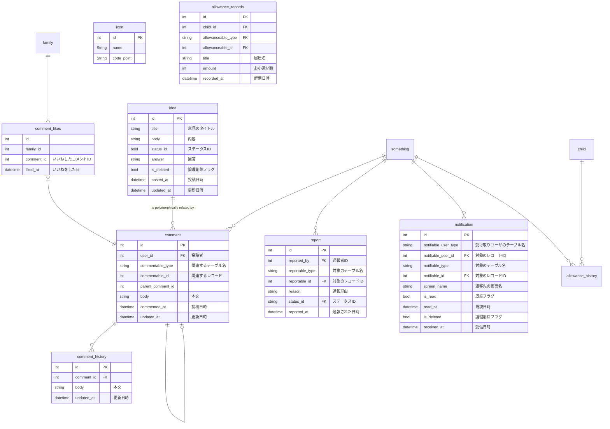

```mermaid
erDiagram

    family ||--|{ comment_likes: ""
    comment_likes {
        int id
        int family_id
        int comment_id "いいねしたコメントID"
        datetime liked_at "いいねをした日"
    }
    comment_likes }|--|| comment: ""

    icon {
        %% アイコン一覧
        %% 
        %% 使用できるアイコンが全て格納されている

        int id PK
        %% ---
        String name
        String code_point
    }

    idea {
        %% 意見箱のトピック
        %% 
        %% 編集はできず、削除のみ
        %% 間違えた場合は、コメント欄でやり取りを行う

        int id PK
        %% ---
        string title "意見のタイトル"
        string body "内容"
        bool status_id "ステータスID"
        string answer "回答"
        %% ---
        bool is_deleted "論理削除フラグ"
        datetime posted_at "投稿日時"
        datetime updated_at "更新日時"
    }

    something {
        %% user, quest, commentなどのなんらかの複数のコレクション
    }

    something ||--o{ comment: ""
    idea ||--o{ comment: "is polymorphically related by"

    comment {
        %% post(quest or penalty)用のコメント欄
        %% 
        %% コメントの階層は二つまで(親コメントと子コメントの二つ)

        int id PK
        %% ---
        int user_id FK "投稿者"
        %% ---
        string commentable_type "関連するテーブル名"
        int commentable_id "関連するレコード"
        %% ---
        int parent_comment_id
        string body "本文"
        %% ---
        datetime commented_at "投稿日時"
        datetime updated_at "更新日時"
    }

    comment ||--o{ comment_history: ""
    comment ||--o| comment : ""

    comment_history {
        %% コメントの履歴

        int id PK
        %% ---
        int comment_id FK
        %% ---
        string body "本文"
        datetime updated_at "更新日時"
    }

    something ||--o{ report: ""

    report {
        %% 通報テーブル
        %% 
        %% 通報対象のテーブルとレコードを保持
        
        int id PK
        %% ---
        int reported_by FK "通報者ID"
        %% ---
        string reportable_type "対象のテーブル名"
        int reportable_id FK "対象のレコードID"
        %% ---
        string reason "通報理由"
        string status_id FK "ステータスID"
        datetime reported_at "通報された日時"
    }

    something ||--o{ notification: ""

    notification {
        %% 通知テーブル

        int id PK
        %% ---
        string notifiable_user_type "受け取りユーザのテーブル名"
        int notifiable_user_id FK "対象のレコードID"
        %% ---
        string notifiable_type "対象のテーブル名"
        int notifiable_id FK "対象のレコードID"
        %% ---
        string screen_name "遷移先の画面名"
        bool is_read "既読フラグ"
        datetime read_at "既読日時"
        %% ---
        bool is_deleted "論理削除フラグ"
        datetime received_at "受信日時"
    }

    something ||--o{ allowance_history: ""
    child ||--o{ allowance_history: ""

    allowance_records {
        %% 月ごとのお小遣い明細の記録 
        %% 
        %% クエスト履歴や月のお小遣いなどと紐づく

        int id PK
        %% ---
        int child_id FK
        %% ---
        string allowanceable_type FK
        int allowanceable_id FK
        %% ---
        string title "履歴名"
        int amount "お小遣い額"
        datetime recorded_at "起票日時"
    }


```
