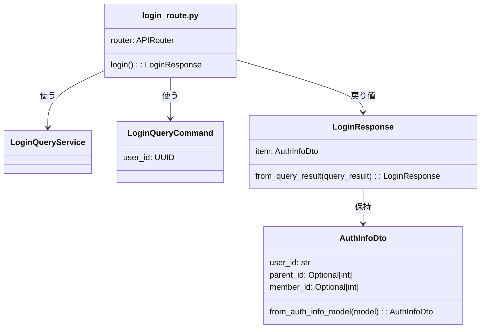

# login関連

## `login`関連

```mermaid
classDiagram
    class login_route.py {
        router: APIRouter
        login(): LoginResponse
    }
    class LoginQueryService
    class LoginQueryCommand {
        user_id: UUID
    }
    class LoginResponse {
        item: AuthInfoDto
        from_query_result(query_result): LoginResponse
    }
    class AuthInfoDto {
        user_id: str
        parent_id: Optional[int]
        member_id: Optional[int]
        from_auth_info_model(model): AuthInfoDto
    }

    login_route.py --> LoginQueryService : 使う
    login_route.py --> LoginQueryCommand : 使う
    login_route.py --> LoginResponse : 戻り値
    LoginResponse --> AuthInfoDto : 保持
```
