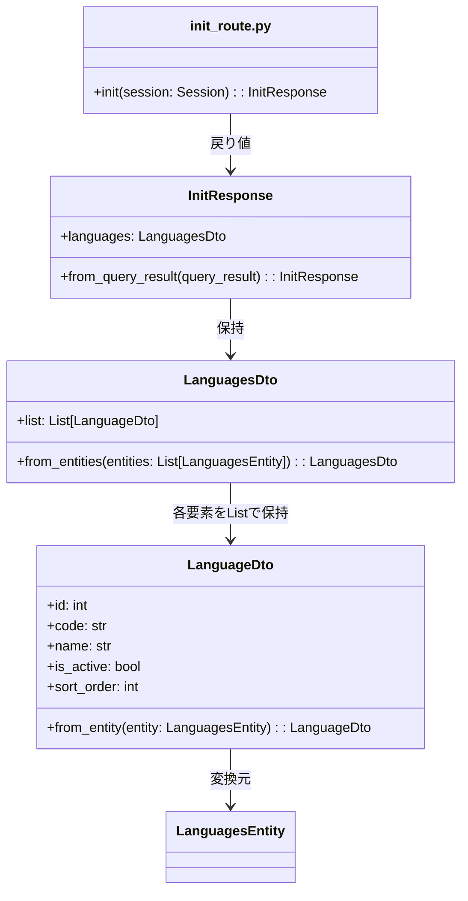

# init_route関連

## InitResponse関連

```mermaid
classDiagram
    class init_route.py {
        +init(session: Session): InitResponse
    }
    class InitResponse {
        +languages: LanguagesDto
        +from_query_result(query_result): InitResponse
    }
    class LanguagesDto {
        +list: List[LanguageDto]
        +from_entities(entities: List[LanguagesEntity]): LanguagesDto
    }
    class LanguageDto {
        +id: int
        +code: str
        +name: str
        +is_active: bool
        +sort_order: int
        +from_entity(entity: LanguagesEntity): LanguageDto
    }
    class LanguagesEntity

    init_route.py --> InitResponse : 戻り値
    InitResponse --> LanguagesDto : 保持
    LanguagesDto --> LanguageDto : 各要素をListで保持
    LanguageDto --> LanguagesEntity : 変換元
```
