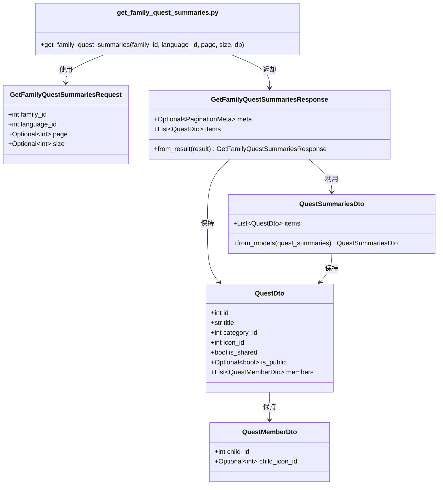

# GetFamilyQuestSummaries関連

## `GetFamilyQuestSummaries`関連

```mermaid
classDiagram
    class get_family_quest_summaries.py {
        +get_family_quest_summaries(family_id, language_id, page, size, db)
    }

    class GetFamilyQuestSummariesRequest {
        +int family_id
        +int language_id
        +Optional~int~ page
        +Optional~int~ size
    }

    class GetFamilyQuestSummariesResponse {
        +Optional~PaginationMeta~ meta
        +List~QuestDto~ items
        +from_result(result) GetFamilyQuestSummariesResponse
    }

    class QuestDto {
        +int id
        +str title
        +int category_id
        +int icon_id
        +bool is_shared
        +Optional~bool~ is_public
        +List~QuestMemberDto~ members
    }

    class QuestMemberDto {
        +int child_id
        +Optional~int~ child_icon_id
    }

    class QuestSummariesDto {
        +List~QuestDto~ items
        +from_models(quest_summaries) QuestSummariesDto
    }

    get_family_quest_summaries.py --> GetFamilyQuestSummariesRequest : 使用
    get_family_quest_summaries.py --> GetFamilyQuestSummariesResponse : 返却
    GetFamilyQuestSummariesResponse --> QuestDto : 保持
    QuestDto --> QuestMemberDto : 保持
    GetFamilyQuestSummariesResponse --> QuestSummariesDto : 利用
    QuestSummariesDto --> QuestDto : 保持
```
