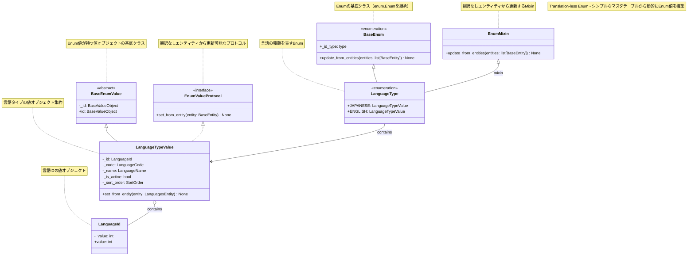
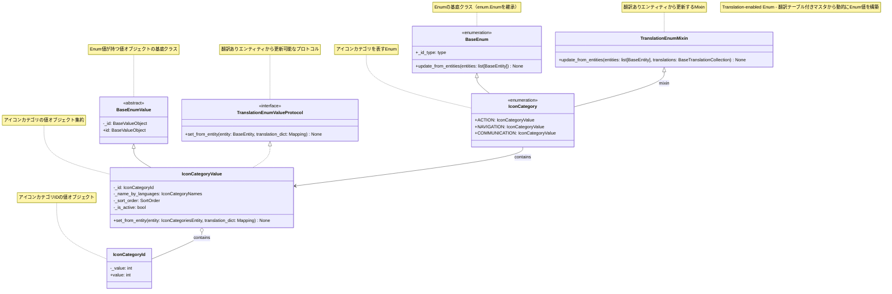

# 🎛️ Domain Enum System

## 関連ドキュメント
- 🔧 [DIコンテナ](di-container.md) - 依存性注入システム
- 🏗️ [アーキテクチャ責務](../architecture/responsibilities.md) - レイヤー責務とアーキテクチャルール
- 🧱 [ディレクトリ構成](../architecture/directory-structure.md) - プロジェクト構成

## 概要
このプロジェクトでは、ドメイン層でEnum値を扱うための独自のシステムを実装しています。通常のPython Enumとは異なり、データベースエンティティから動的にEnum値を構築し、ドメインオブジェクトとして使用できるようになっています。

## クラス図

### 翻訳なしEnum（Translation-less Enum）



### 翻訳ありEnum（Translation-enabled Enum）



## 主要コンポーネント

### 1. プロトコル（インターフェース）

#### EnumValueProtocol
```python
from aqapi.core.domain.value_object.enum_value_protocol import EnumValueProtocol
```
- 翻訳なしエンティティから更新可能な値オブジェクトのインターフェース
- `set_from_entity(entity: BaseEntity)`メソッドを定義

#### TranslationEnumValueProtocol
```python
from aqapi.core.domain.value_object.translation_enum_value_protocol import TranslationEnumValueProtocol
```
- 翻訳ありエンティティから更新可能な値オブジェクトのインターフェース
- `set_from_entity(entity: BaseEntity, translation_dict: Mapping)`メソッドを定義

### 2. 基底クラス

#### BaseEnum
```python
from aqapi.core.domain.base_enum import BaseEnum
```
- `enum.Enum`を継承した基底クラス
- `update_from_entities()`メソッドでエンティティからEnum値を構築
- `_id_type`でID値オブジェクトの型を指定

#### BaseEnumValue
```python
from aqapi.core.domain.value_object.base_enum_value import BaseEnumValue
```
- Enum値が持つ値オブジェクトの基底クラス
- プロトコルの実装を強制する抽象基底クラス

### 3. Mixinクラス

#### EnumMixin
```python
from aqapi.core.domain.enum_mixin import EnumMixin
```
- 翻訳テーブルなしのシンプルなエンティティから更新可能なMixin
- `update_from_entities(entities: list[BaseEntity])`メソッドを提供

#### TranslationEnumMixin
```python
from aqapi.core.domain.translation_enum_mixin import TranslationEnumMixin
```
- 翻訳テーブルありのエンティティから更新可能なMixin
- `update_from_entities(entities: list[BaseEntity], translations: BaseTranslationCollection)`メソッドを提供

### 4. ID値オブジェクト
```python
from aqapi.core.domain.value_object.base_value_object import BaseValueObject
```
- EnumのID値を表現する値オブジェクト
- バリデーション機能付き

## 実装パターン

### パターン1: 翻訳なしEnum定義

#### Enumクラス（言語タイプの例）
```python
from aqapi.language.domain.value_object.language_type_value import LanguageTypeValue
from aqapi.language.domain.value_object.language_id import LanguageId
from aqapi.core.domain.base_enum import BaseEnum
from aqapi.core.domain.enum_mixin import EnumMixin

class LanguageType(BaseEnum, EnumMixin):
    """言語の種類"""
    _id_type = LanguageId

    JAPANESE = LanguageTypeValue(_id_type(1))
    ENGLISH = LanguageTypeValue(_id_type(2))
```

#### EnumValue（値オブジェクト集約）の定義
```python
from aqapi.language.domain.value_object.language_id import LanguageId
from aqapi.language.domain.value_object.language_code import LanguageCode
from aqapi.language.domain.value_object.language_name import LanguageName
from aqapi.shared.entity.sort_order import SortOrder
from aqapi.core.domain.value_object.base_enum_value import BaseEnumValue
from aqapi.core.domain.value_object.enum_value_protocol import EnumValueProtocol

class LanguageTypeValue(BaseEnumValue, EnumValueProtocol):
    """言語タイプの値オブジェクト集約"""
    
    def __init__(self, 
        id: LanguageId,
        code: LanguageCode = LanguageCode(""),
        name: LanguageName = LanguageName(""),
        is_active: bool = False,
        sort_order: SortOrder = SortOrder(0)
    ):
        self._id = id
        self._code = code
        self._name = name
        self._is_active = is_active
        self._sort_order = sort_order

    def set_from_entity(self, entity: LanguagesEntity) -> None:
        """エンティティから値を設定する"""
        self._code = LanguageCode(entity.code)
        self._name = LanguageName(entity.name)
        self._is_active = entity.is_active
        self._sort_order = SortOrder(entity.sort_order)

    @property
    def id(self) -> LanguageId:
        """値オブジェクトのIDを返す"""
        return self._id
```

### パターン2: 翻訳ありEnum定義

#### Enumクラス（アイコンカテゴリの例）
```python
from aqapi.icon.domain.value_object.icon_category_value import IconCategoryValue
from aqapi.icon.domain.value_object.icon_category_id import IconCategoryId
from aqapi.core.domain.base_enum import BaseEnum
from aqapi.core.domain.translation_enum_mixin import TranslationEnumMixin

class IconCategory(BaseEnum, TranslationEnumMixin):
    """アイコンカテゴリの種類"""
    _id_type = IconCategoryId
    
    ACTION = IconCategoryValue(_id_type(1))
    NAVIGATION = IconCategoryValue(_id_type(2))
    COMMUNICATION = IconCategoryValue(_id_type(3))
```

#### EnumValue（値オブジェクト集約）の定義
```python
from typing import Mapping
from aqapi.icon.domain.value_object.icon_category_id import IconCategoryId
from aqapi.icon.entity.icon_categories_entity import IconCategoriesEntity, IconCategoriesTranslationEntity
from aqapi.core.domain.value_object.base_enum_value import BaseEnumValue
from aqapi.icon.domain.value_object.icon_category_names import IconCategoryNames
from aqapi.core.domain.value_object.translation_enum_value_protocol import TranslationEnumValueProtocol
from aqapi.shared.entity.sort_order import SortOrder

class IconCategoryValue(BaseEnumValue, TranslationEnumValueProtocol):
    '''アイコンカテゴリが持つ値オブジェクト集約'''

    def __init__(self, id: IconCategoryId, 
                 name_by_languages: IconCategoryNames=IconCategoryNames.from_empty(),
                 sort_order: SortOrder=SortOrder(0),
                 is_active: bool=True) -> None:
        self._id = id
        self._name_by_languages = name_by_languages
        self._sort_order = sort_order
        self._is_active = is_active

    def set_from_entity(self, entity: IconCategoriesEntity, translation_dict: Mapping[int, IconCategoriesTranslationEntity]) -> None:
        """エンティティから値を設定する"""
        # MappingをdictにキャストしてIconCategoryNames.from_entityに渡す
        self._name_by_languages = IconCategoryNames.from_entity(dict(translation_dict))
        self._sort_order = SortOrder(entity.sort_order)
        self._is_active = entity.is_active

    @property
    def id(self) -> IconCategoryId:
        """値オブジェクトのIDを返す"""
        return self._id
```

### ID値オブジェクトの定義
```python
from dataclasses import dataclass
from aqapi.core.domain.value_object.base_value_object import BaseValueObject

@dataclass
class IconCategoryId(BaseValueObject):
    _value: int

    def __init__(self, value: int):
        self._value = value
        super().__init__()

    def _validate(self) -> None:
        if not isinstance(self._value, int) or self._value <= 0:
            raise ValueError("IconCategoryIdは正の整数でなければなりません。")
```

## 使用方法

### パターン1: 翻訳なしEnumの使用例

#### 基本的な使用例
```python
from aqapi.language.domain.language_type import LanguageType

# Enum値の取得
japanese_lang = LanguageType.JAPANESE
print(japanese_lang.value.id.value)  # 1

# 全てのEnum値の取得
all_languages = list(LanguageType)
print(len(all_languages))  # 2
```

#### エンティティからの値設定
```python
from aqapi.language.domain.language_type import LanguageType
from aqapi.language.entity.languages_entity import LanguagesEntity

# データベースからエンティティを取得（例）
entities = session.query(LanguagesEntity).all()

# Enumにエンティティの値を設定（EnumMixinを使用）
LanguageType.update_from_entities(entities)

# 設定後はcode、nameにアクセス可能
print(LanguageType.JAPANESE.value._code.value)  # "ja"
print(LanguageType.JAPANESE.value._name.value)  # "日本語"
print(LanguageType.JAPANESE.value._is_active)   # True
```

### パターン2: 翻訳ありEnumの使用例

#### 基本的な使用例
```python
from aqapi.icon.domain.icon_category import IconCategory

# Enum値の取得
action_category = IconCategory.ACTION
print(action_category.value.id.value)  # 1

# 全てのEnum値の取得
all_categories = list(IconCategory)
print(len(all_categories))  # 3
```

#### エンティティからの値設定（翻訳あり）
```python
from aqapi.icon.domain.icon_category import IconCategory
from aqapi.icon.entity.icon_categories_entity import IconCategoriesEntity
from aqapi.core.entity.base_translation_collection import BaseTranslationCollection

# データベースからエンティティを取得（例）
entities = session.query(IconCategoriesEntity).all()
translations = BaseTranslationCollection(...)  # 翻訳データの取得

# Enumにエンティティの値を設定（TranslationEnumMixinを使用）
IconCategory.update_from_entities(entities, translations)

# 設定後は翻訳された名前にアクセス可能
print(IconCategory.ACTION.value._name_by_languages.get_by_language_id(1))  # "アクション"
print(IconCategory.ACTION.value._name_by_languages.get_by_language_id(2))  # "Action"
print(IconCategory.ACTION.value._is_active)  # True
```

## 設計思想

### 1. ドメイン駆動設計の実践
- Enumをドメインオブジェクトとして扱う
- 値オブジェクトパターンの活用
- ドメインロジックの集約
- プロトコルによるインターフェース分離

### 2. 型安全性の確保
- プロトコル（Protocol）による静的型チェック
- 強い型付けによるコンパイル時エラーの検出
- バリデーション機能による実行時エラーの防止
- IDの型安全性確保

### 3. データベースとの連携
- エンティティからの動的な値構築
- 翻訳ありと翻訳なしの両パターンサポート
- 国際化対応（翻訳テーブルとの連携）
- マスタデータの変更への対応

### 4. 拡張性とメンテナンス性
- Mixinパターンによるコードの再利用
- プロトコルによる共通インターフェースの強制
- 翻訳あり・なしの実装パターンの統一
- 新しいEnum追加時の一貫性確保

### 5. テスタビリティ
- 各コンポーネントの単体テスト可能
- プロトコルによるモック作成の容易性
- 依存関係の明確化
- 翻訳ありと翻訳なしの分離テスト

## 命名規約

### ファイル・クラス名
- Enumクラス: `{Domain}{Purpose}` (例: `LanguageType`, `IconCategory`)
- EnumValueクラス: `{Domain}{Purpose}Value` (例: `LanguageTypeValue`, `IconCategoryValue`)
- ID値オブジェクト: `{Domain}{Purpose}Id` (例: `LanguageId`, `IconCategoryId`)
- その他値オブジェクト: `{Domain}{Purpose}{Property}` (例: `LanguageCode`, `IconCategoryNames`)

### ディレクトリ構成
```
{domain}/
  domain/
    {enum_name}.py                    # Enumクラス（LanguageType, IconCategory等）
    value_object/
      {enum_name}_value.py            # EnumValueクラス（LanguageTypeValue等）
      {enum_name}_id.py               # ID値オブジェクト（LanguageId等）
      {enum_name}_{property}.py       # その他値オブジェクト（LanguageCode等）
```

### Mixinの選択指針
- **EnumMixin**: 翻訳テーブルがないシンプルなマスタテーブルの場合
- **TranslationEnumMixin**: 翻訳テーブル（多言語対応）があるマスタテーブルの場合

### プロトコルの実装指針
- **EnumValueProtocol**: `set_from_entity(entity: BaseEntity)`のみ実装
- **TranslationEnumValueProtocol**: `set_from_entity(entity: BaseEntity, translation_dict: Mapping)`を実装

## 注意点・制約

### 1. パフォーマンス
- `from_entities()`は初期化時に一度だけ呼び出す
- エンティティ取得のN+1問題に注意
- 大量のEnum値がある場合はメモリ使用量に注意

### 2. 初期化順序
- エンティティがロードされる前は基本値のみ利用可能
- アプリケーション起動時に適切な初期化が必要

### 3. エラーハンドリング
- 存在しないIDでのEnum値作成時の処理
- データベース接続エラー時の処理
- バリデーションエラーの適切な処理

## 実装例

### 翻訳なしEnum（LanguageType）の完全な実装例
- 📄 [LanguageType](../../aqapi/language/domain/language_type.py) - Enumクラスの実装
- 📄 [LanguageTypeValue](../../aqapi/language/domain/value_object/language_type_value.py) - EnumValueクラスの実装
- 📄 [LanguageId](../../aqapi/language/domain/value_object/language_id.py) - ID値オブジェクトの実装

### 翻訳ありEnum（IconCategory）の完全な実装例
- 📄 [IconCategory](../../aqapi/icon/domain/icon_category.py) - Enumクラスの実装
- 📄 [IconCategoryValue](../../aqapi/icon/domain/value_object/icon_category_value.py) - EnumValueクラスの実装
- 📄 [IconCategoryId](../../aqapi/icon/domain/value_object/icon_category_id.py) - ID値オブジェクトの実装

### コアコンポーネントの実装例
- 📄 [EnumValueProtocol](../../aqapi/core/domain/value_object/enum_value_protocol.py) - 翻訳なしプロトコル
- 📄 [TranslationEnumValueProtocol](../../aqapi/core/domain/value_object/translation_enum_value_protocol.py) - 翻訳ありプロトコル
- 📄 [EnumMixin](../../aqapi/core/domain/enum_mixin.py) - 翻訳なしMixin
- 📄 [TranslationEnumMixin](../../aqapi/core/domain/translation_enum_mixin.py) - 翻訳ありMixin

### テストケースの実装例
- 🧪 [test_language_type.py](../../tests/language/domain/test_language_type.py) - 翻訳なしEnumのテスト
- 🧪 [test_icon_category.py](../../tests/icon/domain/test_icon_category.py) - 翻訳ありEnumのテスト
