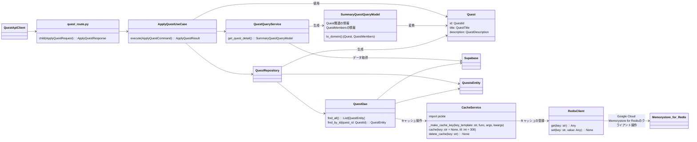

```mermaid
classDiagram
direction LR

QuestApiClient --> quest_route.py

%% 以下は`quest_route.py`
class quest_route.py {
    child(ApplyQuestRequest): ApplyQuestResponse
}

class Quest {
    id: QuestId
    title: QuestTitle
    description: QuestDescription
}

quest_route.py --> ApplyQuestUseCase

class ApplyQuestUseCase {
    execute(ApplyQuestCommand): ApplyQuestResult
}

ApplyQuestUseCase --> QuestRepository
ApplyQuestUseCase --> Quest: 使用
ApplyQuestUseCase --> QuestQueryService

class QuestQueryService {
    get_quest_detail(): SummaryQuestQueryModel
}

QuestQueryService --> Supabase: データ取得
QuestQueryService --> SummaryQuestQueryModel: 生成
SummaryQuestQueryModel --> Quest: 変換

class SummaryQuestQueryModel {
    Quest関連の情報
    QuestMembersの情報
    to_domein(): (Quest, QuestMembers)
}

class QuestRepository

QuestRepository --> Quest: 生成
QuestRepository --> QuestDao
QuestRepository --> QuestsEntity

class QuestDao {
    find_all(): List[QuestEntity]
    find_by_id(quest_id: QuestId): QuestEntity
}

QuestDao --> QuestsEntity
QuestDao --> CacheService: キャッシュ操作
QuestDao --> Supabase

class QuestsEntity

class CacheService {
    %% 本クラスはキャッシュ操作のデコレータを提供
    import pickle
    _make_cache_key(key_template: str, func, args, kwargs)
    cache(key: str = None, ttl: int = 300)
    delete_cache(key: str): None
}

CacheService --> RedisClient: キャッシュの登録

class RedisClient {
    get(key: str): Any
    set(key: str, value: Any): None
}

RedisClient --> Memorystore_for_Redis: Google Cloud Memorystore for Redisのクライアント操作

class Memorystore_for_Redis
class Supabase


```
