# お小遣いクエストボードERD

## core
```mermaid
%% core
erDiagram
    %% 基底エンティティ（全テーブル共通のベースクラス）
    %% 実際のテーブルではないため、ER図には含めない
```

## shared
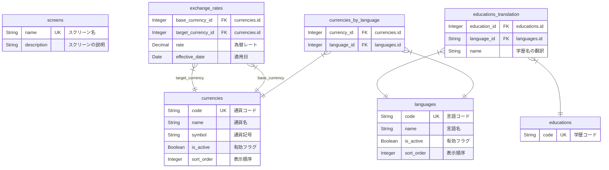

## ui
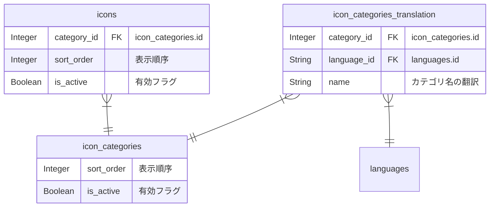

## auth
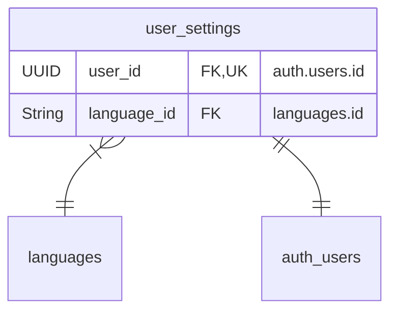

## family
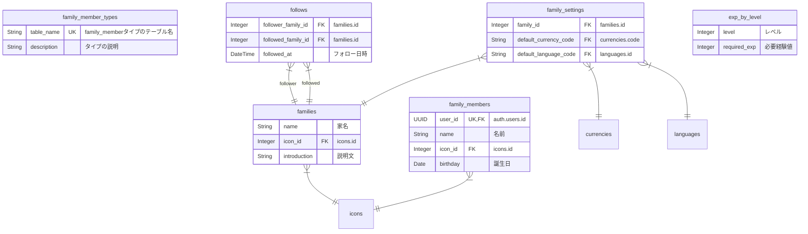

## parent
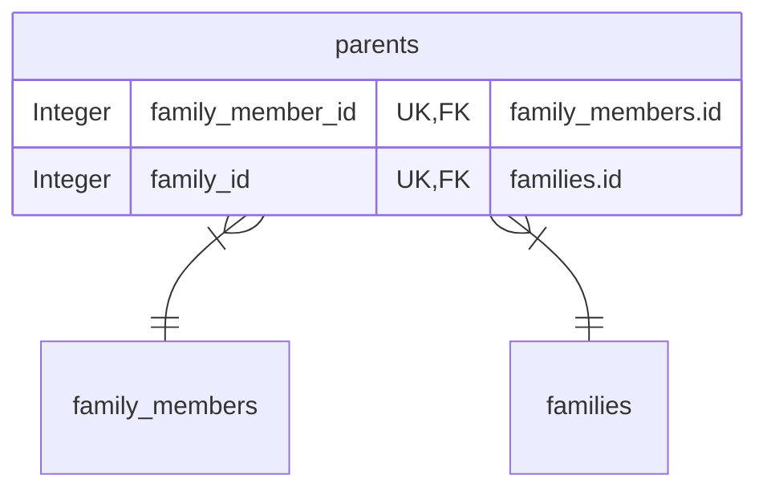

## child
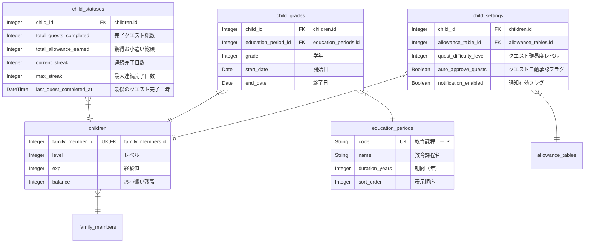

## bank
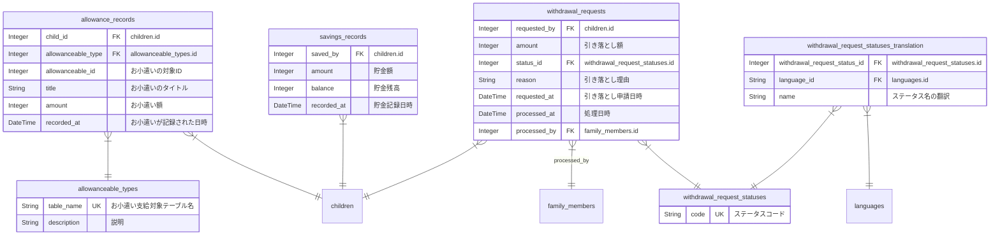

## allowance_tables
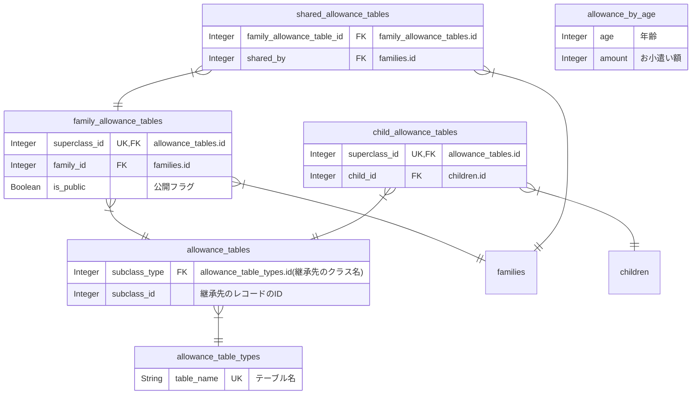

## level_tables
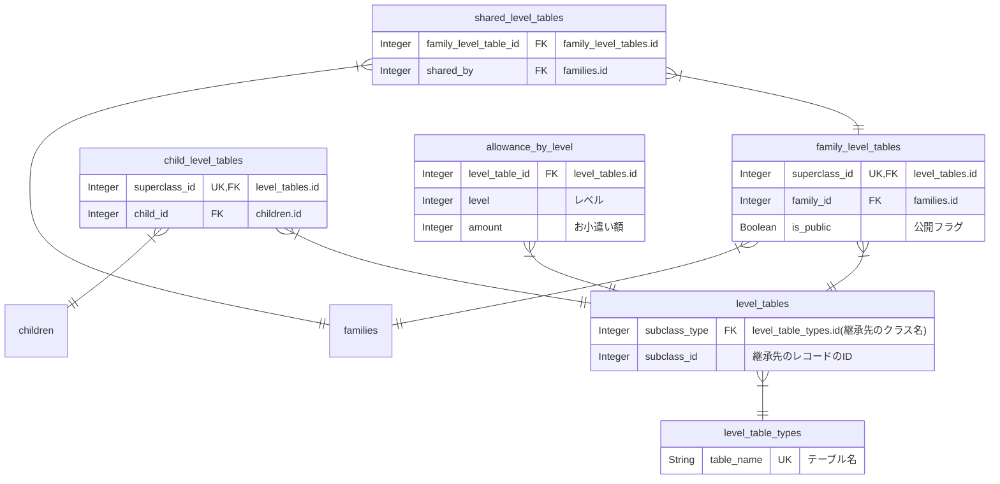

## quest/definition
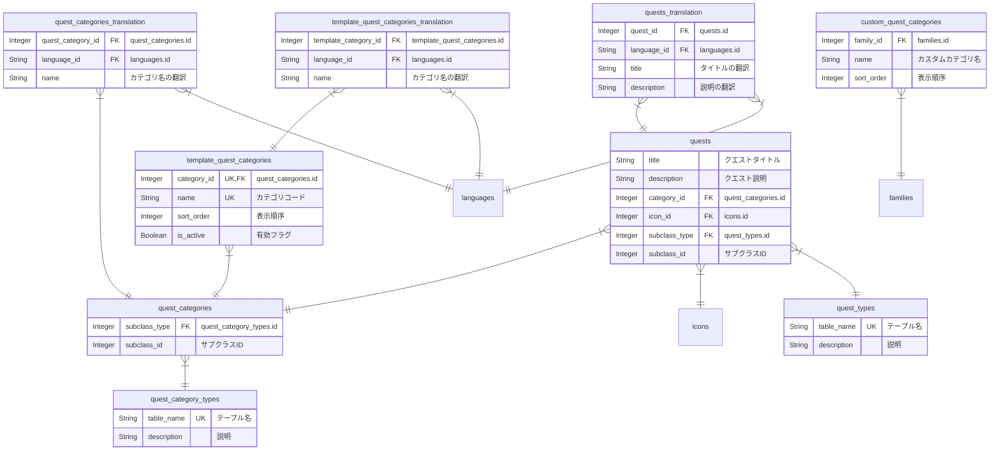

## quest/templates
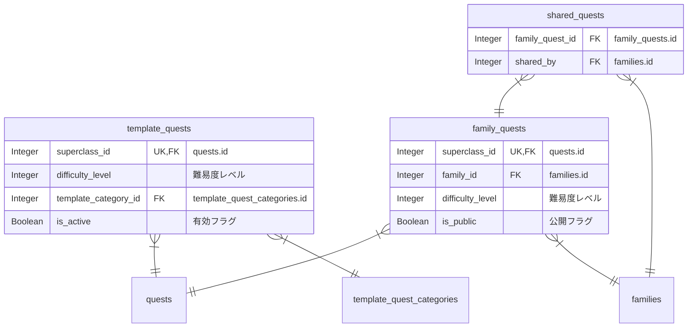

## quest/execution
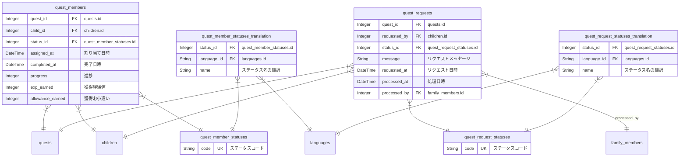

## quest/mechanics
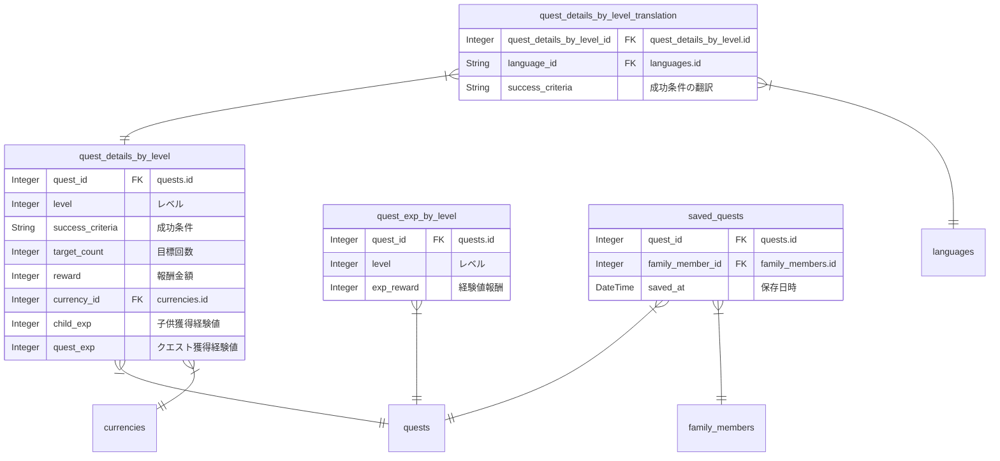

## comment
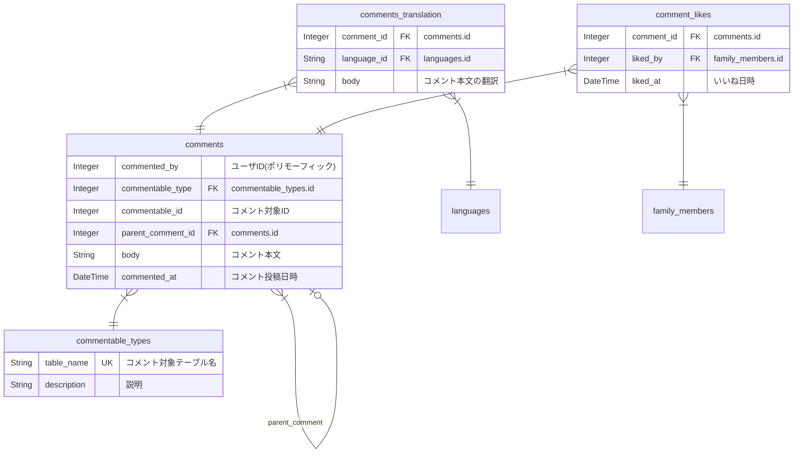

## notification
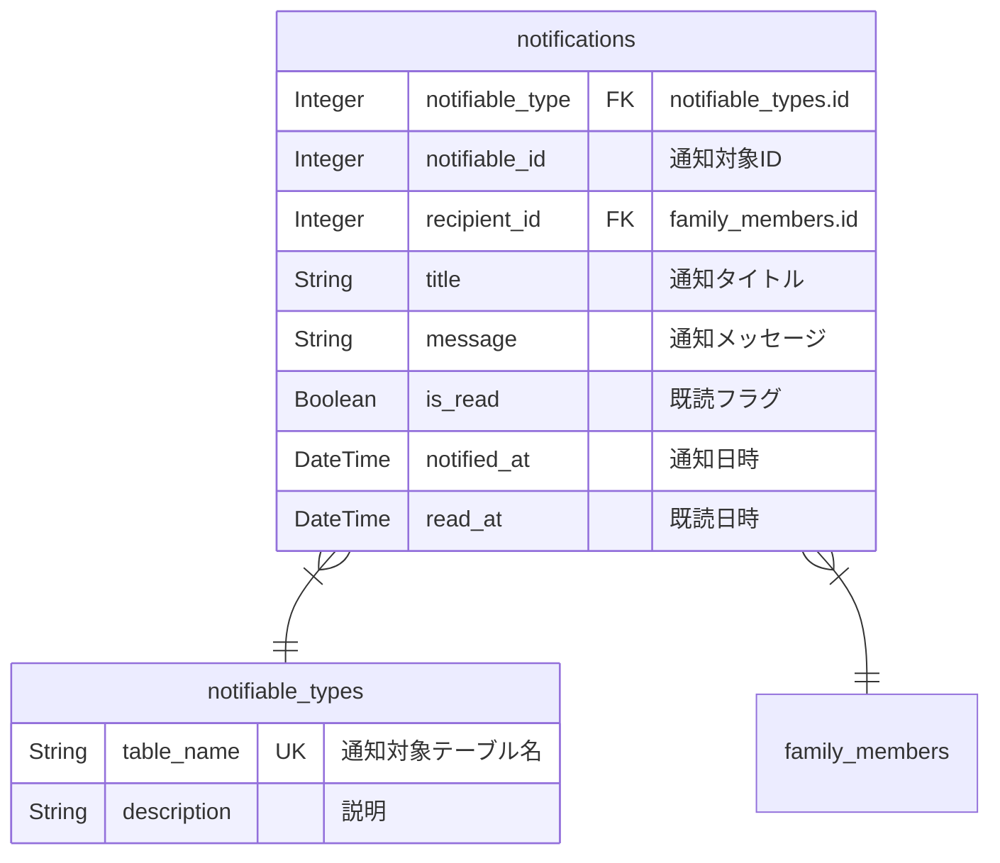

## report
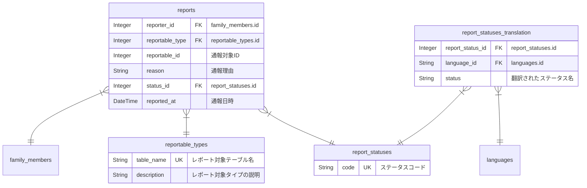
