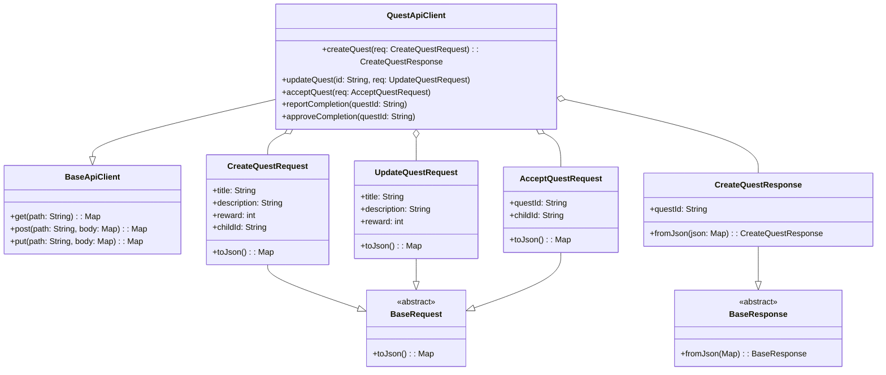

# APIClientの仕様

## クラス図

```mermaid
classDiagram
    class BaseApiClient {
        +get(path: String): Map
        +post(path: String, body: Map): Map
        +put(path: String, body: Map): Map
    }

    class QuestApiClient {
        +createQuest(req: CreateQuestRequest): CreateQuestResponse
        +updateQuest(id: String, req: UpdateQuestRequest)
        +acceptQuest(req: AcceptQuestRequest)
        +reportCompletion(questId: String)
        +approveCompletion(questId: String)
    }

    QuestApiClient --|> BaseApiClient

    class CreateQuestRequest {
        +title: String
        +description: String
        +reward: int
        +childId: String
        +toJson(): Map
    }

    class CreateQuestResponse {
        +questId: String
        +fromJson(json: Map): CreateQuestResponse
    }

    class UpdateQuestRequest {
        +title: String
        +description: String
        +reward: int
        +toJson(): Map
    }

    class AcceptQuestRequest {
        +questId: String
        +childId: String
        +toJson(): Map
    }

    QuestApiClient o-- CreateQuestRequest
    QuestApiClient o-- CreateQuestResponse
    QuestApiClient o-- UpdateQuestRequest
    QuestApiClient o-- AcceptQuestRequest

    class BaseRequest {
        <<abstract>>
        +toJson(): Map
    }

    class BaseResponse {
        <<abstract>>
        +fromJson(Map): BaseResponse
    }

    CreateQuestRequest --|> BaseRequest
    UpdateQuestRequest --|> BaseRequest
    AcceptQuestRequest --|> BaseRequest

    CreateQuestResponse --|> BaseResponse
```

## 注意事項
- RequestとResponceオブジェクトはAPIClientファイル内に記載すること
    - ばらばらに記載しないこと
