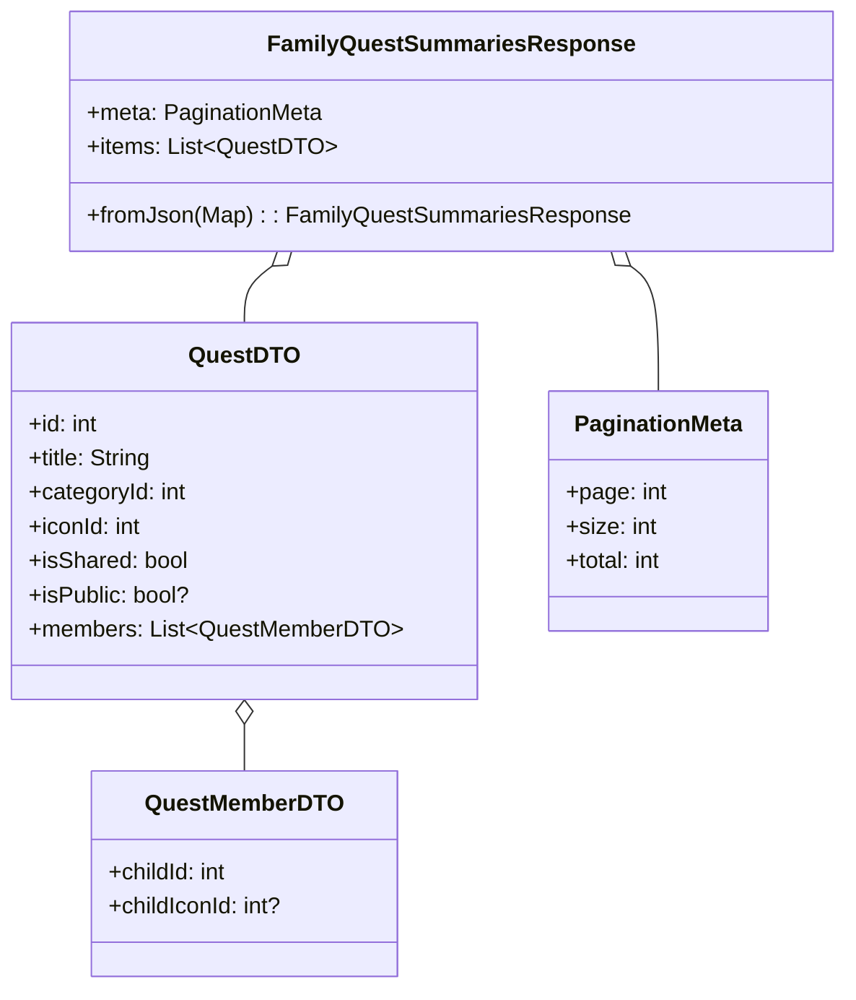

# APIClientの仕様

## DTO / Request / Response 命名規則
- 取得: `〇〇Response`
- リスト取得(ページネーションあり): 
    - `〇〇sResponse`
         - `List[〇〇Dto]`
         - `PaginationMeta`
- 作成: `Create〇〇Request`, `Create〇〇Response`
- 更新: `Update〇〇Request`

- 基本的にはAPサーバ側のオブジェクト構造と同じにする

## メソッド
- `toJson()` は全Request共通
- `fromJson()` はResponse/DTO共通

## 配置ルール
- Request/Responseクラスは対応するAPIClientの中に記載
    - ばらばらに記載しないこと

## クラス図

## リスト形式のオブジェクトの場合

