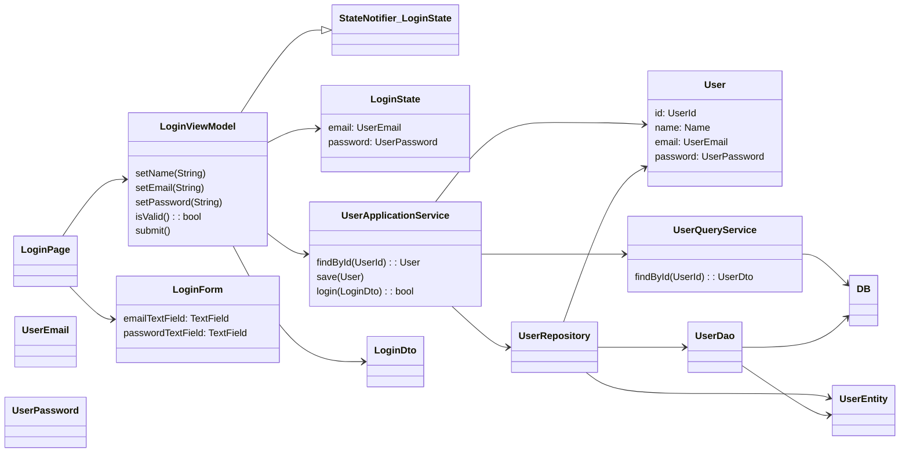

```mermaid
classDiagram
    direction LR
    class LoginPage
    LoginPage --> LoginViewModel
    LoginPage --> LoginForm
    class LoginForm {
        emailTextField: TextField
        passwordTextField: TextField
    }
    class LoginViewModel {
        setName(String)
        setEmail(String)
        setPassword(String)
        isValid(): bool
        submit()
    }
    LoginViewModel --|> StateNotifier_LoginState
    LoginViewModel --> LoginState
    LoginViewModel --> UserApplicationService
    LoginViewModel --> LoginDto
    class LoginDto
    class LoginState {
        email: UserEmail
        password: UserPassword
    }
    class User {
        id: UserId
        name: Name
        email: UserEmail
        password: UserPassword
    }
    class UserEmail
    class UserPassword
    class UserApplicationService {
        findById(UserId): User
        save(User)
        login(LoginDto): bool
    }
    UserApplicationService --> UserQueryService
    UserApplicationService --> UserRepository
    UserApplicationService --> User
    class UserQueryService {
        findById(UserId): UserDto
    }
    UserQueryService --> DB
    class UserRepository
    UserRepository --> User
    UserRepository --> UserDao
    UserRepository --> UserEntity
    class UserDao
    UserDao --> UserEntity
    UserDao --> DB
    class UserEntity
```
