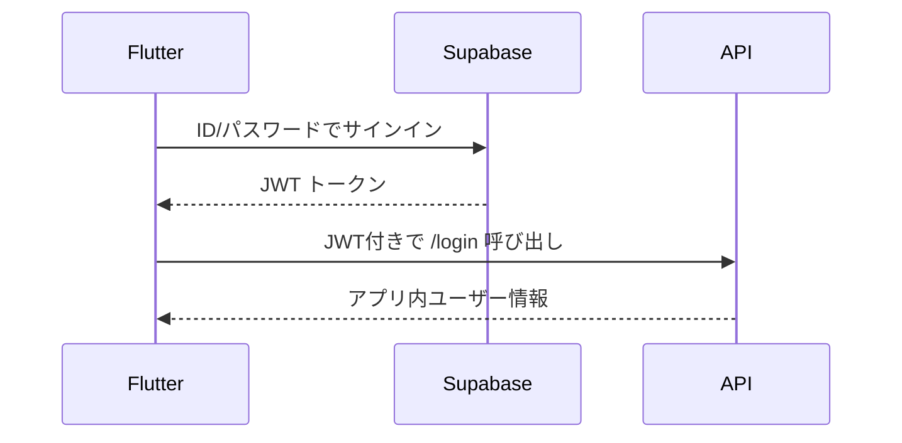

# 🔍 ログインエラー調査レポート

**日時**: 2025年7月21日 21:46-21:55  
**初回エラー**: `ClientException: Failed to fetch, uri=http://0.0.0.0:8000/api/v1/login`  
**修正後エラー**: `HttpException: HTTP Error: 401 - Unauthorized`

## 📋 問題の概要

ログイン機能で2段階のエラーが発生：
1. **CORS エラー** → 修正済み ✅
2. **401 Unauthorized エラー** → 調査中 🔍

## 🔍 根本原因分析

### 1. CORSプリフライトリクエストの問題 ✅ 解決済み
- **現象**: ブラウザが自動的にOPTIONSリクエストを送信
- **原因**: FastAPIのCORS設定が不十分
- **修正**: `allow_methods` に明示的に `"OPTIONS"` を追加

### 2. JWT認証の問題 ✅ 解決済み
- **現象**: `POST /api/v1/login HTTP/1.1" 401 Unauthorized`
- **原因**: JWT issuer の不一致
  - 実際のJWT: `"iss": "https://esoxujkmlwzotpgwbyxq.supabase.co/auth/v1"`
  - API期待値: `"supabase"` ← **これが間違いだった**
- **修正**: `jwt_handler.py` の issuer を正しい値に変更

### 3. デバッグで確認できた情報
- ✅ Supabase認証は正常動作
- ✅ JWTトークンは正しく取得されている
- ✅ Authorizationヘッダーは正しく設定されている
- ✅ JWT_SECRET環境変数も正しく設定済み

### 3. 認証フローの理解


## 🛠️ 実施した修正

### 1. CORS設定の強化 ✅
```python
app.add_middleware(
    CORSMiddleware,
    allow_origins=["*"],
    allow_credentials=True,
    allow_methods=["GET", "POST", "PUT", "DELETE", "OPTIONS"],
    allow_headers=["*"],
    expose_headers=["*"],
)
```

### 2. デバッグログの追加 🆕
- `LoginUsecase` にトークン取得状況のログ追加
- `BaseApiClient` にリクエスト詳細のログ追加

## 📈 進捗状況

- ✅ **CORS問題**: `OPTIONS /api/v1/login HTTP/1.1" 200 OK` で解決確認
- ✅ **認証問題**: JWT issuer 不一致を修正済み

## 🚀 次のアクション

1. **APIサーバ再起動**: JWT設定変更を反映
2. **ログイン機能テスト**: 正常動作確認
3. **成功確認後**: デバッグログの削除を検討

---
*調査者: 海夢ちゃん 🥰✨*
