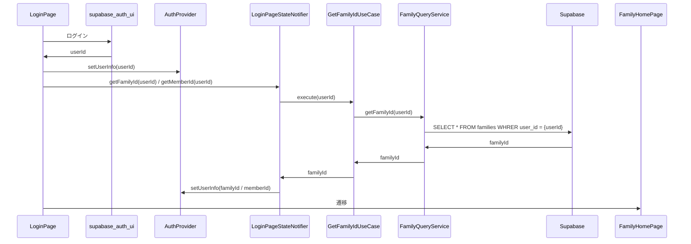

# [Feature] ログイン画面の実装内容確認

## 概要
ログイン画面の実装内容を確認し、不足機能を補足する

## 要件定義
### 機能要件
- [ ] メールアドレス/パスワードでのログイン(supabase_auth_ui)
- [ ] パスワードを忘れた場合のリセット機能(supabase_auth_ui)
- [ ] OAUTH機能の実装(supabase_auth_ui)
- [ ] ローディング状態の表示
- [ ] mailaddressとパスワードのバリデーションチェック
(`supabase_auth_ui`側で行っている場合は割愛)
- [ ] ログインボタンの上にトグルボタンの配置
  - [ ] `家族`状態: この状態でログインを押すと、ログイン時に取得したuser_idをもとに、familiesテーブルからfamily_idを取得し、家族ホーム画面に遷移する
  - [ ] `メンバー`状態: この状態でログインを押すと、ログイン時に取得したuser_idをもとに、membersテーブルからmember_idを取得し、ユーザホーム画面に遷移する
- [ ] 認証情報の保持
  - [x] ChangeNotifierを継承したAuthProviderを作成し、user_id、family_idもしくはmember_idを保持する

### 非機能要件
- [ ] セキュリティ要件（パスワード暗号化等）

## 技術仕様
### 使用技術
- Flutter
- Riverpod（状態管理）
- flutter_hooks（UIコントロールの状態管理）
- Supabase（認証）

### 対象ファイル
- lib/login/*

### シーケンス図

