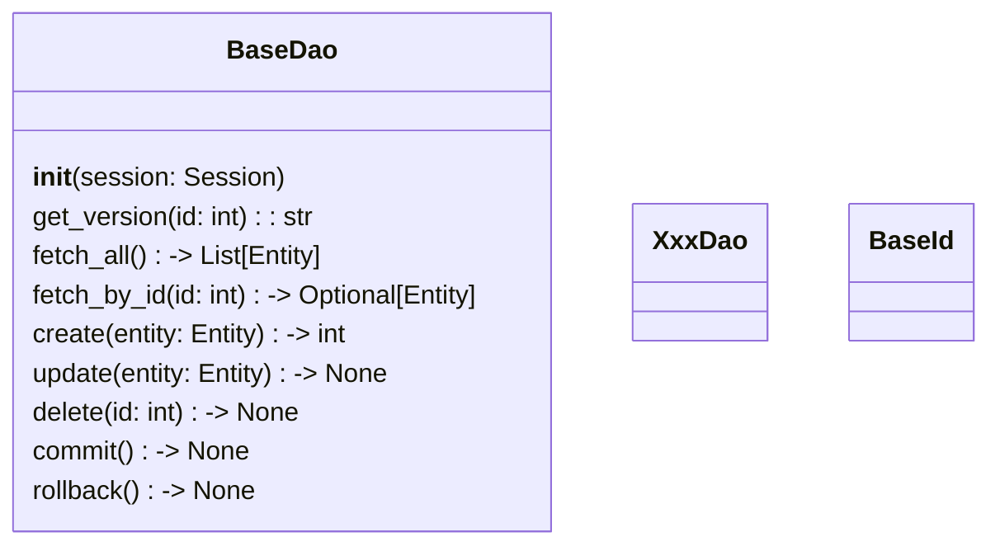

[indexへ戻る](../index.md)
# 🔍 DAO

## 概要
- DAOは`SQLAlchemy`のORMを使用して、データベースとのやり取りを行う
- キャッシュ機能を使用して、データのキャッシュ操作も行う
  - [キャッシュ管理](キャッシュ管理.md)

## オブジェクト図

## `BaseDao`クラス
### 概要
- 
### 配置場所
- 

### 命名規則

## `XxxDao`クラス
### 概要
- 

### 配置場所
- 

### 命名規則
- 

### キャッシュ機能
- `find_by_id()`や`find_all()`などのメソッドには、キャッシュ保存のデコレータを付与する
- `update()`や`delete()`などのメソッドには、キャッシュ削除のデコレータを付与する
