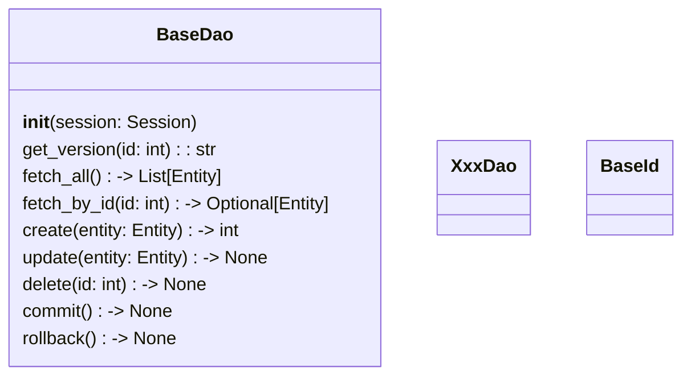

[indexへ戻る](../index.md)
# 🔍 DAO

## 概要
- DAOは`SQLAlchemy`のORMを使用して、データベースとのやり取りを行う
- キャッシュ機能を使用して、データのキャッシュ操作も行う
  - [キャッシュ管理](キャッシュ管理.md)

## オブジェクト図

## `BaseDao`クラス
### 概要
- DAOクラスの基底クラス

- ジェネリクスでエンティティタイプを受け取る
  - 例: `class XxxDao(BaseDao[XxxEntity]):`

- 各DAOで使用する共通の具象メソッドを提供する

### 配置場所
- `core/dao/base_dao.py`

## `XxxDao`クラス
### 概要
- 一つのエンティティに対して一つのDAOを作成する
  - `QuestsEntity`に対して`QuestDao`を作成

- 基底クラス`BaseDao`を継承する
- 基底クラスにない専用処理を実装する

- 基底クラスを継承時、対応するエンティティを指定する

### 配置場所
- `{関心事名}/dao/xxx_dao.py`

### 命名規則
- `{関心事名}Dao`
- 関心事名は

### キャッシュ機能
- `find_by_id()`や`find_all()`などのメソッドには、キャッシュ保存のデコレータを付与する
- `update()`や`delete()`などのメソッドには、キャッシュ削除のデコレータを付与する
