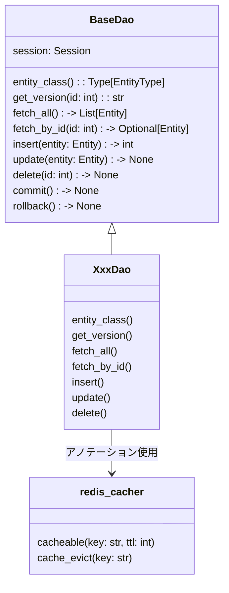

[indexへ戻る](../index.md)
# 🔍 DAO

## 概要
- DAOは`SQLAlchemy`のORMを使用して、データベースとのやり取りを行う
- キャッシュ機能を使用して、データのキャッシュ操作も行う
  - [キャッシュ管理](キャッシュ管理-cache.md)を参照

## オブジェクト図


## `BaseDao`クラス
### 概要
- DAOクラスの基底クラス

- ジェネリクスでエンティティタイプを受け取る
  - 例: `class XxxDao(BaseDao[XxxEntity]):`

- 各DAOで使用する共通の具象メソッドを提供する

### 配置場所
- `core/dao/base_dao.py`

## `XxxDao`クラス
### 概要
- 一つのエンティティに対して一つのDAOを作成する
  - `QuestsEntity`に対して`QuestDao`を作成

- 基底クラス`BaseDao`を継承する
- 基底クラスにない専用処理を実装する

- 基底クラスを継承時、対応するエンティティを指定する

- BaseDaoのメソッドをラッピングしてキャッシュ機能を付与する
- `lazy loading戦略`に従う
  - evict: 古いキャッシュを削除するだけ
  - 次回fetch時: 最新データでキャッシュ再構築
  - put(削除時にキャッシュの貼り直し)は不要


- メソッドのドキュメンテーションは書かないこと
  - 基底クラスのドキュメンテーションを参照する


### クラスの実装例

```python
from aqapi.core.config.redis_config import redis_client
from aqapi.core.cache.redis_cacher import RedisCacher
cacher = RedisCacher(redis_client)

class QuestDao(BaseDao):
    """クエストDAOクラス"""

    def __init__(self, session: AsyncSession):
        super().__init__(session)

    @property
    def entity_class(self) -> type[QuestsEntity]:
        return QuestsEntity
    
    @cacheable("quests:all")
    async def fetch_all(self) -> List[QuestsEntity]:
        return await super().fetch_all()

    @cacheable("quests:{id}")
    async def fetch_by_id(self, id: int) -> Optional[QuestsEntity]:
        return await super().fetch_by_id(id)

    @cache_evict("quests:all")
    async def insert(self, entity: QuestsEntity) -> int:
        return await super().insert(entity)

    @cache_evict("quests:all", "quests:{entity.id}")
    async def update(self, entity: QuestsEntity) -> None:
        await super().update(entity)

    @cache_evict("quests:all", "quests:{id}")
    async def delete(self, id: int) -> None:
        await super().delete(id)
```

### 配置場所
- `{関心事名}/dao/xxx_dao.py`

### 命名規則
- `{関心事名}Dao`

- 関心事名は単数形を用いる
  - `QuestsEntity`に対して`QuestDao`とする

- アノテーションのキーの名前は`{関心事名}s:{値}`とする
  - キー: `quests`, `children`, `families`など
  - 値: `all`, `{id}`, `{entity.id}`など
