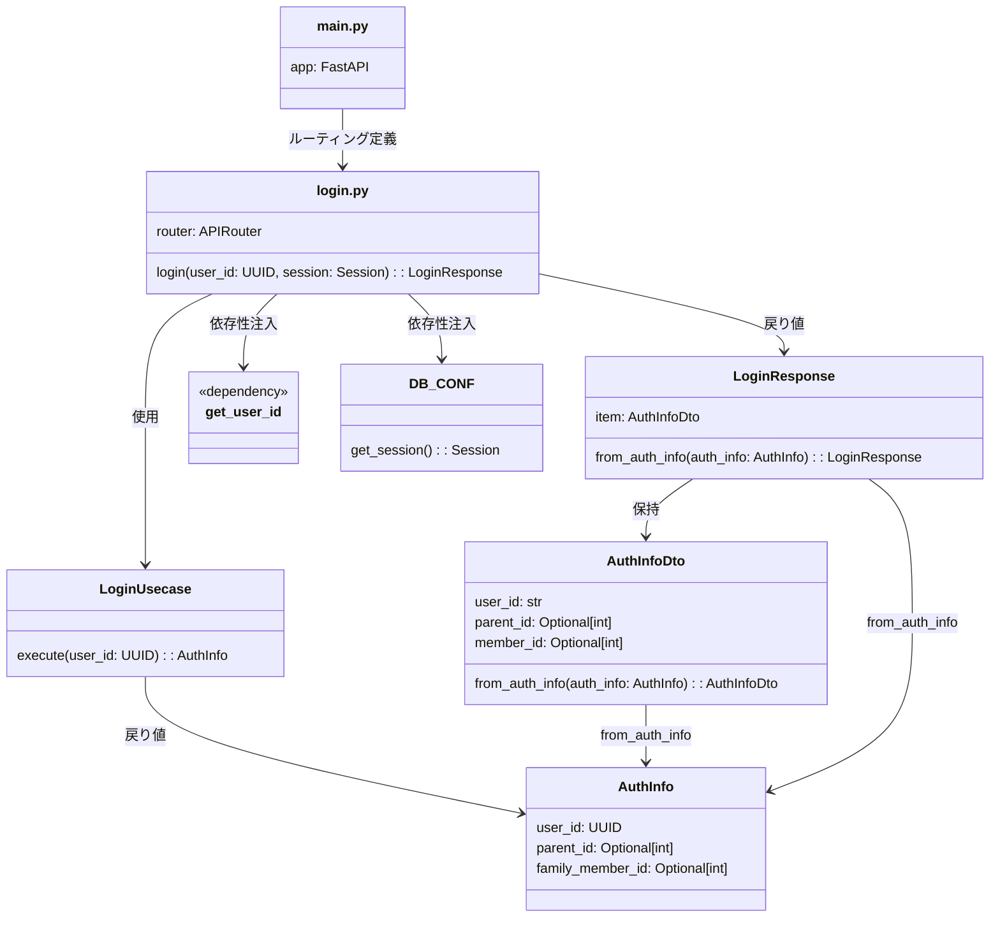

# 🔐 Login API - クラス図

## 概要
Login APIエンドポイントの構成図です。

## クラス図

## ファイル構成

### `/auth/api/v1/login.py`
- **役割**: ログインエンドポイント関数の定義
- **責務**: 
  - JWTトークンからユーザーIDを取得
  - LoginUsecaseの呼び出し
  - HTTPレスポンスの返却

### `/auth/api/v1/login_response.py`  
- **役割**: ログインレスポンスクラスの定義
- **責務**:
  - APIレスポンス形式の定義
  - ドメインモデルからDTOへの変換

## 処理フロー

1. **リクエスト受信**: JWTトークン付きでPOST /loginにアクセス
2. **認証**: get_user_idでJWTトークンからユーザーIDを取得
3. **業務処理**: LoginUsecaseでユーザー情報を取得
4. **レスポンス生成**: AuthInfoからLoginResponseを生成
5. **レスポンス返却**: JSONでクライアントに返却
