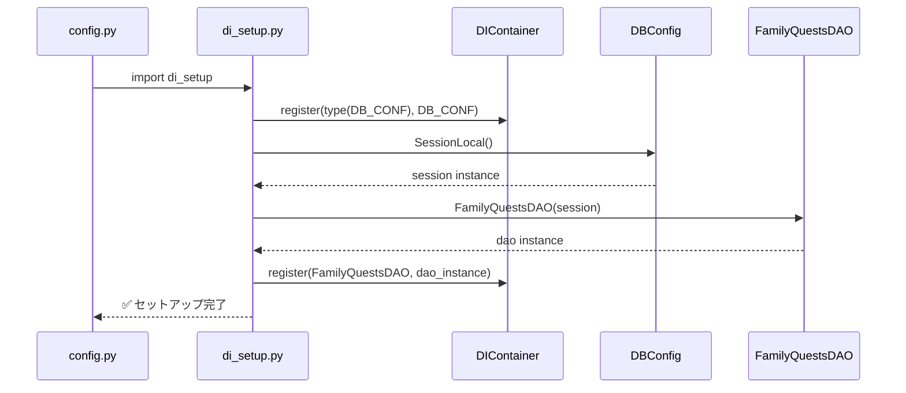

# DIコンテナ セットアップ クラス図

## 概要
DIコンテナのセットアップ処理におけるクラス関係図

## クラス図

```mermaid
classDiagram
    class DBConfig {
        +engine: Engine
        +SessionLocal: sessionmaker
        +Base: declarative_base
        +__init__()
        +get_db() Generator
        +import_all_entities() bool
    }

    class DIContainer {
        -_singletons: Dict[Type, Any]
        -_factories: Dict[Type, Callable]
        -_lock: Lock
        +register(type: Type[T], obj: T) None
        +registers(type: Type[T], objs: List[T]) None
        +get(type: Type[T]) T
        +reset() None
    }

    class FamilyQuestsDAO {
        +session: Session
        +__init__(session: Session)
    }

    class Session {
        <<SQLAlchemy>>
    }

    %% setup処理でのインスタンス作成と登録
    DBConfig ||--o DIContainer : register
    FamilyQuestsDAO ||--o DIContainer : register
    Session ||--o FamilyQuestsDAO : injection
    
    %% 依存関係
    DBConfig --> Session : creates
    FamilyQuestsDAO --> Session : uses

    note for DIContainer "グローバルインスタンス\n_container"
    note for DBConfig "DB_CONF = DBConfig()\nconfig.pyで初期化"
    note for FamilyQuestsDAO "family_quests_dao_instance\n= FamilyQuestsDAO(session)"
```

## セットアップフロー



## ポイント

1. **手続き型セットアップ**: 関数やクラスを使わず、直接的な登録処理
2. **本番用インスタンス**: 実際に使用されるDAO、Repositoryを登録
3. **依存関係の注入**: DAOには明示的にSessionを注入
4. **config.pyからの呼び出し**: アプリケーション起動時の自動初期化
