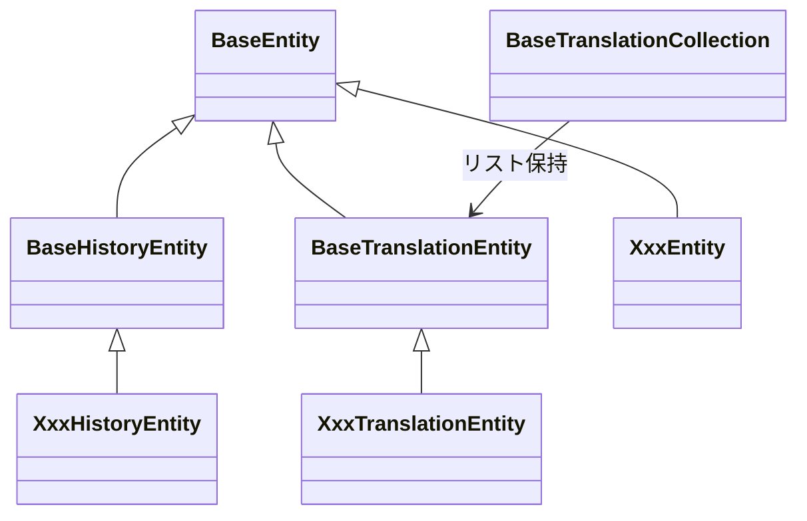

[indexへ戻る](../index.md)
# 🔍 エンティティ

## 概要
- 

## オブジェクト図

## `BaseEntity`クラス
### 概要
- sqlalchemyのdeclarative_baseを継承した基底クラス
- 初期データ投入やドメインモデルから生成するメソッドを持つ

### 配置場所
- `core/entity/base_entity.py`

## `XxxEntity`クラス
### 概要
- 各関心事のEntity
- `BaseEntity`を継承する
- 

### 配置場所
- `{関心事名}/entity/XxxEntity`

### 命名規則
- `{関心事名の複数形}Entity`
  - 例: `QuestsEntity`, `ChildrenEntity`

## `BaseHistoryEntity`クラス
### 概要
- 履歴エンティティが継承する基底クラス

### 配置場所
- `core/entity/base_history_entity.py`

## `XxxHistoryEntity`クラス
### 概要
- 特定のエンティティの履歴Entity

### 配置場所
- 

### 命名規則
- 

## `BaseTranslationEntity`クラス
### 概要
- 

### 配置場所
- 

### 命名## `BaseEntity`クラス
### 概要
- 

### 配置場所
- 

### 命名規則
- 

## `BaseTranslationCollection`クラス
### 概要
- 

### 配置場所
- 

### 命名規則
- 

## `BaseEntity`クラス
### 概要
- 

### 配置場所
- 

### 命名規則
- 
