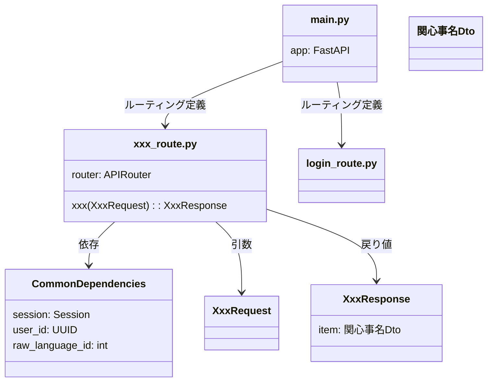
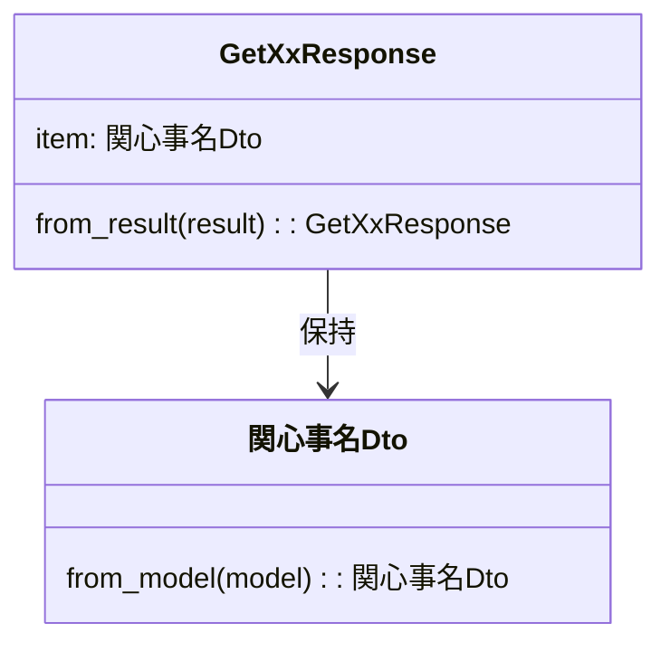
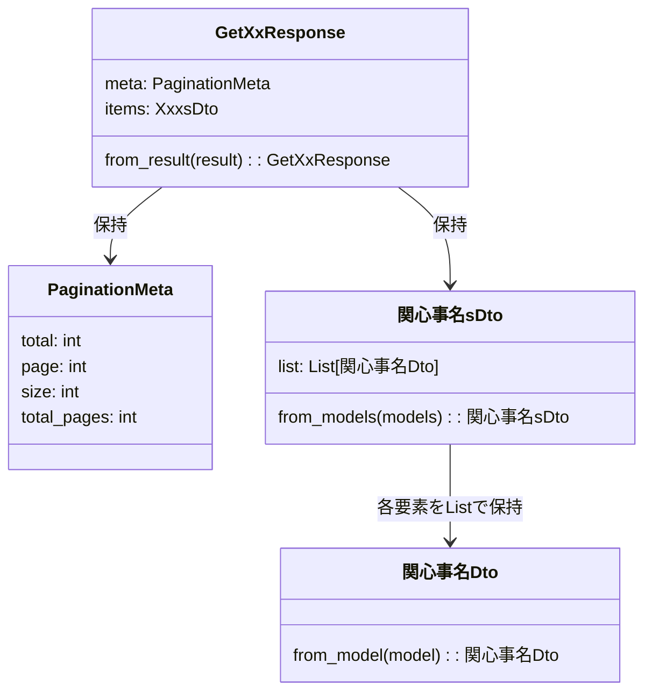

[indexへ戻る](../index.md)
# 🌐 エンドポイント関連

## 概要
- apiサーバのエンドポイントを定義するためのモジュール

## オブジェクト図

## `main.py`ファイル
### 概要
- APIサーバのエントリポイント
- APIサーバの初期設定(コンフィグ読み込みやDIコンテナの初期化など)を行う
- ルーティングの定義を行う
  - 実際のrouteファイルは分割し、main.pyで`include_router`を使って読み込む

### 配置場所
- ./main.py

## route用のファイル
### 概要
- エンドポイント関数の定義を行うファイル
- 一ファイルにつき一つのエンドポイントを定義する
- エンドポイント関数では、usecaseクラスやquery_serviceクラスを呼び出すこと
  - 基本的には具体的な処理はusecaseやquery_serviceに委譲すること

### 配置場所
- `./{関心事名}/api/v{バージョン番号}/{エンドポイント関数名}_route.py`
  - 例: `quest/api/v1/get_quest_route.py`

### 命名規則
- ファイル名は`{エンドポイントの関数名}_route`とする
  - 例: `get_quest_route.py`

- エンドポイント関数の名前は動詞から始める
  - 例: `get_quest`, `create_quest`, `login`

- エンドポイントの名前: 
  - 基本的にはRESTfulな命名規則に従う
    - 例: `/quests`, `/quests/{quest_id}`, `/users/{user_id}/quests`
  - ただし、RESTfulとは違い動詞も使って良い
    - `/quests/create`, `/quests/{quest_id}/update`, `login`

## `CommonDependencies`クラス
### 概要
- エンドポイント関数で共通して使用する依存関係を定義
- FastAPIの`Depends`を使用して依存性注入を行う

- __init__ではアプリで使用するコンフィグ周りの設定を行う

### 配置場所
- `./{関心事名}/core/api/common_dependencies.py`

## `Request`クラス
### 概要
- エンドポイントのリクエストを表現するクラス

### 配置場所
- `./{関心事名}/api/v{バージョン番号}/{エンドポイント関数名}_request.py`
  - 例: `quest/api/v1/get_quest_request.py`

### 命名規則
- クラス名は`{エンドポイント関数名}Request`とする

- 入れ子構造のRequestを保持する場合:
  - `{関心事名}sDto`や`{関心事名}Dto`とする
  - 例: `QuestSummariesDto`, `QuestDto`

## `Response`クラス
### 概要
- エンドポイントのレスポンスを表現するクラス
- usecaseやquery_serviceの結果から直接生成するファクトリメソッドを持つ
- 原則として、Responseクラスがusecaseやquery_serviceに依存することは問題ないとする
- アノテーションは`pydantic`の`@dataclasses.dataclass`を付与すること

### 配置場所
- `./{関心事名}/api/v{バージョン番号}/{エンドポイント関数名}_response.py`
  - 例: `quest/api/v1/get_quest_response.py`

### 命名規則
- トップレベルのクラス名は`{エンドポイント関数名}Response`とすること
- トップレベルのクラスに直接オブジェクトを保持せず、Dtoクラスとして定義すること
  - 例: `GetQuestResponse`の中に`QuestDto`を定義する

- 単一のオブジェクトを返す場合:
  - `{関心事名}Dto`とする
  - 例: `QuestDto`

- 入れ子構造のRequestを保持する場合:
  - `{関心事名}s`や`{関心事名}`とする
  - 例: `QuestSummaries`, `Quest`
  
- 配列のデータを返す場合:
  - Listでオブジェクトを包まず、新たにクラスを定義すること
  - `{関心事名}sDto`とすること
  - 例: `QuestsDto`, `QuestSummariesDto`

- ファクトリメソッドは`from_xxx`とすること
  - 例: usecaseのresultから生成する場合は`from_result`とすること
  - 例: modelから生成する場合は`from_model`とすること

### ページネーションを含む場合
- ページネーションのメタ情報はトップレベルのResponseに含める
  - [ページネーションについて](ページネーション-pagination.md)
- 実際に返すデータは`items`として定義する
  
### クラス図
#### 単一の場合

#### 複数の場合(ページネーションあり)

