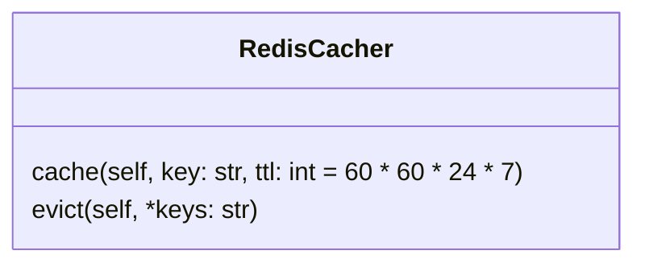

[indexへ戻る](../index.md)
# 🔍 キャッシュ管理

## 概要
- redisを使用したキャッシュ管理

## オブジェクト図

```mermaid
classDiagram
    class RedisCacher {
        cache(self, key: str, ttl: int = 60 * 60 * 24 * 7)
        evict(self, *keys: str)
    }
```

## `RedisCacher`クラス
### 概要
- redisを使用したキャッシュ管理クラス
- DAOクラスで使用する

### 配置場所
- `core/cache/redis_cacher.py`
