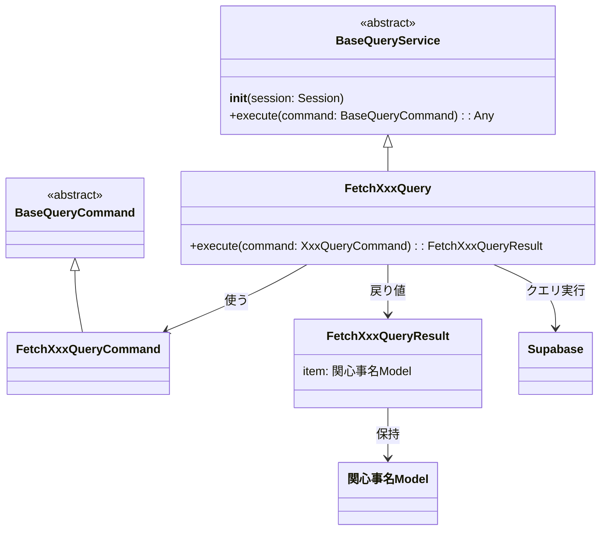
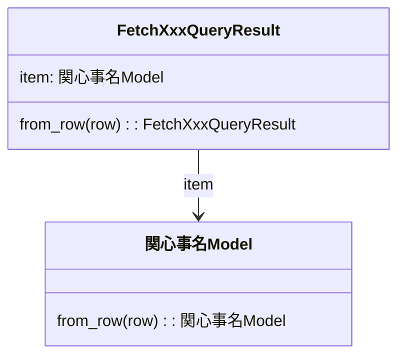
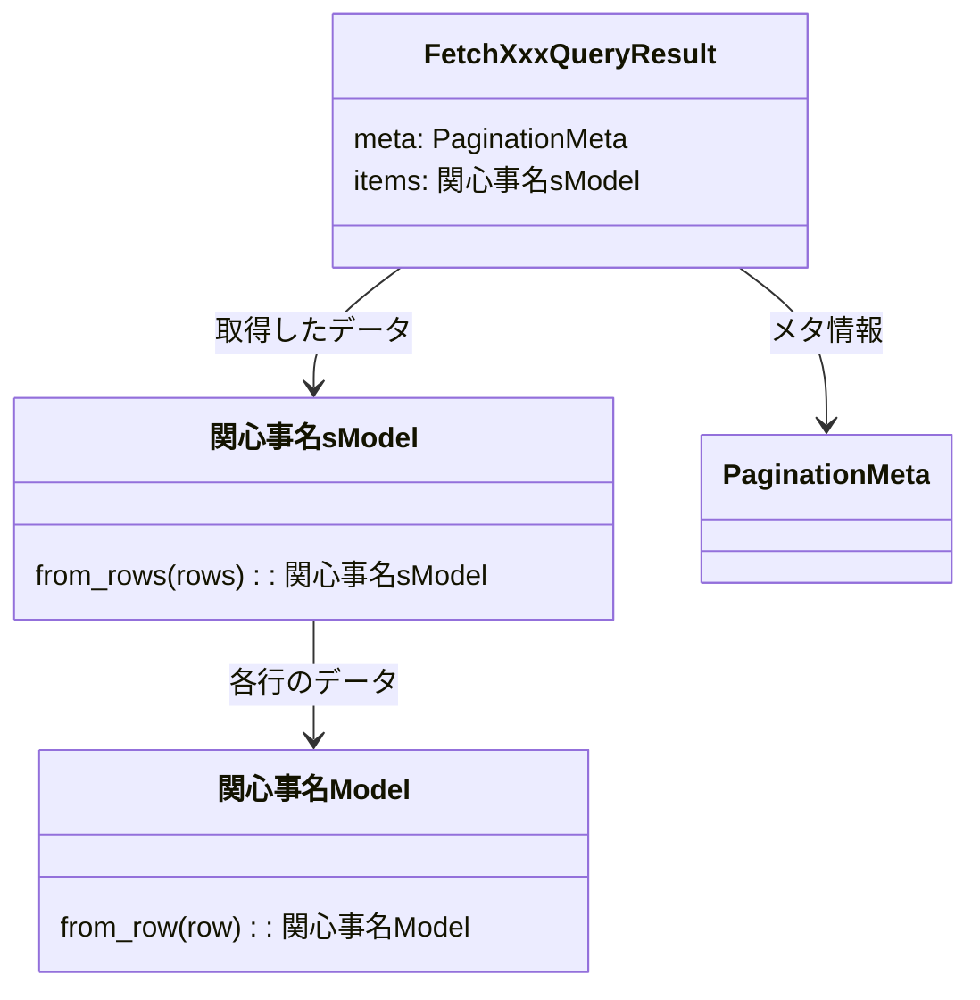

[indexへ戻る](../index.md)
# 🔍 クエリサービス関連

## 概要
- `query_service`は、CQRSに乗っ取り、データの取得に特化したクラス

## オブジェクト図

## `BaseQueryService`抽象クラス
- `BaseQueryService`は、全ての`query_service`の基底クラス
- `query_service`で共通の処理が発生した場合は`BaseQueryService`に実装すること
- `query_service`は一つのメソッドに対して一つのクラスとする
  - 原則一つのクラスでは一つのクエリを実行する
- クエリを実行するメソッドは`execute`とする

### 配置場所
- `/core/query_service/base_query_service.py`に配置

## `QueryService`クラス
### 原則
- 全てのQueryServiceクラスは、`BaseQueryService`を継承すること
- `query_service`は、一つのクエリにつき一つのクラスとする
  - 例: `FetchQuestSummaryQueryService`, `FetchFamilyMembersQueryService`
- `query_service`は、極力一回のクエリで完結するため、Joinを活用すること
- `query_service`は生のクエリは書かず、必ず`SQLAlchemyのORM`を使用すること
  - self.session.query(...)の形で書くこと
  
* `query_service`は読み込み専用のため、ドメインモデルを使用せず、ただのデータクラスを使用すること

### 配置場所
- `{関心事名}/query_service/fetch_Xxx_query.py`に配置すること

### 命名規則
- クラスの名前は`Fetch`から始まる動詞にする
  - `Fetch{関心事名}Query`
  - 例: `FetchSummaryQuestQuery`

- `QueryCommand`クラスのインスタンス名は`cmd`とすること
  - 例: `cmd: FetchQuestSummaryQueryCommand`

## `BaseQueryCommand`抽象クラス
### 概要
- `BaseQueryCommand`は、全ての`QueryCommand`の基底クラス
- `QueryCommand`で共通の処理が発生した場合は`BaseQueryCommand`に実装すること

- `@dataclass`を付与すること

### 配置場所
- `/core/query_service/base_query_service.py`に配置

## `QueryCommand`クラス
### 概要
- `query_service`の引数を表現するクラス
- `@dataclass`を付与すること

### 配置場所
- `{関心事名}/query_service/fetch_Xxx_query_command.py`に配置すること

### 命名規則
- クラス名: `FetchXxxQueryCommand`とする
  - 例: `FetchQuestSummaryQueryCommand`

## `QueryResult`クラス
### 概要
- `query_service`の結果を表現するクラス
- クエリの結果は、Resultに直接入れず、Modelクラスを定義して、そこに入れること

- クエリの結果が単一のオブジェクトの場合:
  - Resultの中に`関心事名Model`を定義する
  - 例: `FetchQuestSummaryQueryResult`の中に`QuestDetailModel`を定義する

- クエリの結果が配列の場合:
  - 配列の要素を表現するクラス(ファーストコレクション)を定義する
  - `関心事名sModel`とする
  - 例: `FetchQuestSummaryQueryResult`の中に`QuestSummariesModel`を定義する
  
- 結果にページネーションmetaが含まれる場合:
  - Resultの中に`PaginationMeta`を定義する
- [参考: ページネーションについて](ページネーション-pagination.md)

### 配置場所
- `{関心事名}/query_service/fetch_Xxx_query_result.py`に配置すること

### 命名規則
- クラス名: `FetchXxxQueryResult`とする
  - 例: `QuestSummaryQueryResult`
- 複数形の場合: `FetchXxxQueryResult`とし、内部に`{関心事名}sModel`を定義する
  - 例: `FetchQuestSummariesQueryResult`とし、内部に`QuestSummariesModel`を定義する

### メソッド
- `from_row`:
  - `Supabase`のクエリ結果(`row`)を受け取り、`Result`のインスタンスを生成するファクトリメソッド
- `from_rows`:
  - `Supabase`のクエリ結果(`rows`)を受け取り、複数の`Result`のインスタンスを生成するファクトリメソッド
  - `from_row`を利用して、各行から`Result`を生成する

### クラス図
#### 単一の場合

#### 複数の場合(ページネーションあり)

    
    
