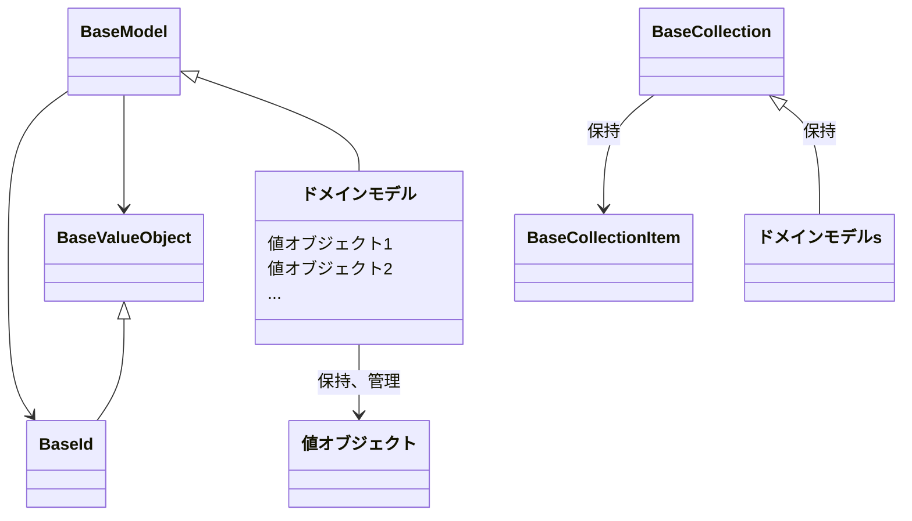

[indexへ戻る](../index.md)
# 🔍 ドメインモデル

## 概要
- ドメインモデルはいわゆる関心事をクラスと表現したもの

## オブジェクト図

## ドメインモデル
### 概要
- 値オブジェクトを保持する関心事の集約クラス
- 

### 配置場所
- 

### 命名規則
- ドメインモデル名は関心事名とする
  - 例: `quest.py`, `user.py`

### 関連エンティティの扱い
- 別コンテキストのエンティティを参照する場合は、IDのみを保持する
  - 例: `Quest`モデルと`User`モデル
- 同コンテキストのエンティティを参照する場合は、オブジェクトを保持する
  - 例: `Quest`モデルと`QuestStatus`モデルなど

### ドメインモデルの構成要素

#### メンバ
- 値オブジェクトや他のドメインモデルを保持する

#### メソッド
- 自身の状態を変更するメソッドのみを定義する
  - 例: `apply_quest`, `complete_quest`など
  - 注意: 他のオブジェクトの状態を変更したり、責務外のメソッドは定義せず、他のクラスに委譲すること

#### ファクトリメソッド
- ドメインモデル駆動なため、他クラスに依存したファクトリメソッドは極力使わない
- 例外として、以下のようなケースでは作成する
  - ドメインモデルの生成に複雑なロジックが必要な場合(例: `Quest`の生成時に、値オブジェクトではなく、生の値から生成する必要がある場合)
  - 他のドメインモデルや値オブジェクトを引数に取る場合
- 上記以外のケースでドメイン外からのファクトリメソッドが必要な場合は、Factoryクラスとして定義する
  - 例: `QuestFactory`など

## 値オブジェクト

### 基本原則
- `value_object/`は値オブジェクトを定義する場所
- 値オブジェクト名は関心事名と同じにする
- 他のドメインモデルでも使用する値オブジェクトは`shared/domain/value_object/`に配置する

### 値オブジェクトの構成要素

#### メンバ
- 値オブジェクトの値を保持する

#### メソッド
- コンストラクタ: 値を受け取り、バリデーションチェックを行う

## ファーストクラスコレクション

### 基本原則
- `models/`内にファーストクラスコレクションを定義
- ドメインモデルの集合は`list`ではなく、**必ず**ファーストクラスコレクションとして定義する

### ファーストクラスコレクションの構成要素

#### メンバ
- プライベートなドメインモデルのリストを保持する(`_list`)

#### メソッド
- 通常のリスト操作メソッドのオーバーライド
  - 例: `append`, `extend`, `__iter__`, `__getitem__`, `__setitem__`, `__delitem__`など
- 複数のドメインモデルを一括で操作、計算などを行うメソッド
  - 例: `get_total_points`, `get_completed_quests`など

## BaseModel

### 概要
`BaseModel`はドメインモデルの基底クラスです。

### 共通要素
- 共通化したいメソッドやプロパティを定義する
- version: ドメインモデルのバージョンを保持する(`aqapi/core/domain/value_object/version.py`)
