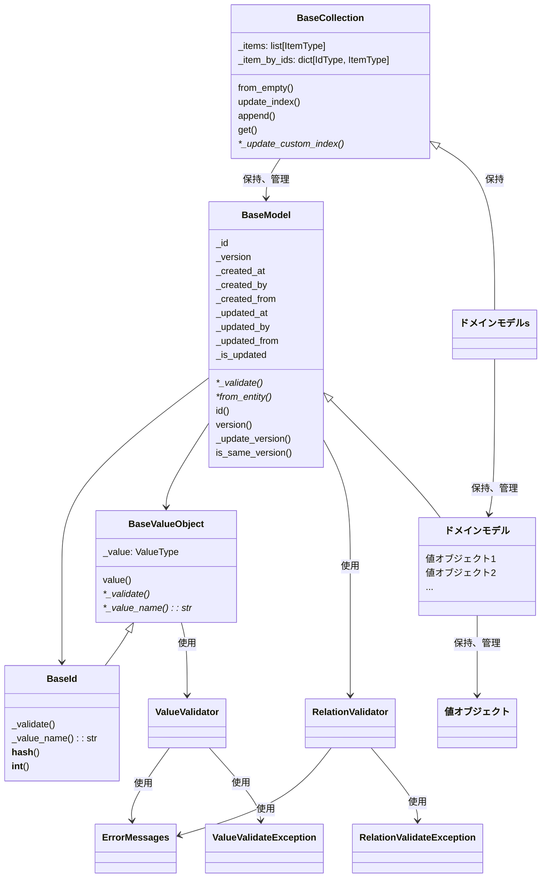

[indexへ戻る](../index.md)
# 🔍 ドメインモデル

## 概要
- 関心事を表現したクラス
- ビジネスロジックを保持する

## オブジェクト図

## `ErrorMessages`クラス
### 概要
- エラーメッセージを定義するクラス
- 言語ごとにエラーメッセージを定義する

### 配置場所
- `core/constants/error_messages.py`

### 命名規則
- メソッド名は自由に決めて良い
- 対応する言語のエラーメッセージを定義すること

## `ValueValidator`クラス
### 概要
- 値オブジェクトの値を検証するクラス

### 配置場所
- `core/validator/value_validator.py`

### 命名規則
- メソッド名は`validate`から始めること
  - 例: `validate_positive_integer`, `validate_email_format`

## `RelationValidator`クラス
### 概要
- 値オブジェクト間の関係を検証するクラス
- ドメインモデル間の検証はここでは行わない

## `BaseValueObject`クラス
### 概要
- 値オブジェクトの基底クラス
- 値オブジェクトの値を保持し、検証を行う

### 配置場所
- `core/domain/value_object/base_value_object.py`

## `BaseId`クラス
### 概要
- IDを表現する値オブジェクトの基底クラス
- IDの値を保持し、検証を行う
- ドメインモデルのIDの値オブジェクトに継承させる

### 配置場所
- `core/domain/value_object/base_id.py`

## `BaseModel`クラス
### 概要
- ドメインモデルの基底クラス
- ドメインモデルのID、バージョン、作成日時、更新日時などの共通属性を持つ
- ドメインモデルの値オブジェクトやIDを保持し、検証を行う
- ドメインモデルのバージョン管理や更新処理を行う

### 配置場所
- `core/domain/base_model.py`

## `BaseCollection`クラス
### 概要
- ドメインモデルのコレクションを表現する基底クラス(ファーストコレクション)
- ドメインモデルのリストを保持し、管理する
- ドメインモデルに対するビジネスロジックを提供する
- IDの辞書(インデックス)を保持する
  - リスト更新時に`update_item_by_ids(self)`を呼び出すことで、IDの辞書を更新する
  - 具象クラスでは必要に応じで任意の辞書を保持することも可能
    - 具象クラスの辞書の更新は`_update_custom_index(self)`メソッドをオーバーライドして実装する
- ドメインモデルの集合は`list`ではなく、**必ず**ファーストクラスコレクションとして定義する

## ドメインモデル
### 概要
- 値オブジェクトを保持する関心事の集約クラス
- ゲッターは原則定義せず、必要な場合にのみ定義する

### 配置場所
- `{関心事名}/domain/{関心事名}.py`
  - 例: `quest/domain/quest.py`

### 命名規則
- ドメインモデル名は関心事名とする
  - 例: `Quest`, `Child`など

### 関連アグリゲートの扱い
- 別コンテキストのアグリゲートを参照する場合は、IDのみを保持する
  - 例: `Quest`モデルと`User`モデル
- 同コンテキストのアグリゲートを参照する場合は、オブジェクトを保持する
  - 例: `Quest`モデルと`QuestStatus`モデルなど

## ファーストクラスコレクション

### 概要
- `BaseCollection`を継承したクラス
- 任意でカスタムインデックスを保持することができる
- 自身のリストに対するビジネスロジックを提供する
  - 例: `get_total_points`, `get_completed_quests`など

### 配置場所
- `{関心事名}/domain/{関心事名の複数形}.py`
  - 例: `quest/domain/quests.py`, `child/domain/children.py`

## 値オブジェクト
### 概要
- `BaseValueObject`を継承したクラス
- ドメインモデルの値を表現するクラス

### 配置場所
- `{関心事名}/domain/value_object/{値オブジェクト名}.py

### 命名規則
- 値オブジェクトのクラス名は`{関心事名}{値オブジェクト名}`とする
  - 例: `QuestName`, `ChildAge`など
  - ただし、共通する値オブジェクトは`shared/value_object/`に配置する
    - 例: `shared/value_object/email.py`, `shared/value_object/money.py`
