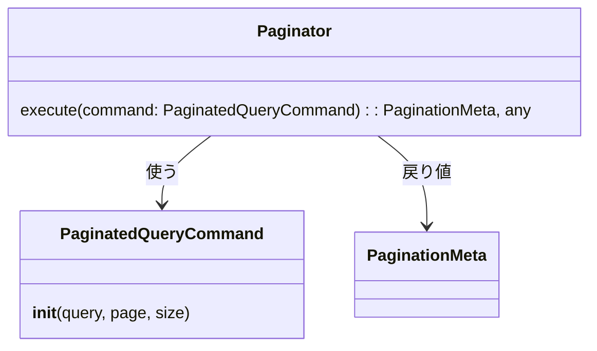

[indexへ戻る](../index.md)
# 📄 ページネーション

## 概要
- Supabaseから取得したデータのページネーションをおこなうためのモジュール

## クラス図

## `Paginator`クラス
### 概要
- `PaginatedQueryCommand`を指定して、`Supabase`から該当箇所のデータを取得する
- 取得したデータとページネーションのメタ情報を返す

### 配置場所
- `core/pagination/paginator.py`

## `PaginatedQueryCommand`クラス
### 概要
- ページネーションクエリを実行するためのコマンドクラス

### 配置場所
- `core/pagination/paginator.py`

### 保持する情報
- query: Query
  - Supabaseのクエリオブジェクト
- page: int
  - 取得するページ番号
- size: int
  - 1ページあたりのデータ数

## `PaginationMeta`クラス
### 概要
- ページネーションのメタ情報を保持するクラス
  
### 配置場所
- `core/pagination/pagination_meta.py`

### 保持する情報
- total: int
  - 取得したデータの総数
- page: int
  - 現在のページ番号
- size: int
  - 1ページあたりのデータ数
- total_pages: int
  - 総ページ数
- has_next: bool
  - 次のページが存在するかどうか
- has_prev: bool
  - 前のページが存在するかどうか
