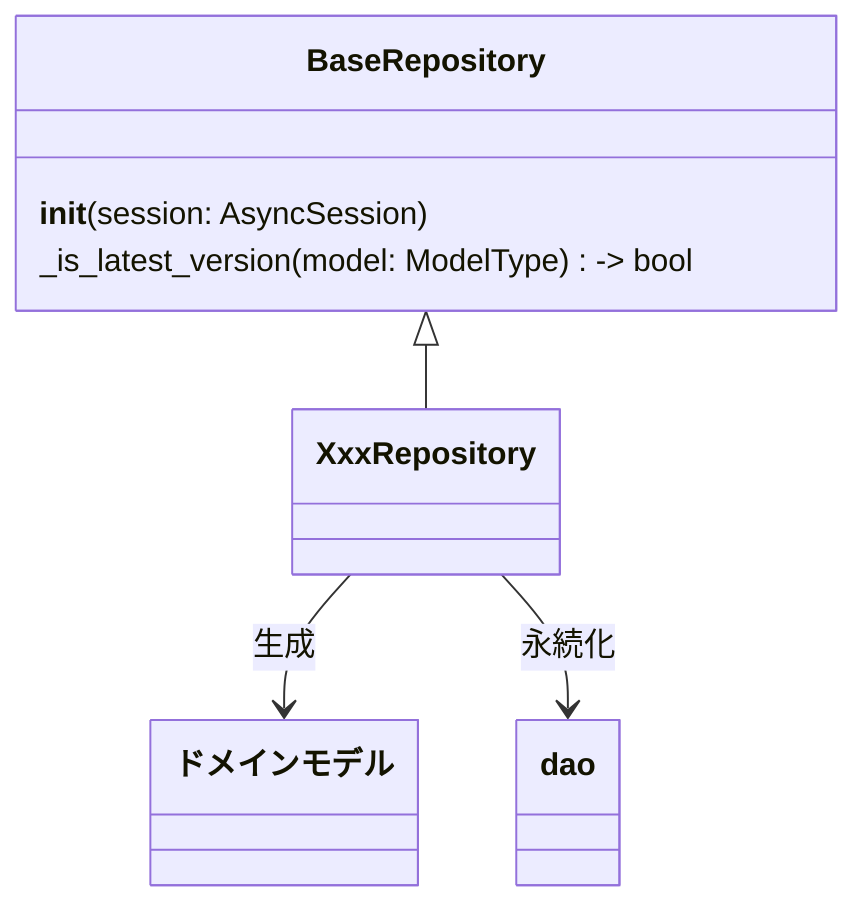

[indexへ戻る](../index.md)
# 🔍 リポジトリクラス

## 概要
- リポジトリは`dao`を使用し、複数の`entity`からドメインモデルの生成を行う
- データの永続化は更に下位層のDAOに委譲する
- DAOから取得したエンティティをドメインモデルに変換
- 複数のエンティティを組み合わせてドメインモデルを構築
- ドメインモデルをエンティティに変換して永続化

## オブジェクト図

## `BaseRepository`クラス
### 概要
- リポジトリの基底クラス
- ジェネリクスでモデルタイプを受け取る
  - 例: `class XxxRepository(BaseRepository[XxxModel]):`

- 各リポジトリで使用する共通の具象メソッドを提供する
  - ただし、findやsaveなどのメソッドは定義せず、必要なときに実装側で定義する

### 配置場所
- `core/repository/base_repository.py`

## `XxxRepository`クラス
### 概要
- 一つのモデルに対して一つのリポジトリを作成
  - `QuestModel`に対して`QuestRepository`を作成

- 必要に応じて以下のようなメソッドを実装する
  - `find_by_id(id: int) -> XxxModel`
    - IDでモデルを検索
  - `find_all() -> List[XxxModel]`
    - 全てのモデルを取得
  - `save(model: XxxModel) -> None`
    - モデルを永続化
  - `delete(model: XxxModel) -> None`
    - モデルを削除

### 配置場所
- `{関心事名}/repository/{関心事名}_repository.py`

### 命名規則
- リポジトリ名は`{関心事名}Repository`とする
  - 例: `QuestRepository`, `FamilyMemberRepository`
