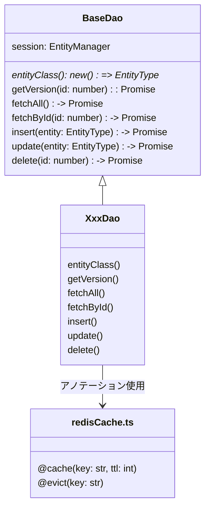

[indexへ戻る](../index.md)
# 🔍 DAO

## 概要
- DAOは`TypeORM`のORMを使用して、データベースとのやり取りを行う
- キャッシュ機能を使用して、データのキャッシュ操作も行う
  - [キャッシュ管理](キャッシュ管理-cache.md)を参照

## オブジェクト図


## `BaseDao`クラス
### 概要
- DAOクラスの基底クラス

- ジェネリクスでエンティティタイプを受け取る
  - 例: `class XxxDao extends BaseDao<XxxEntity>`

- 各DAOで使用する共通の具象メソッドを提供する

### 配置場所
- `packages/backend/src/core/dao/baseDao.ts`

## `XxxDao`クラス
### 概要
- 一つのエンティティに対して一つのDAOを作成する
  - `QuestEntity`に対して`QuestDao`を作成

- 基底クラス`BaseDao`を継承する
- 基底クラスにない専用処理を実装する

- 基底クラスを継承時、対応するエンティティを指定する

- BaseDaoのメソッドをラッピングしてキャッシュ機能を付与する
- `lazy loading戦略`に従う
  - evict: 古いキャッシュを削除するだけ
  - 次回fetch時: 最新データでキャッシュ再構築
  - put(削除時にキャッシュの貼り直し)は不要

- メソッドのドキュメンテーションは書かないこと
  - 基底クラスのドキュメンテーションを参照する

- マスタデータのDAOは参照系のみで、更新系のメソッドは実装しない
  - 例: `LanguageDao`, `IconCategoryDao`は以下のようにする
```typescript
export class LanguageDao extends BaseDao<LanguageEntity> {
  constructor(session: EntityManager) {
    super(session);
  }

  protected get entityClass(): new () => LanguageEntity {
    return LanguageEntity;
  }

  @cache("languages:all")
  async fetchAll(): Promise<LanguageEntity[]> {
    return await super.fetchAll();
  }
}
```

### クラスの実装例
```typescript
import { EntityManager } from 'typeorm';
import { BaseDao } from '@backend/core/dao/baseDao';
import { QuestEntity } from '../entity/questEntity';
import { cache, evict } from '@backend/core/cache/redisCache';

/**
 * クエストDAOクラス
 */
export class QuestDao extends BaseDao<QuestEntity> {
  constructor(session: EntityManager) {
    super(session);
  }

  protected get entityClass(): new () => QuestEntity {
    return QuestEntity;
  }

  /**
   * 全てのクエストを取得（キャッシュ付き）
   */
  @cache("quests:all")
  async fetchAll(): Promise<QuestEntity[]> {
    return await super.fetchAll();
  }

  /**
   * IDでクエストを取得（キャッシュ付き）
   */
  @cache("quests:{id}")
  async fetchById(id: number): Promise<QuestEntity | null> {
    return await super.fetchById(id);
  }

  /**
   * クエストを作成（キャッシュクリア付き）
   */
  @evict("quests:all")
  async insert(entity: QuestEntity): Promise<number> {
    return await super.insert(entity);
  }

  /**
   * クエストを更新（キャッシュクリア付き）
   */
  @evict("quests:all", "quests:{entity.id}")
  async update(entity: QuestEntity): Promise<void> {
    await super.update(entity);
  }

  /**
   * クエストを削除（キャッシュクリア付き）
   */
  @evict("quests:all", "quests:{id}")
  async delete(id: number): Promise<void> {
    await super.delete(id);
  }
}
```
### 配置場所
- `packages/backend/src/features/{関心事名}/dao/xxxDao.ts`

### 命名規則
- `{関心事名}Dao`

- 関心事名は単数形を用いる
  - `QuestEntity`に対して`QuestDao`とする

- アノテーションのキーの名前は`{関心事名}s:{値}`とする
  - キー: `quests`, `children`, `families`など
  - 値: `all`, `{id}`, `{entity.id}`など
