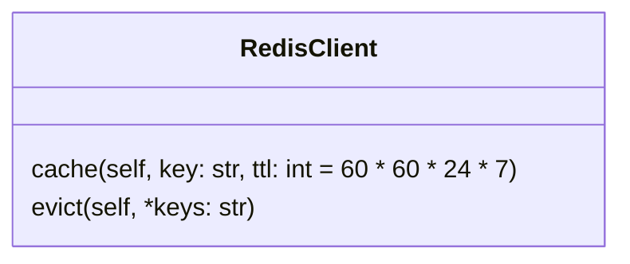

[indexへ戻る](../index.md)
# 🔍 キャッシュ管理

## 概要
- redisを使用したキャッシュ管理

## オブジェクト図


## `RedisClient`クラス
### 概要
- redisを使用したキャッシュ管理クラス
- DAOクラスで使用する
- 共通的に使用するため、`CommonDependencies`でDIコンテナに登録する
    - [CommonDependencies](./エンドポイント-endpoint.md)
### 配置場所
- `core/cache/redis_cacher.py`

## TypeScript版の実装

### 概要
- TypeScriptバックエンドでも同様のキャッシュ機能を実装済み ✨
- デコレータベースでPython版と同様の使い心地を実現

### 配置場所
- `packages/backend/src/core/cache/redisCacher.ts`
- `packages/backend/src/core/config/redisConfig.ts`
- `packages/backend/src/core/dao/baseDao.ts`

### 使い方例
```typescript
import { RedisCacher } from '@backend/core/cache/redisCacher';
import { BaseDao } from '@backend/core/dao/baseDao';

export class QuestDao extends BaseDao<QuestEntity> {
  @cache("quests:all")
  async fetchAll(): Promise<QuestEntity[]> {
    return await super.fetchAll();
  }

  @evict("quests:all", "quests:{id}")
  async delete(id: number): Promise<void> {
    await super.delete(id);
  }
}
```

### 詳細ドキュメント
- [TypeScript版RedisCacher詳細](../../../packages/backend/src/core/cache/README.md)
