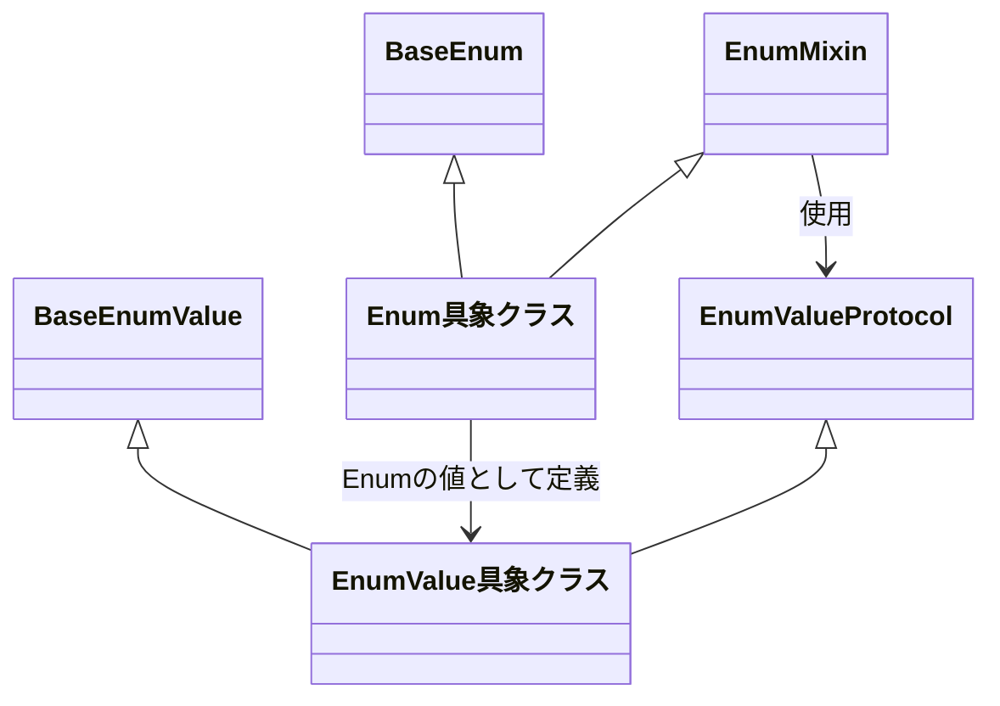
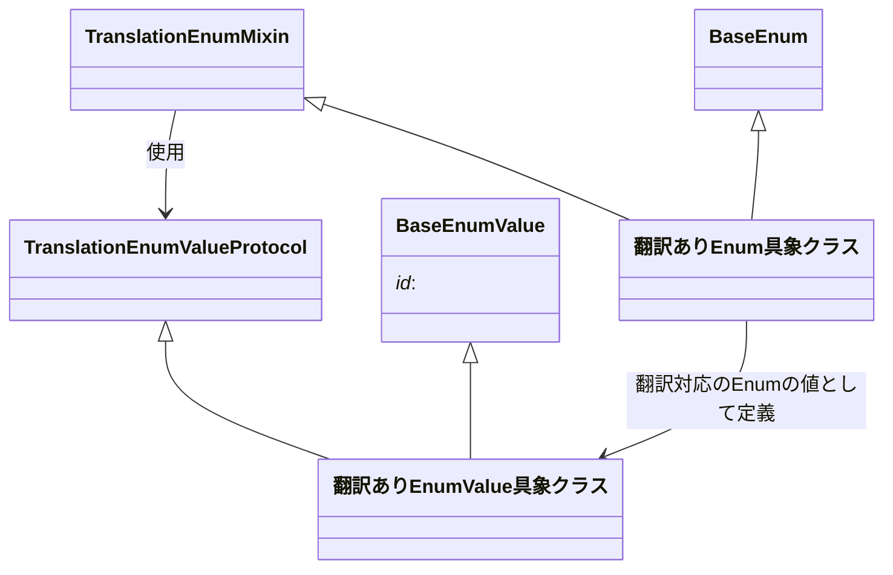

[indexへ戻る](../index.md)
# 🔍 タイトル

## 概要
- Enumの値を定義するためのモジュール
- フロントエンドとバックエンドでEnumの値を共有するために使用

## オブジェクト図
### 翻訳なし

### 翻訳あり



## `BaseEnumValue`クラス
### 概要
- Enumの値を表す基本クラス
- Enumの値はこのクラスを継承して定義する

- 例: 
```typescript
export class LanguageType extends BaseEnum<LanguageId> {
  /** 言語の種類 */

  static readonly JAPANESE = new LanguageTypeValue(new LanguageId(1));  // ←LanguageTypeValueクラスが`BaseEnumValue`を継承
  static readonly ENGLISH = new LanguageTypeValue(new LanguageId(2));
}
```

### 配置場所
- `@shared/core/enum/baseEnumValue.ts`

### 命名規則
- `BaseEnumValue`を継承したクラス名は、`<Enumの値>Value`とする
  - 例: `LanguageTypeValue`, `QuestStatusValue`

## `EnumValueProtocol`インターフェース
### 概要
- Enumの値が実装すべきメソッドを定義するインターフェース
- `BaseEnumValue`を継承したクラスはこのインターフェースを実装する必要がある

### 配置場所
- `@shared/core/enum/enumValueProtocol.ts`

## `EnumValue具象クラス`
### 概要
- `BaseEnumValue`を継承して、Enumの値を具体的に定義するクラス
- `EnumValueProtocol`を実装することで、Enumの値としての機能を持つ

### 配置場所
- `@shared/features/{関心事名}/value-object/{Enum名}Value.ts`

### 命名規則
- `BaseEnumValue`を継承したクラス名は、`<Enumの値>Value`とする
  - 例: `LanguageTypeValue`, `QuestStatusValue`

## `BaseEnum`クラス
### 概要
- Enumの基本クラス
- Enumの値はこのクラスを継承して定義する

### 配置場所
- `@shared/core/enum/baseEnum.ts`

## `EnumMixin`クラス
### 概要
- Enumの値を定義するためのミックスインクラス
- `BaseEnum`を継承したクラスはこのミックスインを使用
- Enumの値を定義する際に、`EnumValueProtocol`を実装

### 配置場所
- `@shared/core/enum/enumMixin.ts`

## `Enum具象クラス`
### 概要
- `BaseEnum`を継承して、Enumの値を具体的に定義するクラス
- `EnumMixin`を使用して、Enumの値としての機能を持つ

### 配置場所
- `@shared/features/{関心事名}/domain/{Enum名}.ts`
  - 例: `@shared/features/language/domain/languageType.ts`

### 命名規則
- Entity名に`Status`や`Category`などの接尾語がつく場合は、Enum名もそれに合わせる
  - 例: `QuestStatus`, `IconCategory`
- 上記の接尾語がつかない場合は、接尾語に`Type`を付ける
  - 例: `LanguageType`

## `TranslationEnumValueProtocol`インターフェース
### 概要
- 翻訳対応のEnumの値が実装すべきメソッドを定義するインターフェース
  - 例: `IconCategoryValue`など(IconCategoryは翻訳対応のEnum)

- エンティティから値を後から設定するためのメソッドを定義
  - Entity側に`BaseTranslationEntity`を継承したエンティティが必要

### 配置場所
- `@shared/core/enum/translationEnumValueProtocol.ts`

## `翻訳ありEnumValue具象クラス`
### 概要
- `BaseEnumValue`と`TranslationEnumValueProtocol`を継承して、翻訳対応のEnumの値を具体的に定義するクラス

### 配置場所
- 通常の`EnumValue具象クラス`と同様

### 命名規則
- 通常の`EnumValue具象クラス`と同様

## `TranslationEnumMixin`クラス
### 概要
- 翻訳対応のEnumの値を定義するためのミックスインクラス

### 配置場所
- `@shared/core/enum/translationEnumMixin.ts`

## `翻訳ありEnum具象クラス`
### 概要
- `BaseEnum`と`TranslationEnumMixin`を継承して、翻訳対応のEnumの値を具体的に定義するクラス

### 配置場所
- 通常の`Enum具象クラス`と同様

### 命名規則
- 通常の`Enum具象クラス`と同様
