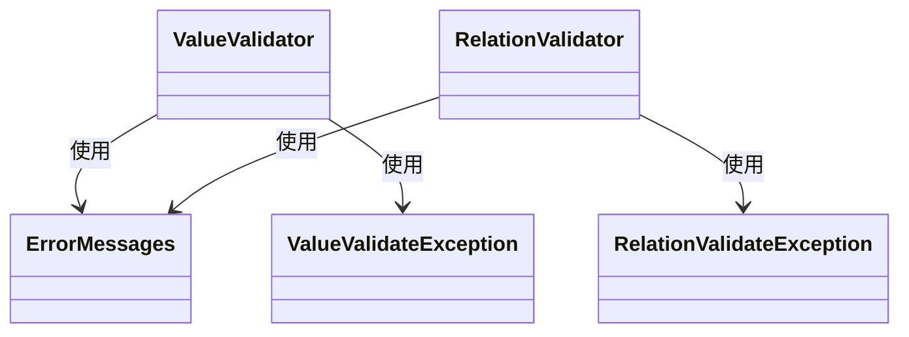
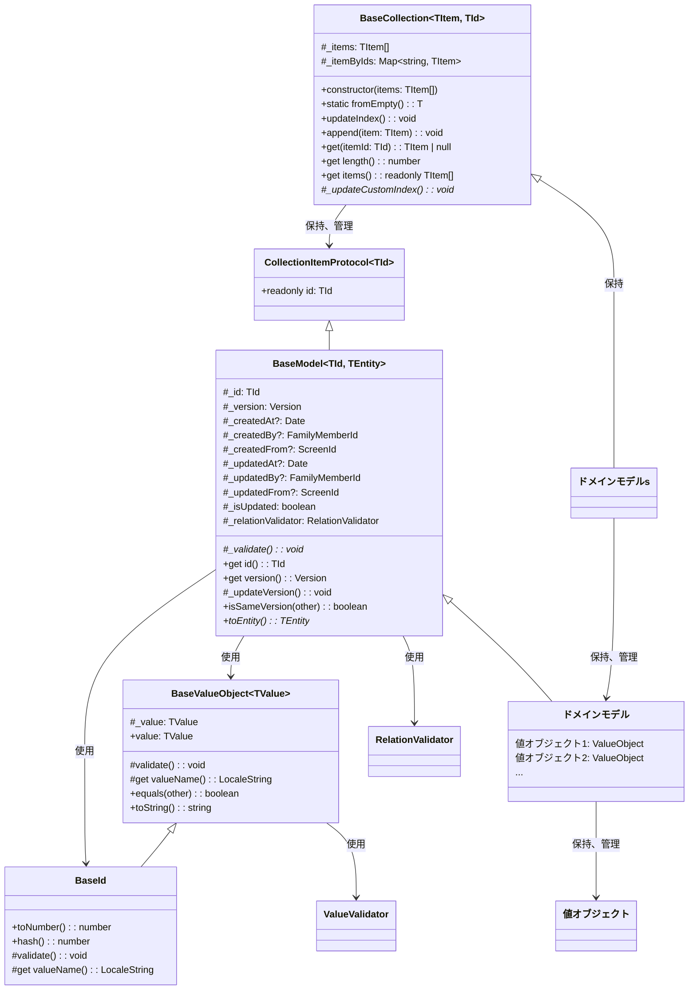

[indexへ戻る](../index.md)
# 🔍 ドメインモデル (TypeScript)

## 概要
- 関心事を表現したクラス
- ビジネスロジックを保持する
- PythonのドメインモデルをTypeScriptに移植

## オブジェクト図

### バリデーション


### ドメインモデル (TypeScript版)


## `BaseValueObject<TValue>`クラス
### 概要
- 値オブジェクトの基底クラス
- 値オブジェクトの値を保持し、検証を行う

### 配置場所
- `shared/core/value-object/baseValueObject.ts`

## `BaseId`クラス
### 概要
- IDを表現する値オブジェクトの基底クラス
- IDの値を保持し、検証を行う
- ドメインモデルのIDの値オブジェクトに継承させる

### 配置場所
- `shared/core/value-object/base_id.ts`

### 提供メソッド
- `toNumber(): number` - IDを数値として取得
- `hash(): number` - ハッシュ値を取得（コレクションのキーとして使用）

## `BaseModel<TId, TEntity>`クラス
### 概要
- ドメインモデルの基底抽象クラス
- ドメインモデルのID、バージョン、作成日時、更新日時などの共通属性を持つ
- ドメインモデルの値オブジェクトやIDを保持し、検証を行う
- ドメインモデルのバージョン管理や更新処理を行う

### 配置場所
- `backend/src/core/domain/baseModel.ts`

### ジェネリクス型パラメータ
- `TId extends BaseId` - ドメインモデルのID型
- `TEntity extends AppBaseEntity` - 対応するエンティティ型

### 主要プロパティ
- `_id: TId` - ドメインモデルのID（値オブジェクト）
- `_version: Version` - バージョン（楽観的ロック用）
- `_createdBy?: FamilyMemberId` - 作成者ID
- `_createdFrom?: ScreenId` - 作成元スクリーンID
- `_updatedBy?: FamilyMemberId` - 更新者ID
- `_updatedFrom?: ScreenId` - 更新元スクリーンID

### 抽象メソッド
- `_validate(): void` - モデルの値を検証する（サブクラスで実装必須）
- `toEntity(): TEntity` - ドメインモデルをエンティティに変換する

## `CollectionItemProtocol<TId>`インターフェース
### 概要
- コレクションアイテムのプロトコル（インターフェース）
- コレクション内のアイテムが実装すべきインターフェース

### 必須プロパティ
- `readonly id: TId` - アイテムのID

## `BaseCollection<TItem, TId>`クラス
### 概要
- ドメインモデルのコレクションを表現する基底抽象クラス（ファーストコレクション）
- ドメインモデルのリストを保持し、管理する
- ドメインモデルに対するビジネスロジックを提供する
- IDのMap（インデックス）を保持する

### 配置場所
- `backend/src/core/domain/baseCollection.ts`

### ジェネリクス型パラメータ
- `TItem extends BaseModel<TId, any> & CollectionItemProtocol<TId>` - コレクション内のアイテム型
- `TId extends BaseId` - アイテムのID型

### 主要メソッド
- `static fromEmpty(): T` - 空のコレクションを作成
- `updateIndex(): void` - インデックス辞書を更新
- `append(item: TItem): void` - アイテムを追加
- `get(itemId: TId): TItem | null` - IDでアイテムを取得
- `get length(): number` - アイテム数を取得
- `get items(): readonly TItem[]` - すべてのアイテムを取得（読み取り専用）

### 抽象メソッド
- `_updateCustomIndex(): void` - カスタムインデックスの更新（具象クラスで実装）

## ドメインモデル
### 概要
- 値オブジェクトを保持する関心事の集約クラス
- ゲッターは原則定義せず、必要な場合にのみ定義する
- BaseModelを継承して作成する

### 配置場所
- `backend/src/features/{関心事名}/domain/{関心事名}Model.ts`
  - 例: `backend/src/features/quest/domain/questModel.ts`

### 命名規則
- ドメインモデル名は`{関心事名}Model`とする
  - 例: `QuestModel`, `ChildModel`など

### 実装例
```typescript
import { BaseModel } from '../../../core/domain/baseModel';
import { QuestId } from './value-object/questId';
import { QuestEntity } from '../entity/questEntity';
import { QuestName } from './value-object/questName';
import { Version } from '../../../../../shared/features/shared/version';

export class QuestModel extends BaseModel<QuestId, QuestEntity> {
  private _name: QuestName;

  constructor(
    id: QuestId,
    version: Version,
    name: QuestName,
    createdAt?: Date,
    // その他のパラメータ...
  ) {
    super(id, version, createdAt, /* その他のパラメータ */);
    this._name = name;
  }

  /**
   * エンティティからドメインモデルを生成
   */
  static fromEntity(entity: QuestEntity): QuestModel {
    return new QuestModel(
      new QuestId(entity.id),
      new Version(entity.version),
      new QuestName(entity.name),
      entity.created_at,
      // その他のマッピング...
    );
  }

  protected _validate(): void {
    // ドメインルールの検証
    // 例: nameが空でないことを確認など
  }

  toEntity(): QuestEntity {
    const entity = new QuestEntity();
    entity.id = this._id.toNumber();
    entity.version = this._version.value;
    entity.name = this._name.value;
    // その他のマッピング...
    return entity;
  }

  // 必要に応じてゲッターを定義
  get name(): QuestName {
    return this._name;
  }
}
```

## ファーストクラスコレクション
### 概要
- `BaseCollection`を継承したクラス
- 任意でカスタムインデックスを保持することができる
- 自身のリストに対するビジネスロジックを提供する

### 配置場所
- `backend/src/features/{関心事名}/domain/{関心事名の複数形}.ts`
  - 例: `backend/src/features/quest/domain/quests.ts`

### 実装例
```typescript
import { BaseCollection } from '../../../core/domain/baseCollection';
import { QuestModel } from './questModel';
import { QuestId } from './value-object/questId';

export class Quests extends BaseCollection<QuestModel, QuestId> {
  private _completedQuests: Map<string, QuestModel> = new Map();

  constructor(items: QuestModel[]) {
    super(items);
  }

  protected _updateCustomIndex(): void {
    // カスタムインデックスの更新
    this._completedQuests.clear();
    for (const quest of this._items) {
      if (quest.isCompleted) {
        const key = quest.id.hash().toString();
        this._completedQuests.set(key, quest);
      }
    }
  }

  /**
   * 完了済みクエストを取得
   */
  getCompletedQuests(): QuestModel[] {
    return Array.from(this._completedQuests.values());
  }

  /**
   * 総ポイントを計算
   */
  getTotalPoints(): number {
    return this._items.reduce((total, quest) => total + quest.points, 0);
  }
}
```

## 値オブジェクト
### 概要
- `BaseValueObject`を継承したクラス
- ドメインモデルの値を表現するクラス

### 配置場所
- `backend/src/features/{関心事名}/domain/value-object/{値オブジェクト名}.ts`
- 共通する値オブジェクトは`shared/features/shared/value-object/`に配置

### 命名規則
- 値オブジェクトのクラス名は`{関心事名}{値オブジェクト名}`とする
  - 例: `QuestName`, `ChildAge`など

### 実装例
```typescript
import { BaseValueObject } from '../../../../../../shared/core/value-object/baseValueObject';
import { LocaleString } from '../../../../../../shared/core/messages/localeString';

export class QuestName extends BaseValueObject<string> {
  constructor(value: string) {
    super({ value });
  }

  protected get valueName(): LocaleString {
    return new LocaleString({
      ja: "クエスト名",
      en: "Quest Name"
    });
  }

  protected validate(): void {
    this.validator.required();
    this.validator.maxLength(100);
  }
}
