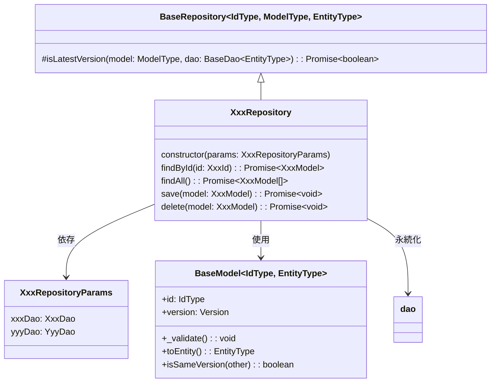

[indexへ戻る](../index.md)
# 🔍 リポジトリクラス

## 概要
- リポジトリは`dao`を使用し、複数の`entity`からドメインモデルの生成を行う
- データの永続化は更に下位層のDAOに委譲する
- DAOから取得したエンティティをドメインモデルに変換
- 複数のエンティティを組み合わせてドメインモデルを構築
- ドメインモデルをエンティティに変換して永続化

## オブジェクト図


## `BaseRepository<IdType, ModelType, EntityType>`クラス
### 概要
- リポジトリの基底クラス
- 3つのジェネリクス型を受け取る
  - `IdType`: BaseIdを継承したID値オブジェクト
  - `ModelType`: BaseModelを継承したドメインモデル
  - `EntityType`: AppBaseEntityを継承したエンティティ
  - 例: `class XxxRepository extends BaseRepository<XxxId, XxxModel, XxxEntity> {}`

- 各リポジトリで使用する共通の具象メソッドを提供する
  - ただし、findやsaveなどのメソッドは定義せず、必要なときに実装側で定義する

- 複数のDAOからデータを取得するときは、非同期で実行すること
- 例:
```typescript
async findAll(): Promise<XxxModel[]> {
    const [xxxEntities, yyyEntities] = await Promise.all([
        this.xxxDao.fetchAll(),
        this.yyyDao.fetchAll()
    ]);
    
    // エンティティからドメインモデルに変換
    return this.convertToModels(xxxEntities, yyyEntities);
}
```

### 配置場所
- `core/repository/baseRepository.ts`

## `XxxRepository`クラス
### 概要
- 一つのモデルに対して一つのリポジトリを作成
  - `QuestModel`に対して`QuestRepository`を作成

- 必要に応じて以下のようなメソッドを実装する
  - `findById(id: number): Promise<XxxModel>`
    - IDでモデルを検索
  - `findAll(): Promise<XxxModel[]>`
    - 全てのモデルを取得
  - `save(model: XxxModel): Promise<void>`
    - モデルを永続化
  - `delete(model: XxxModel): Promise<void>`
    - モデルを削除

### 配置場所
- `features/{関心事名}/repository/{関心事名}Repository.ts`

### 命名規則
- リポジトリ名は`{関心事名}Repository`とする
  - 例: `QuestRepository`, `FamilyMemberRepository`

- `Params`インターフェースのインスタンス名は`params`とする
  - 例: `params: QuestRepositoryParams`

### 実装例
```typescript
import { BaseRepository } from '../../core/repository/baseRepository';
import { QuestModel } from '../domain/questModel';
import { QuestDao } from '../dao/questDao';
import { QuestEntity } from '../entity/questEntity';
import { QuestId } from '../domain/value-object/questId';

export interface QuestRepositoryParams {
  questDao: QuestDao;
  // その他必要なDAO
}

export class QuestRepository extends BaseRepository<QuestId, QuestModel, QuestEntity> {
  private questDao: QuestDao;

  constructor(params: QuestRepositoryParams) {
    super();
    this.questDao = params.questDao;
  }

  async findById(id: QuestId): Promise<QuestModel | null> {
    const entity = await this.questDao.fetchById(id.toNumber());
    if (!entity) {
      return null;
    }
    return QuestModel.fromEntity(entity);
  }

  async findAll(): Promise<QuestModel[]> {
    const entities = await this.questDao.fetchAll();
    return entities.map(entity => QuestModel.fromEntity(entity));
  }

  async save(model: QuestModel): Promise<void> {
    // 楽観的ロック確認（更新の場合）
    if (model.id.toNumber() > 0) {
      const isLatest = await this.isLatestVersion(model, this.questDao);
      if (!isLatest) {
        throw new Error('データが他のユーザによって更新されています。');
      }
    }

    const entity = model.toEntity();
    
    if (model.id.toNumber() > 0) {
      await this.questDao.update(entity);
    } else {
      const newId = await this.questDao.insert(entity);
      // 新しいIDでモデルを再作成する必要があるかも
    }
  }

  async delete(model: QuestModel): Promise<void> {
    const modelId = model.id.toNumber();
    if (modelId <= 0) {
      throw new Error('削除対象のIDが設定されていません。');
    }

    // 楽観的ロック確認
    const isLatest = await this.isLatestVersion(model, this.questDao);
    if (!isLatest) {
      throw new Error('データが他のユーザによって更新されています。');
    }

    await this.questDao.delete(modelId);
  }
}
```

## `XxxRepositoryParams`インターフェース
### 概要
- リポジトリが依存するDAOを保持するインターフェース
- リポジトリのコンストラクタで受け取り、依存性注入を行う
  - params自体をfieldに保持するのではなく、必要なDAOを個別に保持する
- DAOのインスタンスを保持し、リポジトリ内で使用する

### 配置場所
- リポジトリと同じファイルに配置すること
- リポジトリクラスの直前に配置すること

### 命名規則
- インターフェース名は`{関心事名}RepositoryParams`とする
  - 例: `QuestRepositoryParams`, `FamilyMemberRepositoryParams`

### 実装例
```typescript
export interface QuestRepositoryParams {
  questDao: QuestDao;
  categoryDao: CategoryDao;
  // その他必要なDAO
}
```
