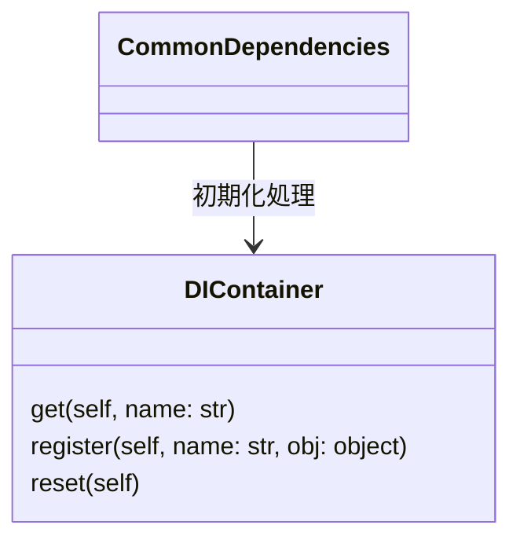

[indexへ戻る](../index.md)
# 🔍 DIコンテナ

## 概要
- APIサーバで共通的に使用するオブジェクトを管理するためのDIコンテナ

## オブジェクト図


## `DIContainer`クラス
### 概要
- `redis`など、共通的にDIしたいオブジェクトを管理する
- 初期化処理は`CommonDependencies`で行う
- 使用時は`di_container.get(RedisClient)`のようにして取得する
- 例:
```python
from aqapi.core.di_container import di_container
redis = di_container.get(RedisClient)  # DIコンテナからRedisClientを取得
```

### 配置場所
- `core/di_container.py`

### 命名規則
- クラス名は`DIContainer`とする
- インスタンス名は`di_container`とする
