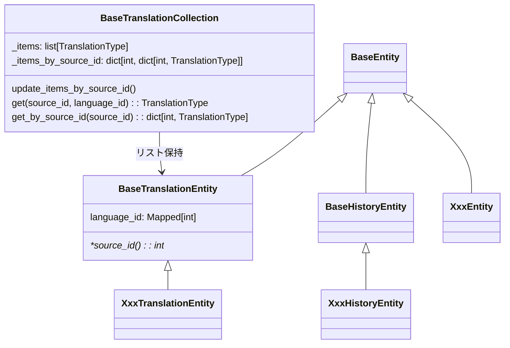

[indexへ戻る](../index.md)
# 🔍 エンティティ

## 基底エンティティ
- 物理名: `AppBaseEntity`
- 全てのエンティティの基底クラス

### 継承
- typeormの`BaseEntity`を継承

### プロパティ
- ID: 数値
  - 主キー
- バージョン: 数値
  - デフォルト値: 1
  - null: 非許容
  - 説明: 楽観的ロックのためのバージョン管理
- 作成日時: 日時
- 作成者: 数値
- 作成元画面: 数値
- 更新日時: 日時
- 更新者: 数値
- 更新元画面: 数値

### 抽象メソッド_モデルからエンティティを生成
- 引数でドメインモデルを受け取り、エンティティを生成する

### 抽象メソッド_初期データを定義
- 初期データを定義するメソッド
- メソッド[初期データ投入](#メソッド_初期データ投入)で呼び出される

### メソッド_初期データ投入
- データベースに初期データを投入するメソッド

## 基底履歴エンティティ
- 物理名: `BaseHistoryEntity`
- 履歴エンティティが継承する基底クラス

### 継承
- `AppBaseEntity`を継承

### プロパティ
- 基底クラスと同様のプロパティをもつ

### メソッド_元のエンティティから生成する
- 基底クラスの属性を元にインスタンスを生成する
- [抽象メソッド_独自の属性を設定する](#抽象メソッド_独自の属性を設定する)

### 抽象メソッド_独自の属性を設定する
- 具象エンティティで実装する
- 元のエンティティの独自の属性を履歴エンティティに設定する

## 基底翻訳エンティティ
- 物理名: `BaseTranslationEntity`

### 継承
- `AppBaseEntity`を継承

### プロパティ
- 言語ID: 数値
- 元のエンティティID: 数値
  - 外部参照

## オブジェクト図

## `BaseEntity`クラス
### 概要
- SQLAlchemyのdeclarative_baseを継承した基底クラス
- 初期データ投入やドメインモデルから生成するメソッドを持つ

### 配置場所
- `core/entity/base_entity.py`

## `XxxEntity`クラス
### 概要
- 各関心事のEntity
- `BaseEntity`を継承する

- `_seed_data`メソッドをオーバーライドし、初期データを定義する

- 対応するドメインモデルを作成した場合は、`from_model`メソッドをオーバーライドして、ドメインモデルからEntityを生成するロジックを実装する

### 配置場所
- `{関心事名}/entity/XxxEntity`

### 命名規則
- `{関心事名の複数形}Entity`
  - 例: `QuestsEntity`, `ChildrenEntity`

## `BaseHistoryEntity`クラス
### 概要
- 履歴エンティティが継承する基底クラス
- ユーザ側で更新ができるエンティティは基本的に履歴エンティティを持つようにする

- 元のエンティティから自身を生成するメソッドを持つ
  - 具象側で_set_specific_attrsを実装することで、自身を生成する際に必要な属性を設定する

### 配置場所
- `core/entity/base_history_entity.py`

## `XxxHistoryEntity`クラス
### 概要
- 特定エンティティの履歴Entity
- `BaseHistoryEntity`を継承すること

### 配置場所
- `{関心事名}/entity/{関心事名の単数形}_entity`
  - オリジナルのエンティティと同じファイル内に配置すること
  - オリジナルのエンティティの下に定義すること

### 命名規則
- オリジナルのエンティティ名の`Entity`の前に`History`を付ける
  - 例: `QuestsEntity` → `QuestsHistoryEntity`

## `BaseTranslationEntity`クラス
### 概要
- 翻訳エンティティの基底クラス
- 言語IDと翻訳元のIDを持つ
- 具象側では他言語化したい属性を定義する
  - 例: `name`, `description`など

### 配置場所
- `core/entity/base_translation_entity.py`

## `XxxTranslationEntity`クラス
### 概要
- 特定エンティティの翻訳Entity
- `BaseTranslationEntity`を継承すること
  - `source_id`プロパティをオーバーライドし、翻訳対象のエンティティのIDを返すようにする

### 配置場所
- `{関心事名}/entity/{関心事名の複数形}_entity`
  - オリジナルのエンティティと同じファイル内に配置すること
  - オリジナルのエンティティの下に定義すること
  - 履歴エンティティが存在する場合は、その下に定義すること

### 命名規則
- オリジナルのエンティティ名の`Entity`の前に`Translation`を付ける
  - 例: `QuestsEntity` → `QuestsTranslationEntity`
