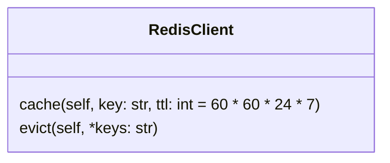

[indexへ戻る](../index.md)
# 🔍 キャッシュ管理

## 概要
- redisを使用したキャッシュ管理

## オブジェクト図

## `RedisClient`クラス
### 概要
- redisを使用したキャッシュ管理クラス
- DAOクラスで使用する
- 共通的に使用するため、`CommonDependencies`でDIコンテナに登録する
    - [CommonDependencies](./エンドポイント-endpoint.md)
### 配置場所
- `core/cache/redis_cacher.py`
