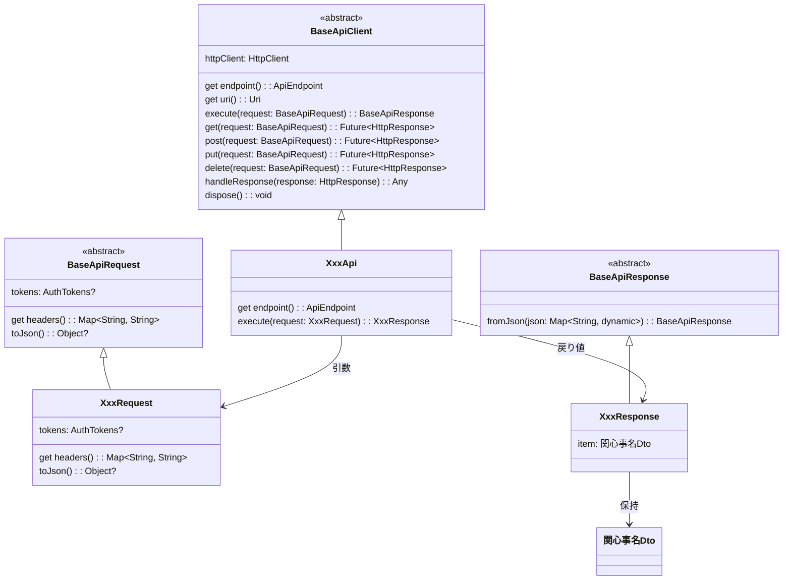

[indexへ戻る](../index.md)
# 🔍 APIクライアント

## 概要
- APサーバのエンドポイントにAPIリクエストを送信するためのモジュール
- 必ず`BaseApiClient`を継承して実装すること

## クラス図

## `BaseApiClient`クラス
### 概要
- `BaseApiClient`は全てのAPIクライアントの基底クラス
- APIクライアントで共通の処理が発生した場合は`BaseApiClient`に実装すること
- `BaseApiClient`の具象クラスは、一つのエンドポイントに対して一つのクラスとする
  - 例: `GetQuestApi`, `LoginApi`
  - エンドポイント関数名と同じ名前にすること
- APIリクエストを実行するメソッドは`execute`とする

### 配置場所
- `/core/api/base_api_client.dart`に配置

## `Api`クラス
### 概要
- 全てのAPIクライアントは`BaseApiClient`を継承すること

### 配置場所
- `{関心事名}/api/v{バージョン番号}/{エンドポイント関数名}/{エンドポイント関数名}_api.dart`
  - 例: `quest/api/v1/get_quest/get_quest_api`
  - `v1`はバージョン番号で、必要に応じて変更すること
  - エンドポイントの関数毎に一つのフォルダを作成し、その中に以下配置すること
    - `{エンドポイント関数名}_api.dart`
    - `{エンドポイント関数名}_request.dart`
    - `{エンドポイント関数名}_response.dart`
    - `{エンドポイント関数名}.md` (クラス図)

### 命名規則
- ファイル名は`{エンドポイント関数名}_api`とする
  - 例: `get_quest_api.dart`

- クラス名は`{エンドポイント関数名}Api`とする
  - 例: `GetQuestApi`

## `BaseApiRequest`抽象クラス
### 概要
- `BaseApiRequest`は全てのAPIリクエストの基底クラス
- APIリクエストで共通の処理が発生した場合は`BaseApiRequest`に実装すること

### 配置場所
- `/core/api/base_api_request.dart`に配置

### 命名規則
- クラス名は`BaseApiRequest`とする

## `Request`クラス
### 概要
- エンドポイントのリクエストを表現するクラス
- 基本的に構造はAPサーバ側の`Request`クラスと同じにすること
  - [APIサーバの設計書](../api/エンドポイント-endpoint.md)を参照すること

### 配置場所
- APIクライアントのファイルと同じフォルダに配置すること

### 命名規則
- APIサーバ側の`Response`クラスと同じ命名規則に従うこと

## `BaseApiResponse`抽象クラス
### 概要
- `BaseApiResponse`は全てのAPIレスポンスの基底クラス
- APIレスポンスで共通の処理が発生した場合は`BaseApiResponse`に実装すること

### 配置場所
- `/core/api/base_api_response.dart`に配置

### 命名規則
- クラス名は`BaseApiResponse`とする

## `Response`クラス
### 概要
- エンドポイントのレスポンスを表現するクラス
- 基本的にAPIサーバ側の`Response`クラスと同じ構造にすること
  - [APIサーバの設計書](../api/エンドポイント-endpoint.md)を参照すること

### 配置場所
- APIクライアントのファイルと同じフォルダに配置すること

### 命名規則
- APIサーバ側の`Response`クラスと同じ命名規則に従うこと
