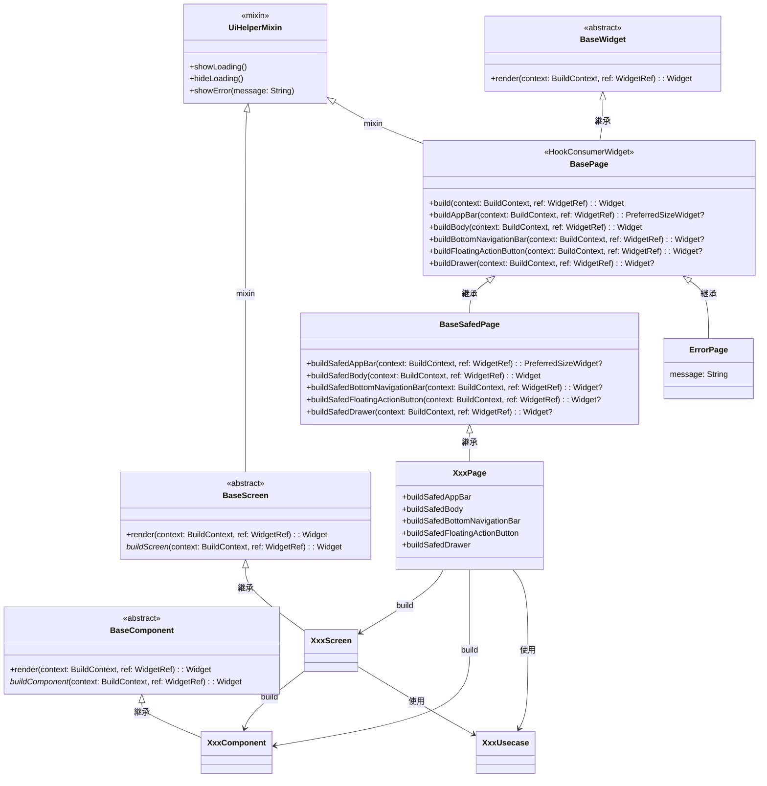

[indexへ戻る](../index.md)
# 🔍 ページ

## 概要
- Scaffoldを含む画面の設計

## オブジェクト図


## フォルダ構成
- `Page`とスクリーンは専用のフォルダを持つこと
```plaintext
{関心事名}/
  ├─ {画面名}_page/
  │   ├─ shared/  // 共通の部品や基底ページ
  │   │   ├─ base_{画面名}_page.dart  // ページが複数の種類に分かれる場合、基底ページを準備する
  │   │   ├─ component/  // 共通のコンポーネント
  │   │   │   ├─ {スクリーン名}  // スクリーン(タブ内の画面やダイアログなど)はフォルダを分ける
  │   │   ├─ state/  // 共通の状態管理クラス
  │   │   ├─ value_object/  // 共通の値オブジェクト
  │   │   ├─ usecase/  // 共通のユースケース
  │   │   ├─ api/  // 共通のAPIクライアント
  │   ├─ {画面名}_page/  // 基底クラスを継承した画面ごとのフォルダ（一ページにつき一つのフォルダを作成）
  │   │   ├─ {画面名}_page.dart  // 画面の実体
  │   │   ├─ component/, state/, usecase/, api/  // 画面で使用するコンポーネントや状態管理クラス、ユースケース、APIクライアント
  │   ├─ {画面名}_page1/, {画面名}_page2/  // 他の画面も同様に配置 
  ├─ {その他の画面名}_page/  // 他の関心事の画面も同様に配置
...
```

### 例:
```plaintext
quest/
  ├─ quest_list_page/                        # クエスト一覧ページのフォルダ
  │   ├─ shared/                                     # 共通の部品や基底ページを配置する
  │   │   ├─ base_quest_list_page.dart               # ページが複数の種類に分かれる場合、基底ページを準備する
  │   │   ├─ component/                                     # 共通のコンポーネントや基底となるコンポーネントを配置する
  │   │   │   ├─ base_quest_title_text.dart           # 基底のコンポーネントを定義
  │   │   │   ├─ base_quest_list_tab.dart            # 〃
  │   │   │   ├─ base_quest_list_tab_screen/          # 〃
  │   │   │   │   ├─ base_quest_list_tab_screen.dart # 〃
  │   │   │   │   ├─ component/                    # 〃
  │   │   │   │   │   ├─ base_quest_list_item.dart    # 〃
  │   │   ├─ state/                                     # 共通、基底の状態に関するフォルダ
  │   │   │   ├─ quest_list_state_notifier.dart       # クエスト一覧の状態を管理するクラス
  │   │   ├─ value_object/                          # 値オブジェクト(ただし、読み取り専用ページでは不要)
  │   │   │   ├─ quest_title.dart                  # クエストタイトルの値オブジェクト
  │   │   │   ├─ quest_description.dart          # クエスト説明の値オブジェクト
  │   │   ├─ usecase/                                   # 共通のユースケース
  │   │   ├─ api/                                    # 共通のAPIクライアント
  │   ├─ family_quest_list_page/                # 基底クラスを継承した家族クエスト一覧ページのフォルダ
  │   │   ├─ family_quest_list_page.dart          # 家族クエスト一覧ページの実体
  │   │   ├─ component/                              # ページで使用するコンポーネント
  │   │   │   ├─ familiy_quest_title_text.dart      # 家族クエスト一覧アイテムコンポーネント
  │   │   ├─ state/                                     # 状態管理クラス
  │   ├─ usecase/                                    # ユースケース
  │   │   ├─ family_quest_list_usecase.dart         # 家族クエスト一覧のユースケース
  │   ├─ api/                                        # APIクライアント
  │   │   ├─ family_quest_list_api.dart             # 家族クエスト一覧のAPIクライアント
  │   ├─ xxx_quest_list_page/                # その他の種類のクエスト一覧ページのフォルダ
  ├─ quest_xxx_page/                        # クエストに関する他のページのフォルダ
...
```

## `UiHelperMixin`ミックスイン
### 概要
- よく使うUI関連のメソッドをまとめたMixinクラス
- ローディングやエラーメッセージの表示を行う

### 配置場所
- `/core/page/ui_helper_mixin.dart`

## `BaseWidget`抽象クラス
### 概要
- ページやコンポーネントの基底クラス
- `render`メソッドを実装することで、Widgetを描画する

### 配置場所
- `/core/page/base_widget.dart`

## `BasePage`基底クラス
### 概要
- アプリで定義するPageクラスの基盤となるクラス
- 共通の処理を実装する

## `BaseSafedPage`基底クラス
### 概要
- エラー処理を含むPageの基底クラス
- `ErrorPage`以外のアプリで使用するPageクラスはこのクラスを継承すること
- 実装クラスで発生したエラーをキャッチして、`ErrorPage`に遷移したり、ログを出力する
  - [ロガー設計](ロガー-logger.md)を参照

### 配置場所
- `/core/page/base_safed_page.dart`

## `XxxPage`クラス
### 概要
- Scaffoldを含む画面クラス
- `BasePage`を継承すること

- ページ内に直接以下のようなWidgetを記述せず、**スクリーンやコンポーネントとして切り出す**こと
  - `Icon`や`Text`, `Button`などの単純なWidget
- 直接使用して良いWidget
  - `Column`や`Row`, `Container`などのレイアウトウィジェット

- ページ内のコールバック処理は、引数にそのまま書かず、プライベートメソッドとして切り出すこと
  - 例: `onPressed: _onButtonPressed`

- 編集・詳細画面では、`{画面名}FormState`を定義すること
  - Formは`FreezedRiverpod`を使用して実装すること
  - Formが管理する各項目は`BaseValueObject`を継承すること
    - [状態管理設計](状態管理-state.md)を参照

- ビジネスロジックは`XxxUsecase`から呼び出すこと
  - [ユースケース設計](ユースケース-usecase.md)を参照
  - `StateNotifier`や`ApiClient`を直接使用しないこと

- 画面内で表示するメッセージは、`L10nProvider`を使用してローカライズされたメッセージを取得すること
  - [多言語設計](多言語対応-l10n.md)を参照
  - 例: `l10n.I.userIdRequired`

### 配置場所
- `{関心事名}/page/{画面名}_page/{画面名}_page.dart`
- 一ページにつき一つのフォルダを作成し、その中にページとcomponentフォルダを作成すること
  - 例: `quest/page/quest_page/quest_page.dart`
  - `quest/page/quest_page/component/{コンポーネント名}.dart`

### 命名規則
- `{ページでやりたいこと}Page`

## `BaseComponent`抽象クラス
### 概要
- ページやスクリーンを構成するコンポーネントの基底クラス
- `buildComponent`メソッドを実装することで、コンポーネントを描画する

### 配置場所
- `/core/page/base_component.dart`

## `{スクリーン名}`
### 概要
- コンポーネントの集約(タブ内の画面やダイアログなど)

- スクリーン内に直接以下のようなWidgetを記述せず、**スクリーンやコンポーネントとして切り出す**こと
  - `Icon`や`Text`, `Button`などの単純なWidget
- 直接使用して良いWidget
  - `Column`や`Row`, `Container`などのレイアウトウィジェット

- コールバック処理は、引数にそのまま書かず、プライベートメソッドとして切り出すこと
  - 例: `onPressed: _onButtonPressed`


### 配置場所
- `{関心事名}/page/login_page/{スクリーン名}/{スクリーン名}.dart`
- 一つのスクリーンに対して一つのフォルダを作成し、その中にスクリーンとcomponentフォルダを作成すること
  - 例: `quest/page/component/quests_tab/quests_tab.dart`
  - `quest/page/component/quests_tab/component/{コンポーネント名}.dart`

### 命名規則
- 文脈から適切に命名すること
  - 例: `QuestsTabScreen`, `SelectQuestDialog`

## `{コンポーネント名}`
### 概要
- ページやスクリーンを構成する共通部品
- 以下のようなWidgetをラッピングすること
  - `TextField`や`Button`, `Icon`などの単純なWidget

- 複数回使用されるされないにかかわらず、必ずコンポーネントとして切り出すこと
  - 例: `TextField`を使用する場合は、`XxxTextField`として切り出す

- コールバック処理は、引数にそのまま書かず、プライベートメソッドとして切り出すこと
  - 例: `onPressed: _onButtonPressed`

### 配置場所
- **ページ内コンポーネント**: `{関心事名}/page/xxx_page/component/{コンポーネント名}.dart`
  - 例: `quest/page/quest_page/component/quest_title.dart`
- **スクリーン内コンポーネント**: `{関心事名}/page/xxx_page/component/{スクリーン名}/component/{コンポーネント名}.dart`
  - 例: `quest/page/select_quest_dialog_/component/quest_summary.dart`

- 他の画面と共通のコンポーネントは、`share/component`フォルダに配置すること
  - 例: `share/component/app_text_field.dart`

### 命名規則
- 内部で使用しているWidgetの名前を後ろにつける
  - 例: TextFieldウィジェット使用 → `{名前}TextField`
- 複数のWidgetを組み合わせている場合は、文脈から適切に命名すること
  - 例: `QuestSummaryCard`, `QuestTitleEntry`

- 末尾に`Component`とつけないこと


## その他規約
### 動作確認用コードの記載
- ページやコンポーネントを作成した場合、一番下に動作確認用のコードを記載すること
  - 例: `login_page.dart`に以下のように記載
```dart
// login_page.dart

...

// 動作確認用コード
void main() {
  runApp(
    ProviderScope(
      child: MaterialApp(
        home: LoginPage(),
      ),
    ),
  );
}
```

### importの書き方
- import文には`show`を使用して、必要なクラスのみをインポートすること
  - ただし、`package:flutter/material.dart`は全てのWidgetを使用するため、`show`は不要
- 例:
```dart
import 'package:flutter/material.dart';
import 'package:allowance_questboard/core/page/login_page/login_page.dart' show LoginPage;
import 'package:allowance_questboard/core/page/login_page/component/login_form.dart' show LoginForm;
```

### 画面遷移
- 画面遷移には`TypeGoRouter`を使用すること
  - 配置場所: `/core/router/app_route.dart`

### 画面の状態
- 
