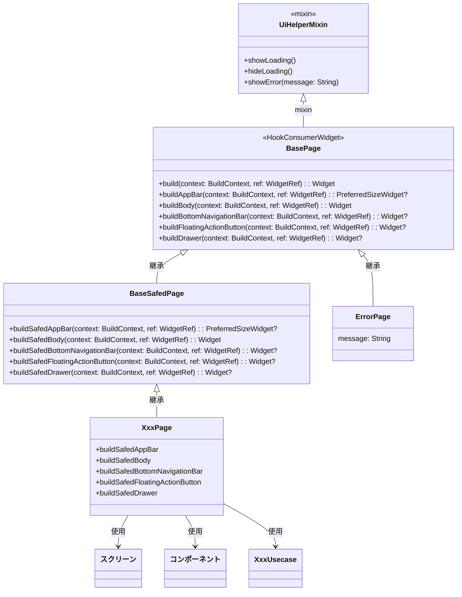

[indexへ戻る](../index.md)
# 🔍 ページ

## 概要
- Scaffoldを含む画面の設計

## オブジェクト図


## フォルダ構成
- `Page`とスクリーンは専用のフォルダを持つこと
```plaintext
{関心事名}/
  ├─ page/
  │   ├─ {画面名}_page/
  │   │   ├─ {画面名}_page.dart
  │   │   ├─ component
  │   │   │   ├─ {コンポーネント名}.dart
  │   │   │   ├─{スクリーン名}/
  │   │   │   │   ├─ {スクリーン名}.dart
  │   │   │   │   ├─ component
  │   │   │   │   │   └─ {コンポーネント名}.dart
```

## `UiHelperMixin`クラス
### 概要
- よく使うUI関連のメソッドをまとめたMixinクラス
- ローディングやエラーメッセージの表示を行う

## `BasePage`基底クラス
### 概要
- アプリで定義するPageクラスの基盤となるクラス
- 共通の処理を実装する

## `BaseSafedPage`基底クラス
### 概要
- エラー処理を含むPageの基底クラス
- `ErrorPage`以外のアプリで使用するPageクラスはこのクラスを継承すること
- 実装クラスで発生したエラーをキャッチして、`ErrorPage`に遷移したり、ログを出力する
  - [ロガー設計](ロガー.md)を参照

### 配置場所
- `/core/page/base_safed_page.dart`

## `XxxPage`クラス
### 概要
- Scaffoldを含む画面クラス
- `BasePage`を継承すること

- ページ内に直接以下のようなWidgetを記述せず、**スクリーンやコンポーネントとして切り出す**こと
  - `Icon`や`Text`, `Button`などの単純なWidget
- 直接使用して良いWidget
  - `Column`や`Row`, `Container`などのレイアウトウィジェット

- ページ内のコールバック処理は、引数にそのまま書かず、プライベートメソッドとして切り出すこと
  - 例: `onPressed: _onButtonPressed`

- 状態の取り出しは、stateを用いて行う
  - [状態管理設計](状態管理.md)を参照

- ビジネスロジックは`XxxUsecase`から呼び出すこと
  - [ユースケース設計](ユースケース.md)を参照
  - `StateNotifier`や`ApiClient`を直接使用しないこと

- 画面内で表示するメッセージは、`L10nProvider`を使用してローカライズされたメッセージを取得すること
  - [多言語設計](多言語対応.md)を参照
  - 例: `l10n.I.userIdRequired`

### 配置場所
- `{関心事名}/page/{画面名}_page/{画面名}_page.dart`
- 一ページにつき一つのフォルダを作成し、その中にページとcomponentフォルダを作成すること
  - 例: `quest/page/quest_page/quest_page.dart`
  - `quest/page/quest_page/component/{コンポーネント名}.dart`

### 命名規則
- `{ページでやりたいこと}Page`

## `{スクリーン名}`
### 概要
- コンポーネントの集約(タブ内の画面やダイアログなど)

- スクリーン内に直接以下のようなWidgetを記述せず、**スクリーンやコンポーネントとして切り出す**こと
  - `Icon`や`Text`, `Button`などの単純なWidget
- 直接使用して良いWidget
  - `Column`や`Row`, `Container`などのレイアウトウィジェット

- コールバック処理は、引数にそのまま書かず、プライベートメソッドとして切り出すこと
  - 例: `onPressed: _onButtonPressed`


### 配置場所
- `{関心事名}/page/login_page/{スクリーン名}/{スクリーン名}.dart`
- 一つのスクリーンに対して一つのフォルダを作成し、その中にスクリーンとcomponentフォルダを作成すること
  - 例: `quest/page/component/quests_tab/quests_tab.dart`
  - `quest/page/component/quests_tab/component/{コンポーネント名}.dart`

### 命名規則
- 文脈から適切に命名すること
  - 例: `QuestsTabScreen`, `SelectQuestDialog`

## `{コンポーネント名}`
### 概要
- ページやスクリーンを構成する共通部品
- 以下のようなWidgetをラッピングすること
  - `TextField`や`Button`, `Icon`などの単純なWidget

- 複数回使用されるされないにかかわらず、必ずコンポーネントとして切り出すこと
  - 例: `TextField`を使用する場合は、`XxxTextField`として切り出す

- コールバック処理は、引数にそのまま書かず、プライベートメソッドとして切り出すこと
  - 例: `onPressed: _onButtonPressed`

### 配置場所
- **ページ内コンポーネント**: `{関心事名}/page/xxx_page/component/{コンポーネント名}.dart`
  - 例: `quest/page/quest_page/component/quest_title.dart`
- **スクリーン内コンポーネント**: `{関心事名}/page/xxx_page/component/{スクリーン名}/component/{コンポーネント名}.dart`
  - 例: `quest/page/select_quest_dialog_/component/quest_summary.dart`

- 他の画面と共通のコンポーネントは、`share/component`フォルダに配置すること
  - 例: `share/component/app_text_field.dart`

### 命名規則
- 内部で使用しているWidgetの名前を後ろにつける
  - 例: TextFieldウィジェット使用 → `{名前}TextField`
- 複数のWidgetを組み合わせている場合は、文脈から適切に命名すること
  - 例: `QuestSummaryCard`, `QuestTitleEntry`

- 末尾に`Component`とつけないこと
