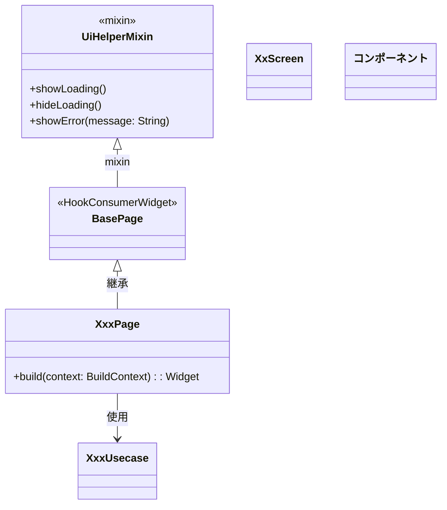

[indexへ戻る](../index.md)
# 🔍 タイトル

## 概要
- Scaffoldを含む画面の設計

## クラス図

## `UiHelperMixin`クラス
### 概要
- よく使うUI関連のメソッドをまとめたMixinクラス

### 配置場所
- 

### 命名規則
- 

## `BasePage`基底クラス
### 概要
- アプリで定義するPageクラスの基盤となるクラス

## `XxxPage`クラス
### 概要
- Scaffoldを含む画面クラス
- `BasePage`を継承すること

### 配置場所
- `{関心事名}/pagi/{画面名}_pagi.dart`

### 命名規則
- `{ページでやりたいこと}Page`

### 

## `XxScreen`クラス
### 概要
- PageにTabがある場合の子画面を定義する

### 配置場所
- `{関心事名}/pagi/screen/xx_screen.dart`

## `{コンポーネント}`
### 概要
- 画面を構成する使いまわす部品

### 配置場所
- `{関心事名}/pagi/component/{コンポーネント名}.dart`
- `share/pagi/component/{コンポーネント名}.dart`

### 命名規則
- 極力内部で使用しているWidgetの名前にする
  - 例: TextFieldウィジェット使用 → {名前}TextField

