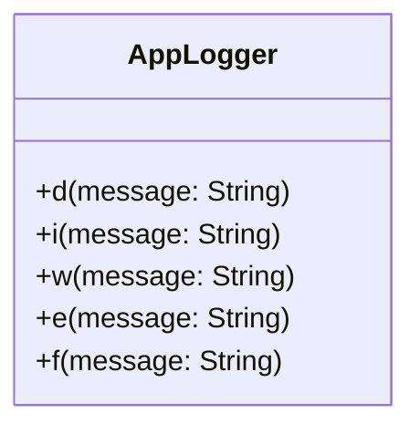

[indexへ戻る](../index.md)
#  ロガー

## 概要
- アプリケーション全体で使用するロガークラス

## オブジェクト図


## `AppLogger`クラス
### 概要
- アプリケーション全体で使用するロガークラス
- エラー情報を出力する際は`ErrorParser`を使用して解析した後に出力する
  - [例外解析](例外解析.md)を参照

### 配置場所
- `/core/logger/app_logger.dart`

### 使用方法
```dart
import 'package:allowance_questboard/core/logger/app_logger.dart' show logger;
import 'package:allowance_questboard/core/exception/error_parser.dart' show eParse;

logger.d("デバッグメッセージ");
logger.i("情報メッセージ");
logger.w("警告メッセージ");
logger.e("エラーメッセージ");
logger.f("致命的なエラーメッセージ");

try {
  // 何らかの処理
} catch (error, stackTrace) {
  logger.e("エラーが発生しました: ${eParse(error, stackTrace)}");
}
```
