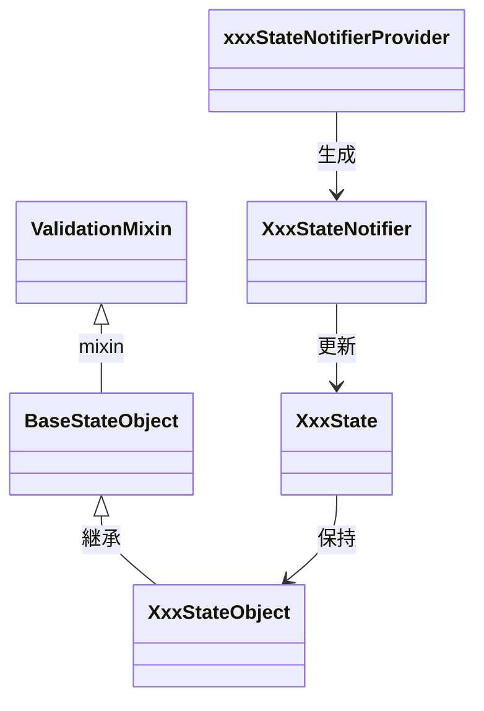

[indexへ戻る](../index.md)
# 🔍 状態管理

## 概要
- Flutterの状態管理を行う方法

## オブジェクト図

## `ValidationMixin`クラス
### 概要
- StateObjectの値を検証するロジックを提供するミックスイン

### 配置場所
- `core/state/validation_mixin.dart`

### メソッド
- validateRequired(value, message): 必須入力チェック
- validateMinLength(value, minLength, message): 文字数制限チェック（最小文字数）
- validateMaxLength(value, maxLength, message): 文字数制限チェック（最大文字数）
- validatePositiveInteger(value, message): 正の整数チェック
- validateNumberRange(value, min, max, message): 数値範囲チェック

* 必要があれば上記以外の検証メソッドを追加すること

## `BaseStateObject`クラス
### 概要
- Stateオブジェクトの基盤となるクラス
- 初期化時に値の検証を行う
- 不正な値が入るとバリデーション例外を発生させる
- バリデーション例外をキャッチし、例外メッセージをエラーメッセージとして保持する

### 配置場所
- `core/state/base_state_object.dart`

## `XxxStateObject`クラス
### 概要
- Stateクラスが保持する値オブジェクト
- `BaseStateObject`を継承すること
- `validate`メソッドをオーバーライドして、値の検証を行う
- 値の検証には`ValidationMixin`を使用すること
- `ValidationMixin`メソッドの引数`message`には、L10nProviderを使用して、ローカライズされたエラーメッセージを指定すること
  - 例: `validateRequired(value, l10n.I.userIdRequired);`
  - [多言語設計](多言語対応-l10n.md)を参照

### 配置場所
- `{関心事名}/state/state_object/XxxStateObject`

### 命名規則
- `{オブジェクト名}State`
  - 例: `QuestTitleState`, `FamilyIdState`

## `XxxState`クラス
### 概要
- FreezedRiverpodを使用し状態を管理する
- Stateオブジェクトを束ねる**状態の集約**
- 保持する状態は`boolean`型以外は全て`XxxStateObject`を定義し使用すること
  - 組み込みのプリミティブをそのまま使用しないこと

### 配置場所
- `{関心毎名}/state/xxx_state.dart`

### 命名規則
- `{集約名}State`
  , 例: `AuthState`, `QuestSummaryState`

## `XxxStateNotifier`クラス
### 概要
- `XxxState`の状態を管理するクラス
- `StateNotifier`を継承すること
- 状態管理以外のロジックはここでは実装しないこと

### 配置場所
- `{関心事名}/state/xxx_state_notifier.dart`

### 命名規則
- `{集約名}StateNotifier`
  - 例: `AuthStateNotifier`, `QuestSummaryStateNotifier`

## `xxxStateNotifierProvider`変数
### 概要
- `XxxStateNotifier`を生成するProviderクラス
- 配置場所は`XxxStateNotifier`と同じファイルの上部にfinalで定義すること

### 配置場所
- `{関心事名}/state/xxx_state_notifier.dart

### 命名規則
- `xxxStateNotifierProvider`
  - 例: `authStateNotifierProvider`, `questSummaryStateNotifierProvider`
