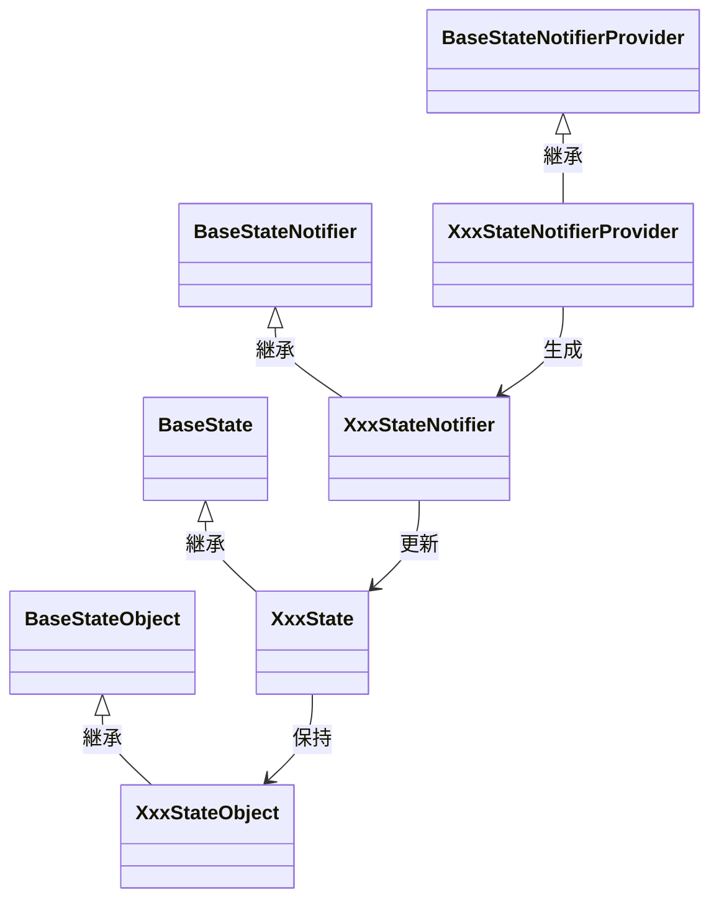

[indexへ戻る](../index.md)
# 🔍 タイトル

## 概要
- 

## クラス図

## `BaseStateObject`クラス
### 概要
- Stateオブジェクトの基盤となるクラス
- 初期化時に値の検証を行う
- 不正な値が入るとバリデーション例外を発生させる
- バリデーション例外をキャッチし、例外メッセージをエラーメッセージとして保持する

### 配置場所
- `core/state/base_state_object.dart`

## `XxxStateObject`クラス
### 概要
- Stateクラスが保持する値オブジェクト
- 

### 配置場所
- 

### 命名規則
- 

## `BaseState`クラス
### 概要
- 

### 配置場所
- 

### 命名規則
- 

## `XxxState`クラス
### 概要
- 

### 配置場所
- 

### 命名規則
- 

## `BaseStateNotifier`クラス
### 概要
- 

### 配置場所
- 

### 命名規則
- 

## `XxxStateNotifier`クラス
### 概要
- 

### 配置場所
- 

### 命名規則
- 

## `BaseStateNotifierProvider`クラス
### 概要
- 

### 配置場所
- 

### 命名規則
- 

## `XxxStateNotifierProvider`クラス
### 概要
- 

### 配置場所
- 

### 命名規則
- 