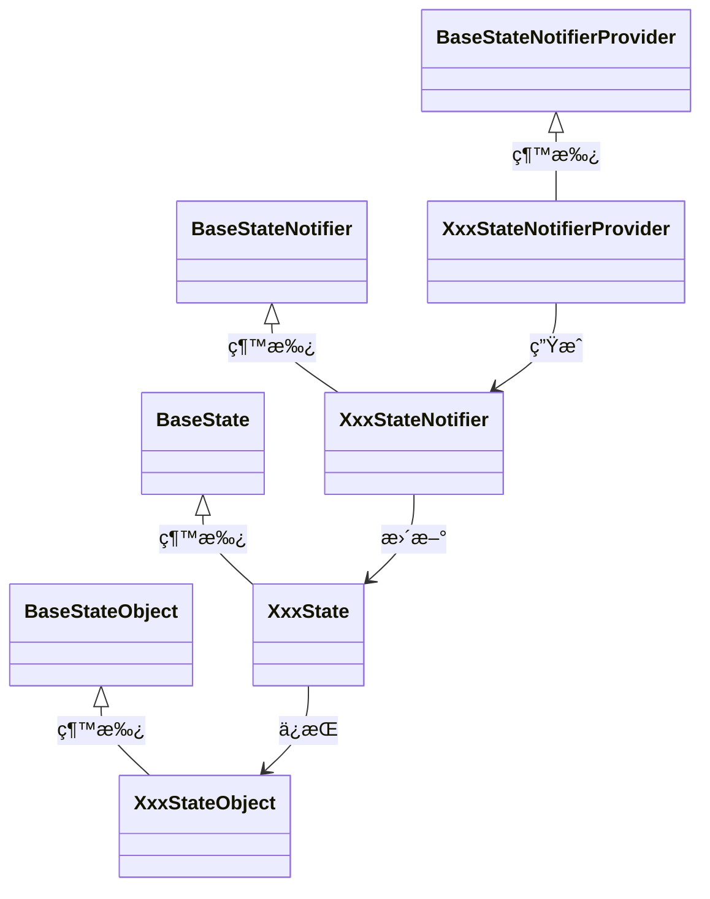

[indexã¸æˆ»ã‚‹](../index.md)
# 🔠タイトル

## 概è¦
- 

## クラス図

```mermaid
classDiagram
    class BaseStateObject
    class XxxStateObject
    class BaseState
    class XxxState
    class BaseStateNotifier
    class XxxStateNotifier
    class BaseStateNotifierProvider
    class XxxStateNotifierProvider

    BaseStateObject <|-- XxxStateObject : 継承
    BaseState <|-- XxxState : 継承
    BaseStateNotifier <|-- XxxStateNotifier : 継承
    BaseStateNotifierProvider <|-- XxxStateNotifierProvider : 継承

    XxxState --> XxxStateObject : ä¿æŒ
    XxxStateNotifier --> XxxState : æ›´æ–°
    XxxStateNotifierProvider --> XxxStateNotifier : 生æˆ
```

## `BaseStateObject`クラス
### 概è¦
- Stateオブジェクトã®åŸºç›¤ã¨ãªã‚‹ã‚¯ãƒ©ã‚¹

### é…置場所
- `core/state/base_state_object.dart`

### 命åè¦å‰‡
- 

## `XxxStateObject`クラス
### 概è¦
- 

### é…置場所
- 

### 命åè¦å‰‡
- 

## `BaseState`クラス
### 概è¦
- 

### é…置場所
- 

### 命åè¦å‰‡
- 

## `XxxState`クラス
### 概è¦
- 

### é…置場所
- 

### 命åè¦å‰‡
- 

## `BaseStateNotifier`クラス
### 概è¦
- 

### é…置場所
- 

### 命åè¦å‰‡
- 

## `XxxStateNotifier`クラス
### 概è¦
- 

### é…置場所
- 

### 命åè¦å‰‡
- 

## `BaseStateNotifierProvider`クラス
### 概è¦
- 

### é…置場所
- 

### 命åè¦å‰‡
- 

## `XxxStateNotifierProvider`クラス
### 概è¦
- 

### é…置場所
- 

### 命åè¦å‰‡
- 