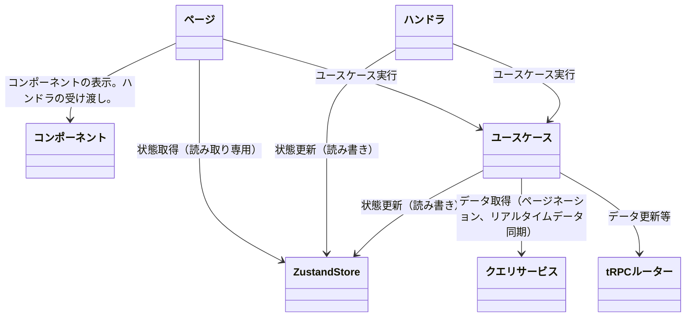

# ./frontend/ページ

## フォルダ構成
```
src/
├─ features/
│  ├─ {機能名}/
│  │  ├─ {ページ名}/
│  │  │  ├─ {ページ名}.tsx  // ページコンポーネント
│  │  │  ├─ components/  // ページ内で使用するコンポーネント
│  │  │  ├─ models/  // ページStoreで管理するクラス
│  │  │  ├─ stores/  // ページStore
│  │  │  │  ├─ {ページ名}Store.ts  // ページStoreの実装
│  │  │  ├─ services/  // ページのユースケース（1ユースケース1ファイル）
│  │  │  │  ├─ {ユースケース名}.ts  // ユースケースの実装
│  │  │  ├─ handlers/  // ページのイベントハンドラ（1ハンドラ1ファイル）
│  │  │  │  ├─ handleXxx.ts  // コンポーネントのイベントハンドラ
│  │  ├─components/  // ページ間で共有するコンポーネント
│  │  ├─models/  // ページ間で共有するモデル
│  │  ├─stores/  // ページ間で共有するストア
│  │  ├─services/  // ページ間で共有するユースケース
```

## 依存関係


## 共通ルール
- Zustandのストアのインスタンス名は以下とする
  - セッションストア: `sessionStore`
  - ページストア: `pageStore`


### メッセージの定義方法
#### 画面上のテキスト
- コンポーネントに表示するテキストは、i18nのローカライズされた文字列を使用すること
  - ja.jsonとen.jsonの配置場所: `src/core/i18n/locales/`

#### エラーメッセージ
- エラーメッセージは、i18nを使用せず、LocaleStringを使用すること
  - エラーメッセージの配置場所: `@backend/core/messages/{機能名}ErrorMessages.ts`
  - 定義例:
```typescript
import { LocaleString } from "./localeString";

/**
 * AuthErrorMessages クラスは、認証関連のエラーメッセージを管理します。
 */
class Messages {
  loginFailed(): LocaleString { return new LocaleString({
      ja: 'ログインに失敗しました。メールアドレスとパスワードを確認してください。',
      en: 'Login failed. Please check your email and password.'});}
...
  // 他のエラーメッセージも同様に定義
}

export const AuthErrorMessages = new Messages();
```
- クラス自身は`Messages`とし、公開するインスタンスは`{機能名}ErrorMessages`とすること

#### console.logの使用
- 一時的なconsole.logは、ハードコーディングすること
