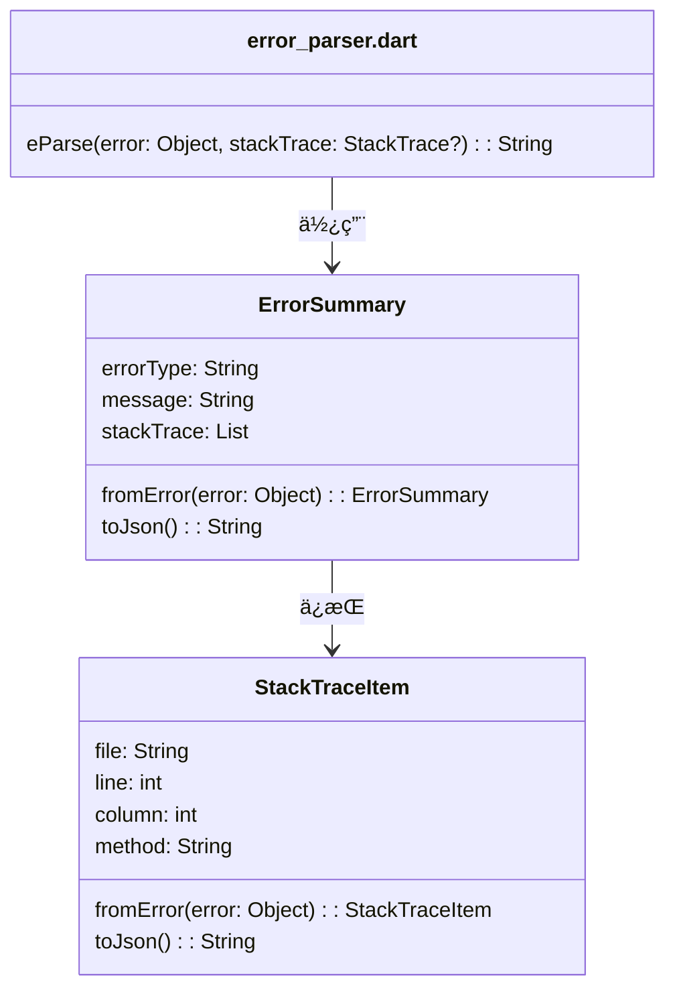

[indexã¸æˆ»ã‚‹](../index.md)
# 🔠例外解æ

## 概è¦
- 例外情報を解æã—ã€æ•´å½¢ã™ã‚‹ã‚¯ãƒ©ã‚¹

## オブジェクト図

```mermaid
classDiagram
    class error_parser.dart {
        eParse(error: Object, stackTrace: StackTrace?): String
    }

    class ErrorSummary {
        errorType: String
        message: String
        stackTrace: List<StackTraceItem>
        fromError(error: Object): ErrorSummary
        toJson(): String
    }

    class StackTraceItem {
        file: String
        line: int
        column: int
        method: String
        fromError(error: Object): StackTraceItem
        toJson(): String
    }

    error_parser.dart --> ErrorSummary : 使用
    ErrorSummary --> StackTraceItem : ä¿æŒ
```

## `eParse`関数
### 概è¦
- `ErrorSummary`ã®ä½¿ç”¨ã‚’簡略化ã™ã‚‹ãŸã‚ã®é–¢æ•°
- エラーã¨ã‚¹ã‚¿ãƒƒã‚¯ãƒˆãƒ¬ãƒ¼ã‚¹ã‚’å—ã‘å–ã‚Šã€æ•´å½¢ã•ã‚ŒãŸJSON文字列を返ã™

### 使用方法
```dart
import 'package:allowance_questboard/core/exception/error_parser.dart' show eParse;

try {
  // 何らã‹ã®å‡¦ç†
} catch (error, stackTrace) {
  final errorJson = eParse(error, stackTrace);
  print(errorJson);
}
```


## `ErrorSummary`クラス
### 概è¦
- 出力ã™ã‚‹ãƒˆãƒƒãƒ—レベルã®ã‚¨ãƒ©ãƒ¼æƒ…報クラス
- 内部ã«`StackTraceItem`ã®ãƒªã‚¹ãƒˆã‚’æŒã¤

### é…置場所
- `core/exception/error_parser.dart`

## `StackTraceItem`クラス
### 概è¦
- スタックトレースã®å„項目を表ã™ã‚¯ãƒ©ã‚¹
- `file`, `line`, `column`, `method`ã®æƒ…報をæŒã¤

### é…置場所
- `core/exception/error_parser.dart`
