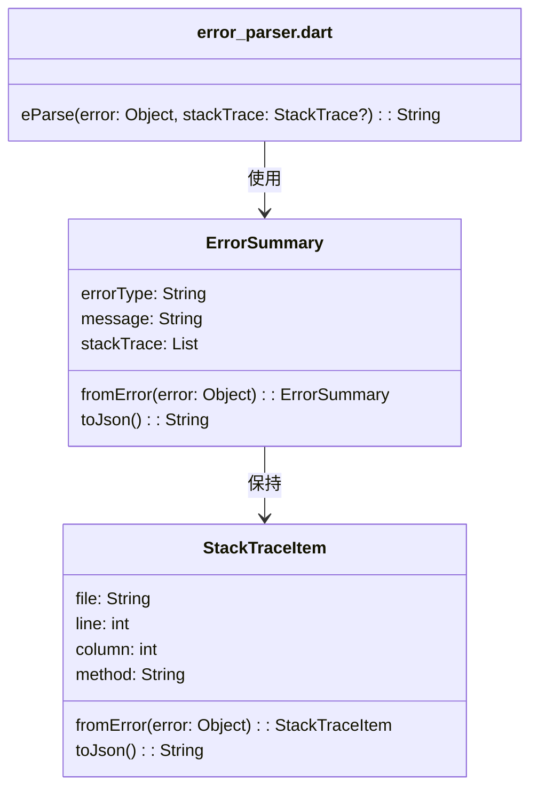

[indexへ戻る](../index.md)
# 🔍 例外解析

## 概要
- 例外情報を解析し、整形するクラス

## オブジェクト図


## `eParse`関数
### 概要
- `ErrorSummary`の使用を簡略化するための関数
- エラーとスタックトレースを受け取り、整形されたJSON文字列を返す

### 使用方法
```dart
import 'package:allowance_questboard/core/exception/error_parser.dart' show eParse;

try {
  // 何らかの処理
} catch (error, stackTrace) {
  final errorJson = eParse(error, stackTrace);
  print(errorJson);
}
```


## `ErrorSummary`クラス
### 概要
- 出力するトップレベルのエラー情報クラス
- 内部に`StackTraceItem`のリストを持つ

### 配置場所
- `core/exception/error_parser.dart`

## `StackTraceItem`クラス
### 概要
- スタックトレースの各項目を表すクラス
- `file`, `line`, `column`, `method`の情報を持つ

### 配置場所
- `core/exception/error_parser.dart`
