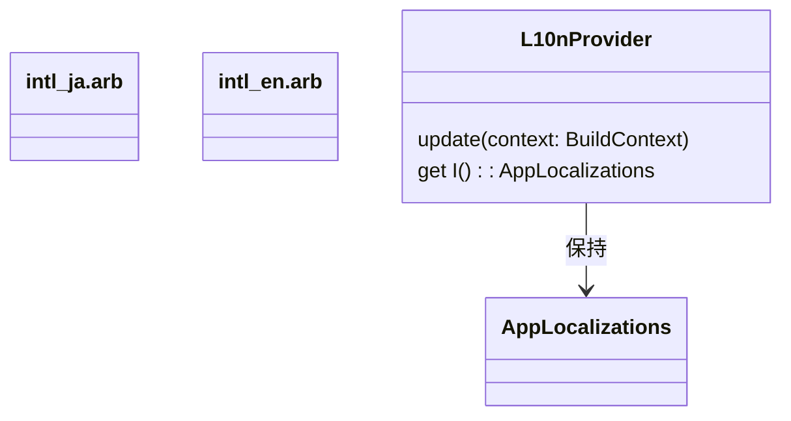

[indexへ戻る](../index.md)
# 💬 多言語対応

## 概要
- アプリの多言語対応を行うための設定

## オブジェクト図


## `intl_ja.arb`, `intl_en.arb`ファイル
### 概要
-  多言語化設定ファイル
-  画面上に表示する文字列は全てこのファイルに定義すること
-  定義するときは、intl_ja.arbとintl_en.arbの両方に同じキーを定義すること
  - 例: `{"userIdRequired": "ユーザーIDは必須です"}`

- 設定を変更した場合は、以下のコマンドを実行して、コードを生成すること
```bash
flutter gen-l10n
```

### 配置場所
- `core/l10n/intl_ja.arb`
- `core/l10n/intl_en.arb`

## `L10nProvider`クラス
### 概要
- 多言語化のためのプロバイダクラス
- 以下の状況で更新すること
  - アプリ起動時
  - 言語設定を変更したとき
  - システムの言語設定が変更されたとき

### 配置場所
- `core/l10n/l10n_provider.dart`

### 使用例
```dart
import 'package:allowance_questboard/core/l10n/l10n_provider.dart' show l10n;

l10n.update(context);  // アプリ起動時や言語設定変更時に呼び出す

message = l10n.I.userIdRequired;  // ローカライズされたメッセージを取得
```
