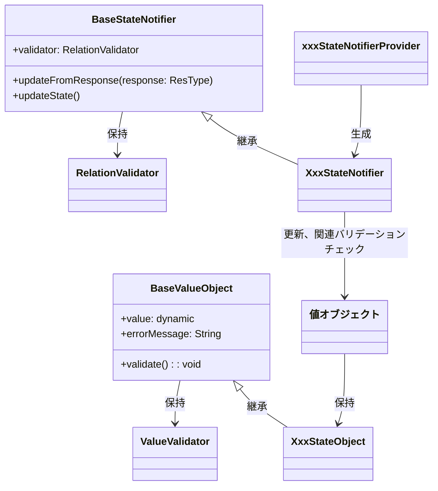

[indexへ戻る](../index.md)
# 🔍 状態管理

## 概要
- Flutterの状態管理を行う方法
- 状態には以下２つがある
  - SessionState: セッション全体で保持される状態
  - XxxPageState: 画面単位の状態

## オブジェクト図

## `ValueValidator`クラス
### 概要
- BaseValueObjectがもつvalueの値を検証するロジックを提供する

### 配置場所
- `core/state/value_validator.dart`

## `BaseValueObject`クラス
### 概要
- Stateオブジェクトの基盤となるクラス
- 初期化時に値の検証を行う
- 不正な値が入るとバリデーション例外を発生させる
- バリデーション例外をキャッチし、例外メッセージをエラーメッセージとして保持する

### 配置場所
- `core/state/base_value_object.dart`

## `値オブジェクト`クラス
### 概要
- Stateクラスが保持する値オブジェクト
- `BaseValueObject`を継承すること

### 配置場所
- `{関心事名}/state/value_object/{値オブジェクト名}.dart`

### 命名規則
- `{値オブジェクト名}`
  - 例: `QuestTitle`, `FamilyId`

## `XxxState`クラス
### 概要
- FreezedRiverpodを使用し状態を管理する
- Stateオブジェクトを束ねる**状態の集約**
- 保持する状態は`boolean`型以外は全て`値オブジェクト`を定義し使用すること
  - 組み込みのプリミティブをそのまま使用しないこと

### 配置場所
- `{関心毎名}/state/xxx_state.dart`

### 命名規則
- `{集約名}State`
  , 例: `AuthState`, `QuestSummaryState`

## `BaseStateNotifier`クラス
### 概要
- `StateNotifier`を継承し、状態管理の基底クラス
- `RelationValidator`を保持し、関連チェックを行う
- `updateFromResponse`メソッドを実装し、レスポンスから状態を更新する
- `updateState`メソッドを実装し、状態を更新する

### 配置場所
- `core/state/base_state_notifier.dart`

## 'RelationValidator`クラス
### 概要
- 関連チェックを行うクラス
- `BaseStateNotifier`で使用する

### 配置場所
- `core/state/relation_validator.dart`

## `XxxStateNotifier`クラス
### 概要
- `XxxState`の状態を管理するクラス
- `StateNotifier`を継承すること
- 状態管理以外のロジックはここでは実装しないこと

### 配置場所
- `{関心事名}/state/xxx_state_notifier.dart`

### 命名規則
- `{集約名}StateNotifier`
  - 例: `AuthStateNotifier`, `QuestSummaryStateNotifier`

## `xxxStateNotifierProvider`変数
### 概要
- `XxxStateNotifier`を生成するProviderクラス
- 配置場所は`XxxStateNotifier`と同じファイルの上部にfinalで定義すること

### 配置場所
- `{関心事名}/state/xxx_state_notifier.dart

### 命名規則
- `xxxStateNotifierProvider`
  - 例: `authStateNotifierProvider`, `questSummaryStateNotifierProvider`
