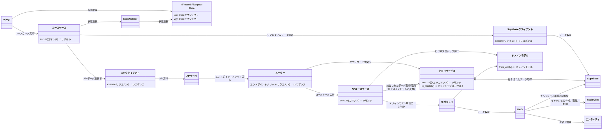

# 開発者向け共通Wikiトップページ

## 1. 実装する前に
- 何を実装するにしても、まずは**設計書を確認**すること
  - どれを参考にする予定か、実装前に必ず教えてください
- 設計書を確認して、「さぁ実装」とする前に**一度似たような実装を確認**すること
- 同じディレクトリに`{モジュール名}.md`がある場合は読むこと
- クラスを作成、更新した場合は、関連するドキュメントを更新すること
  - [クラス図更新のルール](./common/クラス図更新)
- コーディング規約を確認すること
  - [コーディング規約](./common/コーディング規約.md)
- フォルダ構成や書き方がドキュメントと異なる場合は、修正するかユーザに確認すること

- 実装後は以下を行うこと
  - [単体テストの実施](common/単体テスト-unittest.md)
  - 関連する設計書を更新

## 3. 今から何をする？
### フロントエンド
- [ページを作成する](./flutter/ページ-page.md)
- [状態管理を行う](./flutter/状態管理-state.md)
- [APIクライアントを作成する](./flutter/APIクライアント-apiclient.md)
- [ユースケースを作成する](./flutter/ユースケース-usecase.md)
- [多言語化する](./flutter/多言語対応-l10n.md)
- [ログを出力する](./flutter/ロガー-logger.md)
- [例外情報を解析、整形する](./flutter/例外解析-eparser.md)

### APIサーバ
- [環境構築を行う](./api/環境構築.md)
- [APIサーバでPythonをテスト実行する](./api/環境構築.md)
- [APIのエンドポイント(route.py)を作成する](./api/エンドポイント-endpoint.md)
- [APIのユースケースを作成する](api/APユースケース-usecase.md)
- [QueryServiceを作成する](./api/クエリサービス-queryservice.md)
- [ページネーションを実装する](./api/ページネーション-pagination.md)
- [ドメインモデルを作成する](./api/ドメインモデル-domain_model.md)
- [ドメインEnumを作成する](./api/ドメインEnum-domain_enum.md)
- [リポジトリクラスを作成する](./api/リポジトリクラス_repository.md)
- [DAOを作成する](./api/DAO.md)
- [キャッシュを管理する](./api/キャッシュ管理-cache.md)
- [エンティティを変更・確認する](./api/エンティティ-entity.md)
- [共通メッセージを使用する](./api/共通メッセージ管理-common_message.md)

## 簡易全体クラス図

