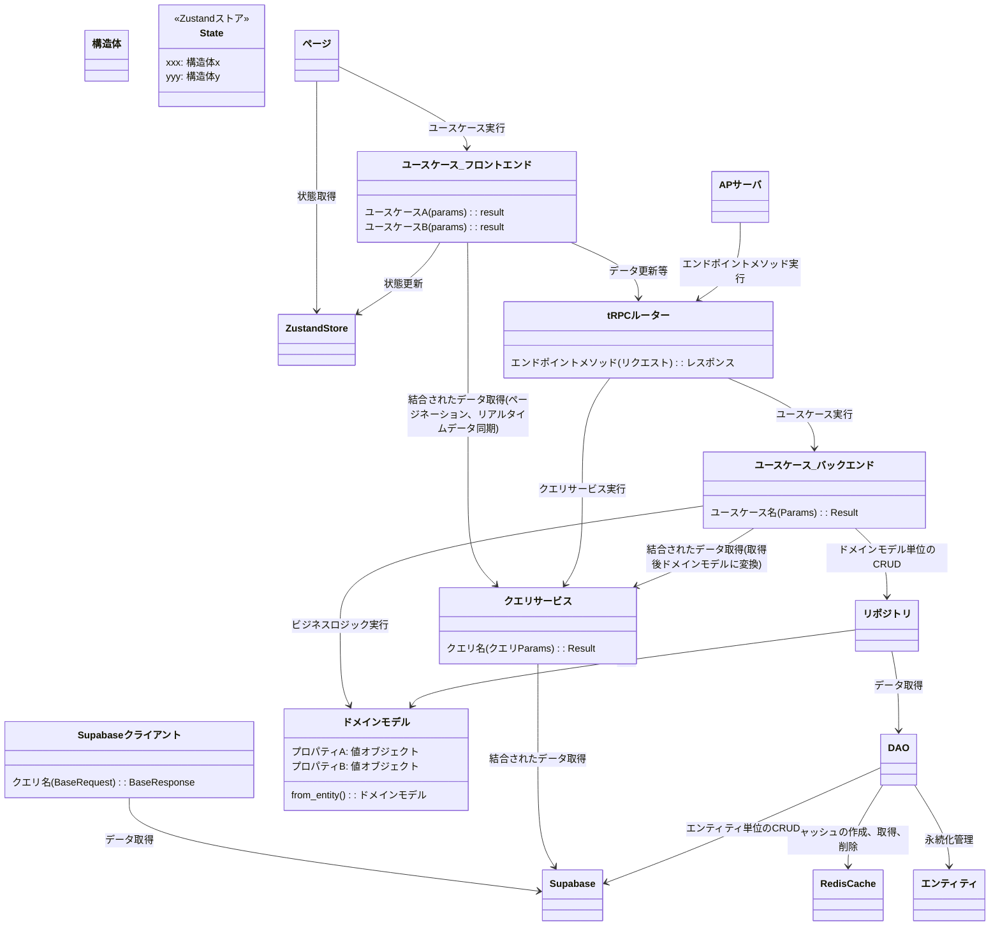

# 開発者向け共通Wikiトップページ

## 1. 実装する前に
- 何を実装するにしても、まずは**設計書を確認**すること
  - どれを参考にする予定か、実装前に必ず教えてください
- 設計書を確認して、「さぁ実装」とする前に**一度似たような実装を確認**すること
- コーディング規約を確認すること
  - [コーディング規約](common/コーディング規約.md)
- フォルダ構成や書き方がドキュメントと異なる場合は、修正するかユーザに確認すること

- 実装後は以下を行うこと
  - [単体テストの実施](./common/単体テスト.md)
  - 関連する設計書を更新

## 3. 今から何をする？
### フロントエンド
- [ページを作る](./frontend/ページ.md)
- [VS Codeでデバッグする](./frontend/VSCodeデバッグ.md)

### バックエンド

## 簡易全体クラス図

