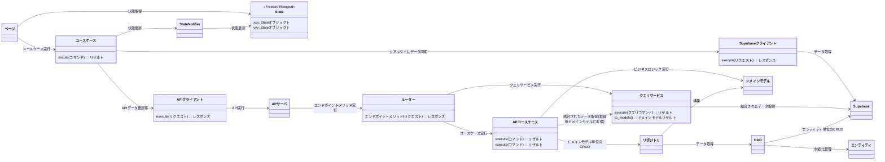

# 開発者向け共通Wikiトップページ

## 1. 実装する前に
- 何を実装するにしても、まずは**設計書を確認**すること
  - どれを参考する予定か、実装前に必ず教えてください
- 設計書を確認して、「さぁ実装」とする前に**一度似たような実装を確認**すること
- 同じディレクトリに`{モジュール名}.md`がある場合は読むこと
- クラスを作成、更新した場合は、関連するドキュメントを更新すること
  - [クラス図更新のルール](./common/クラス図更新)

## 2. コードを実装するときの必読ドキュメント
- [よくある命名規則パターン](common/コーディング規約.md)
- [クラス図更新のルール](./common/クラス図更新)

## 3. 今から何をする？
### フロントエンド
- [ページを作成する](flutter/ページ.md)
- [状態管理を行う](flutter/状態管理.md)
- [APIクライアントを作成する](flutter/APIクライアント.md)
- [ユースケースを作成する](flutter/ユースケース.md)
- [多言語化する](flutter/多言語対応.md)
- [ログを出力する](flutter/ロガー.md)
- [例外情報を解析、整形する](flutter/例外解析.md)

### APIサーバ
- [APIサーバでPythonをテスト実行する](api/環境構築.md)
- [APIのエンドポイント(route.py)を作成する](api/エンドポイント.md)
- [QueryServiceを作成する](api/クエリサービス.md)
- [ページネーションを実装する](api/ページネーション.md)
- [リポジトリクラスを作成する](api/リポジトリクラス.md)
- [DAOを作成する](api/DAO.md)

## 4. 実装が終わったら？
- 関連する設計書を更新すること

## 簡易全体クラス図
