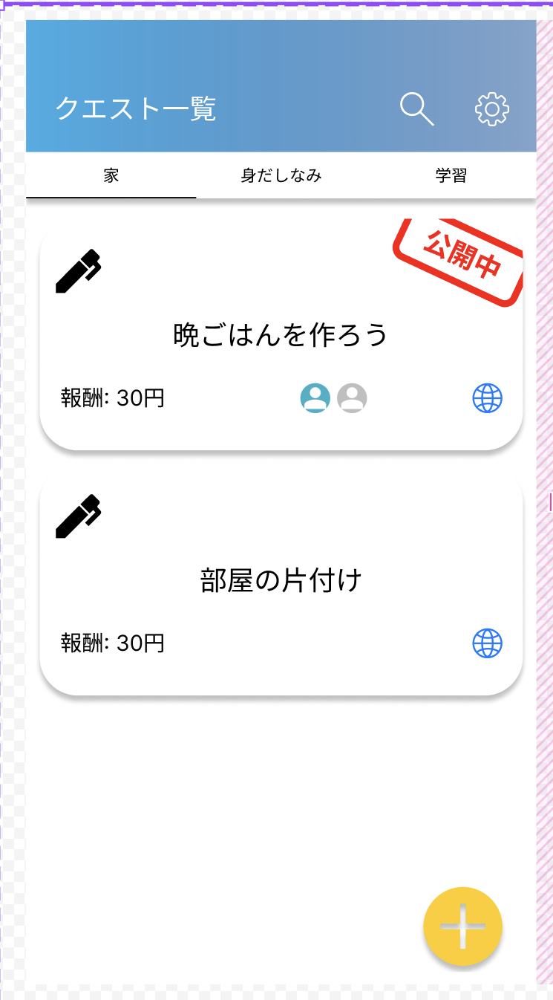
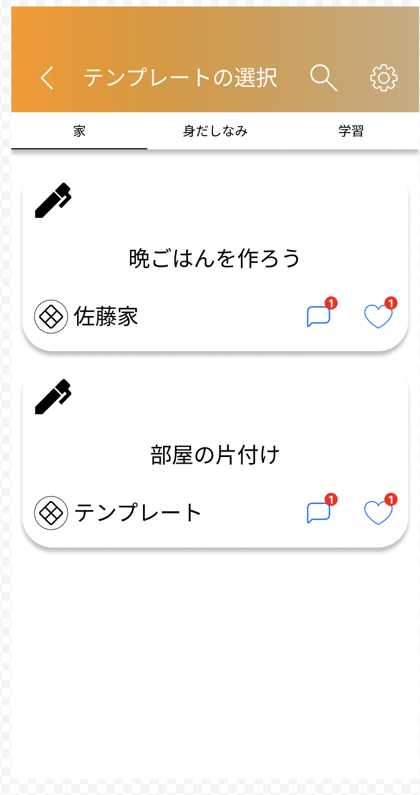
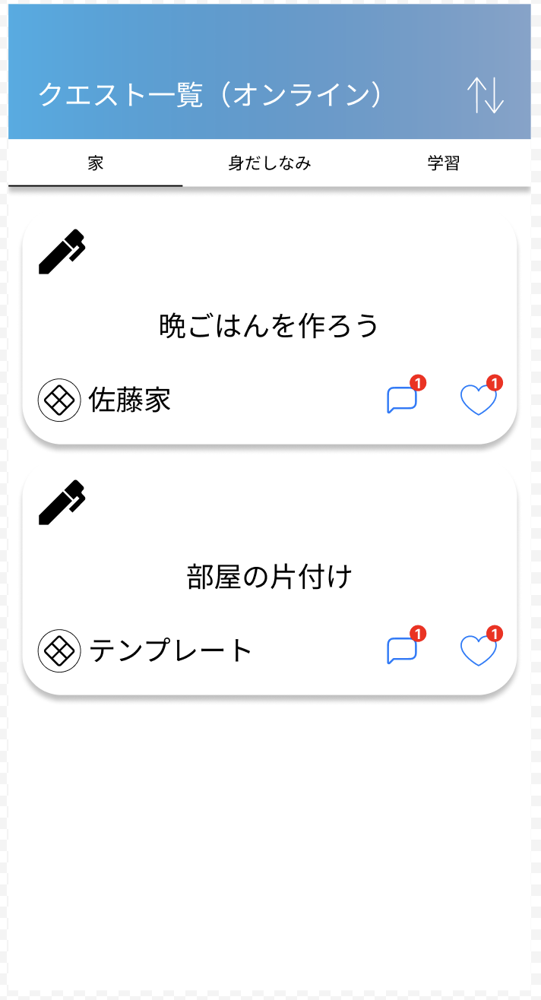
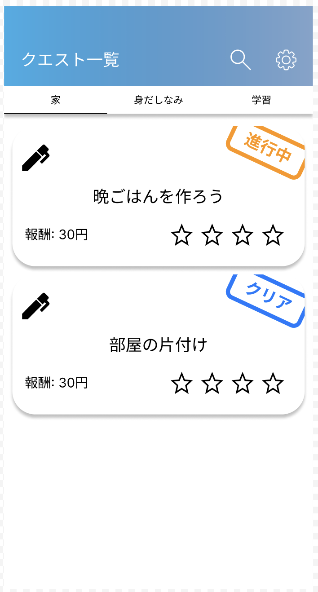
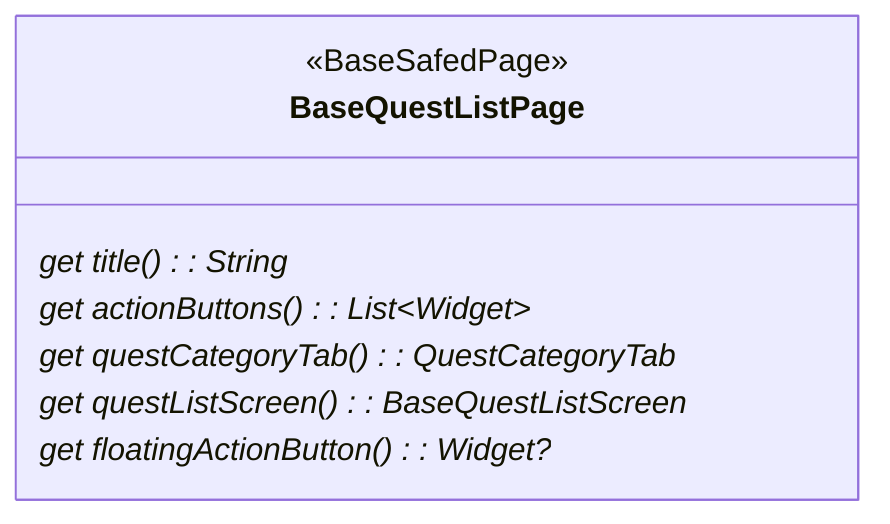
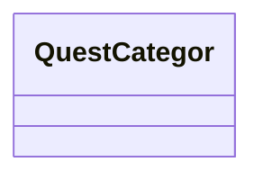

# クエスト一覧画面の作成
## 画面イメージ


## 基底ページ
### 基底クラスと具象クラス
- `BaseQuestListPage`
  - FamilyQuestListPage: 家族クエスト一覧画面
  - ChildQuestListPage: 子供クエスト一覧画面
  - OnlineQuestListPage: オンラインクエスト一覧画面
  - TemplateQuestListPage: テンプレートクエスト一覧画面
- `BaseQuestListScreen`
  - FamilyQuestListScreen: 家族クエスト一覧スクリーン
  - ChildQuestListScreen: 子供クエスト一覧スクリーン
  - OnlineQuestListScreen: オンラインクエスト一覧スクリーン
  - TemplateQuestListScreen: テンプレートクエスト一覧スクリーン
- `BaseQuestListItem`
  - FamilyQuestListItem: 家族クエスト一覧アイテム
  - ChildQuestListItem: 子供クエスト一覧アイテム
  - OnlineQuestListItem: オンラインクエスト一覧アイテム
  - TemplateQuestListItem: テンプレートクエスト一覧アイテム

### 共通コンポーネント
- `SearchButton`: 検索画面へ遷移
- `SettingButton`: 設定画面へ遷移
- `QuestCategoryTab`: クエスト分類選択タブ
- `QuestTitleLabel`: クエストタイトルラベル
- `QuestRewardLabel`: クエスト報酬ラベル
- `QuestMemberListLabel`: クエストメンバーリストラベル
- `QuestPublicFlagLabel`: クエスト公開非公開フラグラベル
- `QuestStatusLabel`: クエストステータスラベル
- `QuestOnlineIcon`: クエストオンライン公開アイコン
- `QuestAddButton`: クエスト追加ボタン
- `QuestLevelLabel`: クエストレベルラベル
- `QuestListFamilyNameLabel`: クエスト家族名ラベル
- `QuestListCommentIcon`: クエストコメントアイコン
- `QuestListLikeIcon`: クエストいいねアイコン

### 状態
- `FamilyQuestListPageState`: 家族クエスト一覧画面の状態
  - `QuestList`: 家族クエスト一覧
  - `QuestCategoryTab`: クエスト分類タブ
  - `SearchQuery`: 検索クエリ
- `ChildQuestListPageState`: 子供クエスト一覧画面の状態
  - `QuestList`: 子供クエスト一覧
  - `QuestCategoryTab`: クエスト分類タブ
  - `SearchQuery`: 検索クエリ
- `OnlineQuestListPageState`: オンラインクエスト一覧画面の状態
  - `QuestList`: オンラインクエスト一覧
  - `QuestCategoryTab`: クエスト分類タブ
  - `SearchQuery`: 検索クエリ
- `TemplateQuestListPageState`: テンプレートクエスト一覧画面の状態
  - `QuestList`: テンプレートクエスト一覧
  - `QuestCategoryTab`: クエスト分類タブ
  - `SearchQuery`: 検索クエリ

### 構造体、値オブジェクト
- `FamilyQuestList`: 家族クエスト一覧
  - `FamilyQuestListItem`: 家族クエスト一覧アイテム
    - `QuestId`: クエストID
    - `QuestTitle`: クエストタイトル
    - `QuestIcon`: クエストアイコン
    - isPublic: クエスト公開フラグ
    - isShared: クエスト共有フラグ(オンラインフラグ)
    - `QuestReward`: クエスト報酬
    - `QuestMembers`: クエストメンバー
      - `ChildId`: 子供ID
      - `ChildName`: 子供名前
      - `ChildIcon`: 子供アイコン
- `TemplateQuestList`: テンプレートクエスト一覧
  - `TemplateQuestListItem`: テンプレートクエスト一覧アイテム
    - `TemplateQuestId`: テンプレートクエストID
    - `TemplateQuestTitle`: テンプレートクエストタイトル
    - `TemplateQuestIcon`: テンプレートクエストアイコン
    - `FamilyName`: 家族名
    - `CommentCount`: コメント数
    - `LikeCount`: いいね数


## `BaseQuestListPage`
- クエスト一覧画面の基底クラス
### 抽象メソッド


## `QuestCategoryTab`
- クエスト分類選択タブ
### クラス図


## `BaseQuestListScreen`
- クエスト一覧スクリーンの基底クラス
- クエストリスト

## BaseQuestListScreen

## 画面の種類
- この画面は以下の画面の種類がある
  - 家族クエスト一覧
  - 子供クエスト一覧
  - オンラインクエスト一覧
  - テンプレートクエスト一覧
- それぞれの種類は基底クラスBaseQuestListPageを継承する
- 各画面で使用する部品はpageのルートディレクトリのcomponentに配置する
  例: BaseQuestListItemなど

## 画面項目
### Page
- 検索ボタン: 検索画面へ遷移
- 設定ボタン: 設定画面へ遷移
- Screen
- ボトムタブ
  - ホーム、クエスト一覧、通知、オンライン切り替え
- フローティング
  - クエスト追加ボタン: クエスト作成画面へ遷移

### Screen
- クエスト分類選択タブ: 
  - 各分類のクエスト一覧スクリーン

### 各分類のクエスト一覧スクリーン

- クエスト表示欄
  - List(FamilyQuestListItem)
  
### {種類名}QuestListItem
- クエストアイコン: 共通
- 公開非公開フラグ: 家族、子供
- クエストタイトル: 共通
- 報酬: 家族
- リスト(メンバーアイコン): 家族
- オンライン公開アイコン: 家族

## ディレクトリ構成
```
quest/
- quest_list_page/
  - base_quest_list_page.dart
  - state/
    - base_quest_list_state_notifier.dart
  - family_quest_list_page/
    - family_quest_list_page.dart
    - state/
      - family_quest_list_state_notifier.dart
      - family_quest_list_state.dart
  - child_quest_list_page/
  - online_quest_list_page/
  - template_quest_list_page/
  - component/
    - 
```

## データ取得
- FamilyQuestSummariesはリアルタイムデータ同期取得する
### クエスト分類タブの取得
#### 取得情報
- 

## イベント
### 設定ボタン
- 設定画面へ遷移

### 検索ボタン
- 検索画面へ遷移する

### クエスト分類選択タブ
- 対応する各分類のクエスト一覧スクリーンを表示

### FamilyQuestListItem
- クエスト詳細画面に遷移

#### リスト(メンバーアイコン)
- クエスト詳細画面のメンバー選択画面へ遷移

#### オンライン公開アイコン
- クエスト詳細画面のオンライン公開非公開切り替え画面へ遷移

#### クエスト追加ボタン
- クエスト編集画面(新規)に遷移

# オブジェクト図
